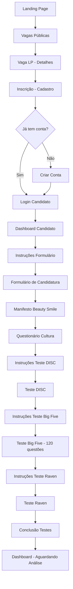
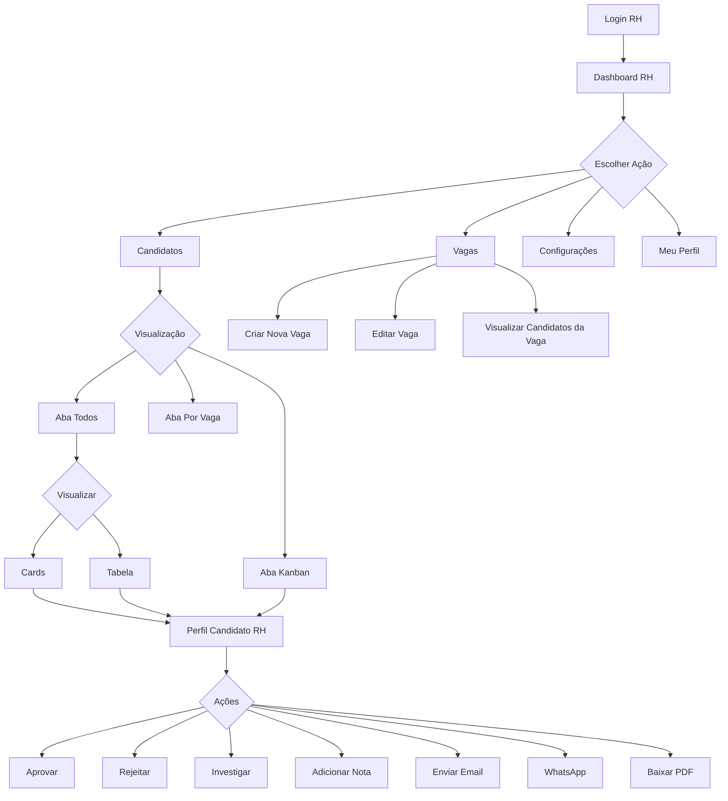
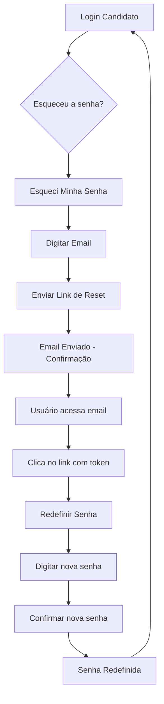

# Inventário Técnico - Beauty Smile Sistema de Recrutamento

## 📋 Índice
1. [Visão Geral do Projeto](#1-visão-geral-do-projeto)
2. [Estrutura de Pastas](#2-estrutura-de-pastas)
3. [Mapa Completo de Rotas](#3-mapa-completo-de-rotas)
4. [Componentes Principais](#4-componentes-principais)
5. [Funcionalidades Interativas Detalhadas](#5-funcionalidades-interativas-detalhadas)
6. [Fluxos de Navegação](#6-fluxos-de-navegação)
7. [Integrações Externas](#7-integrações-externas)
8. [Design System](#8-design-system)
9. [Autenticação](#9-autenticação)
10. [Pontos de Atenção](#10-pontos-de-atenção)

---

## 1. Visão Geral do Projeto

### 1.1 Stack Tecnológico

**Framework Base:** React 18.3.1 com Vite 6.3.5
**Linguagem:** TypeScript
**Build Tool:** Vite (SWC para compilação rápida)
**Porta de Desenvolvimento:** 3000
**Tipo de Aplicação:** SPA (Single Page Application)

### 1.2 Arquitetura

- **Tipo:** Client-Side Rendering (CSR) com Vite
- **Roteamento:** Gerenciamento de estado local (sem React Router)
- **Navegação:** Via estado `currentPage` no componente App.tsx
- **Pattern:** Component-based architecture

### 1.3 Dependências Principais

#### UI Components (Radix UI)
- `@radix-ui/react-accordion` ^1.2.3
- `@radix-ui/react-alert-dialog` ^1.1.6
- `@radix-ui/react-avatar` ^1.1.3
- `@radix-ui/react-checkbox` ^1.1.4
- `@radix-ui/react-collapsible` ^1.1.3
- `@radix-ui/react-dialog` ^1.1.6
- `@radix-ui/react-dropdown-menu` ^2.1.6
- `@radix-ui/react-hover-card` ^1.1.6
- `@radix-ui/react-popover` ^1.1.6
- `@radix-ui/react-select` ^2.1.6
- `@radix-ui/react-tabs` ^1.1.3
- `@radix-ui/react-tooltip` ^1.1.8

#### Formulários e Validação
- `react-hook-form` ^7.55.0
- `input-otp` ^1.4.2

#### Rich Text Editor
- `@tiptap/core` *
- `@tiptap/react` *
- `@tiptap/starter-kit` *
- `@tiptap/extension-text-style` *

#### Drag and Drop
- `react-dnd` *
- `react-dnd-html5-backend` *

#### Visualização de Dados
- `recharts` ^2.15.2

#### Animações
- `motion` * (Framer Motion)

#### Notificações
- `sonner` ^2.0.3

#### UI Utilities
- `lucide-react` ^0.487.0 (ícones)
- `class-variance-authority` ^0.7.1 (variantes de componentes)
- `clsx` * (classes condicionais)
- `tailwind-merge` * (merge de classes Tailwind)
- `cmdk` ^1.1.1 (command palette)
- `embla-carousel-react` ^8.6.0 (carrossel)
- `vaul` ^1.1.2 (drawer)
- `react-resizable-panels` ^2.1.7 (painéis redimensionáveis)
- `react-day-picker` ^8.10.1 (date picker)
- `next-themes` ^0.4.6 (tema claro/escuro)

### 1.4 Scripts Disponíveis

```json
{
  "dev": "vite",
  "build": "vite build"
}
```

---

## 2. Estrutura de Pastas

```
SistemaRecrutamento/
├── src/
│   ├── assets/
│   │   ├── images/
│   │   │   ├── raven/              # Imagens do teste de Raven
│   │   │   └── backgrounds.ts      # Configuração de backgrounds
│   │   └── logos/                  # Logos da marca
│   │
│   ├── components/
│   │   ├── examples/               # Componentes de exemplo
│   │   │   ├── CardExamples.tsx
│   │   │   └── LayoutExamples.tsx
│   │   │
│   │   ├── figma/                  # Componentes do Figma Make
│   │   │   └── ImageWithFallback.tsx
│   │   │
│   │   ├── pages/                  # ⭐ PÁGINAS DO SISTEMA (30 páginas)
│   │   │   ├── LandingPage.tsx
│   │   │   ├── VagasPublicasPage.tsx
│   │   │   ├── VagaLPPage.tsx
│   │   │   ├── InscricaoPage.tsx
│   │   │   ├── LoginCandidatoPage.tsx
│   │   │   ├── EsqueciSenhaPage.tsx
│   │   │   ├── RedefinirSenhaPage.tsx
│   │   │   ├── InstrucoesFormularioPage.tsx
│   │   │   ├── FormularioCandidaturaPage.tsx
│   │   │   ├── ManifestoPage.tsx
│   │   │   ├── QuestionarioCulturaPage.tsx
│   │   │   ├── InstrucoesDISCPage.tsx
│   │   │   ├── InstrucoesBigFivePage.tsx
│   │   │   ├── InstrucoesRavenPage.tsx
│   │   │   ├── TesteBigFivePage.tsx
│   │   │   ├── TesteDISCPage.tsx
│   │   │   ├── TesteRavenPage.tsx
│   │   │   ├── ConclusaoTestesPage.tsx
│   │   │   ├── QuestionarioPage.tsx
│   │   │   ├── DashboardCandidatoPage.tsx
│   │   │   ├── MeuPerfilCandidatoPage.tsx
│   │   │   ├── LoginRHPage.tsx
│   │   │   ├── DashboardRHPage.tsx
│   │   │   ├── VagasRHPage.tsx
│   │   │   ├── CriarEditarVagaPage.tsx
│   │   │   ├── CandidatosRHPage.tsx
│   │   │   ├── PerfilCandidatoRHPage.tsx
│   │   │   ├── ConfiguracoesPage.tsx
│   │   │   ├── MeuPerfilPage.tsx
│   │   │   ├── SuporteRHPage.tsx
│   │   │   └── VagasPage.tsx
│   │   │
│   │   ├── ui/                     # ⭐ COMPONENTES UI (shadcn/ui + custom)
│   │   │   ├── accordion.tsx
│   │   │   ├── alert-dialog.tsx
│   │   │   ├── alert.tsx
│   │   │   ├── aspect-ratio.tsx
│   │   │   ├── avatar.tsx
│   │   │   ├── badge.tsx
│   │   │   ├── breadcrumb.tsx
│   │   │   ├── button.tsx
│   │   │   ├── calendar.tsx
│   │   │   ├── card.tsx
│   │   │   ├── carousel.tsx
│   │   │   ├── chart.tsx
│   │   │   ├── checkbox.tsx
│   │   │   ├── collapsible.tsx
│   │   │   ├── command.tsx
│   │   │   ├── context-menu.tsx
│   │   │   ├── dialog.tsx
│   │   │   ├── drawer.tsx
│   │   │   ├── dropdown-menu.tsx
│   │   │   ├── form.tsx
│   │   │   ├── glass.tsx           # ⭐ CUSTOM - Glassmorphism
│   │   │   ├── hover-card.tsx
│   │   │   ├── input-otp.tsx
│   │   │   ├── input.tsx
│   │   │   ├── label.tsx
│   │   │   ├── menubar.tsx
│   │   │   ├── navigation-menu.tsx
│   │   │   ├── pagination.tsx
│   │   │   ├── popover.tsx
│   │   │   ├── progress.tsx
│   │   │   ├── radio-group.tsx
│   │   │   ├── resizable.tsx
│   │   │   ├── scroll-area.tsx
│   │   │   ├── select.tsx
│   │   │   ├── separator.tsx
│   │   │   ├── sheet.tsx
│   │   │   ├── sidebar.tsx
│   │   │   ├── skeleton.tsx
│   │   │   ├── slider.tsx
│   │   │   ├── sonner.tsx
│   │   │   ├── switch.tsx
│   │   │   ├── table.tsx
│   │   │   ├── tabs.tsx
│   │   │   ├── textarea.tsx
│   │   │   ├── toggle-group.tsx
│   │   │   ├── toggle.tsx
│   │   │   ├── tooltip.tsx
│   │   │   ├── use-mobile.ts
│   │   │   └── utils.ts
│   │   │
│   │   ├── BackgroundImage.tsx     # ⭐ CUSTOM - Backgrounds
│   │   ├── BeautySmileLogo.tsx     # ⭐ CUSTOM - Logo SVG
│   │   ├── GlassShowcase.tsx       # Showcase de componentes
│   │   ├── MetricCard.tsx          # ⭐ CUSTOM - Cards de métricas
│   │   ├── RHLayout.tsx            # ⭐ CUSTOM - Layout RH
│   │   ├── RHSidebar.tsx           # ⭐ CUSTOM - Sidebar RH
│   │   ├── RHTopBar.tsx            # ⭐ CUSTOM - TopBar RH
│   │   └── RichTextEditor.tsx      # ⭐ CUSTOM - Editor de texto
│   │
│   ├── guidelines/                 # Diretrizes de design
│   ├── styles/
│   │   └── globals.css             # ⭐ Design System CSS
│   │
│   ├── App.tsx                     # ⭐ COMPONENTE PRINCIPAL
│   ├── main.tsx                    # Entry point
│   └── index.css                   # Tailwind CSS gerado
│
├── vite.config.ts                  # ⭐ Configuração Vite
├── package.json                    # Dependências
└── README.md
```

### 2.1 Descrição das Pastas

- **`src/assets/`**: Imagens, logos e configurações de assets estáticos
- **`src/components/pages/`**: Todas as páginas do sistema (31 arquivos)
- **`src/components/ui/`**: Componentes UI reutilizáveis (shadcn/ui + customizados)
- **`src/components/`**: Componentes customizados de alto nível (layouts, cards, etc.)
- **`src/styles/`**: Arquivos CSS globais e design system
- **`src/guidelines/`**: Documentação de diretrizes de design

---

## 3. Mapa Completo de Rotas

### 3.1 Sistema de Navegação

**Tipo:** State-based navigation (sem React Router)
**Gerenciamento:** `useState<PageType>` no `App.tsx`
**Menu:** Sheet lateral (mobile-first) com botão flutuante

### 3.2 Tabela de Rotas/Páginas

| # | Rota/ID | Arquivo | Tipo | Funcionalidade | Área |
|---|---------|---------|------|----------------|------|
| 1 | `landing` | LandingPage.tsx | Pública | Página inicial de boas-vindas | Home |
| 2 | `vagas-publicas` | VagasPublicasPage.tsx | Pública | Listagem de vagas abertas | Vagas |
| 3 | `vaga-lp` | VagaLPPage.tsx | Pública | Landing page de divulgação de vaga | Vagas |
| 4 | `inscricao` | InscricaoPage.tsx | Pública | Cadastro de novo candidato | Auth |
| 5 | `login-candidato` | LoginCandidatoPage.tsx | Pública | Login de candidato | Auth |
| 6 | `esqueci-senha` | EsqueciSenhaPage.tsx | Pública | Recuperação de senha | Auth |
| 7 | `redefinir-senha` | RedefinirSenhaPage.tsx | Pública | Redefinir senha com token | Auth |
| 8 | `instrucoes-formulario` | InstrucoesFormularioPage.tsx | Protegida | Instruções do formulário de candidatura | Candidatura |
| 9 | `formulario-candidatura` | FormularioCandidaturaPage.tsx | Protegida | Formulário completo de candidatura | Candidatura |
| 10 | `manifesto` | ManifestoPage.tsx | Protegida | Manifesto Beauty Smile | Cultura |
| 11 | `questionario-cultura` | QuestionarioCulturaPage.tsx | Protegida | Questionário de fit cultural | Testes |
| 12 | `instrucoes-disc` | InstrucoesDISCPage.tsx | Protegida | Instruções do teste DISC | Testes |
| 13 | `instrucoes-bigfive` | InstrucoesBigFivePage.tsx | Protegida | Instruções do teste Big Five | Testes |
| 14 | `instrucoes-raven` | InstrucoesRavenPage.tsx | Protegida | Instruções do teste Raven | Testes |
| 15 | `teste-bigfive` | TesteBigFivePage.tsx | Protegida | Teste de personalidade Big Five (120 questões) | Testes |
| 16 | `teste-disc` | TesteDISCPage.tsx | Protegida | Teste de perfil comportamental DISC | Testes |
| 17 | `teste-raven` | TesteRavenPage.tsx | Protegida | Teste de inteligência Raven | Testes |
| 18 | `conclusao-testes` | ConclusaoTestesPage.tsx | Protegida | Página de conclusão dos testes | Testes |
| 19 | `questionario` | QuestionarioPage.tsx | Protegida | Questionário geral | Candidato |
| 20 | `dashboard-candidato` | DashboardCandidatoPage.tsx | Protegida | Dashboard do candidato | Candidato |
| 21 | `meu-perfil-candidato` | MeuPerfilCandidatoPage.tsx | Protegida | Perfil e configurações do candidato | Candidato |
| 22 | `login-rh` | LoginRHPage.tsx | Pública | Login de usuário RH/Admin | Auth RH |
| 23 | `dashboard-rh` | DashboardRHPage.tsx | Protegida | Dashboard administrativo RH | RH |
| 24 | `vagas-rh` | VagasRHPage.tsx | Protegida | Gestão de vagas (RH) | RH |
| 25 | `criar-vaga` | CriarEditarVagaPage.tsx | Protegida | Criar ou editar vaga | RH |
| 26 | `candidatos-rh` | CandidatosRHPage.tsx | Protegida | Gestão de candidatos (cards/tabela/kanban) | RH |
| 27 | `perfil-candidato-rh` | PerfilCandidatoRHPage.tsx | Protegida | Visualizar perfil detalhado do candidato | RH |
| 28 | `configuracoes` | ConfiguracoesPage.tsx | Protegida | Configurações do sistema | RH |
| 29 | `meu-perfil` | MeuPerfilPage.tsx | Protegida | Perfil do usuário RH | RH |
| 30 | `suporte-rh` | SuporteRHPage.tsx | Protegida | Suporte técnico (relatar erros e melhorias) | RH |
| 31 | `showcase` | GlassShowcase.tsx | Dev | Showcase de componentes (dev only) | Dev |

### 3.3 Fluxo de Navegação (Menu)

O menu de navegação está implementado em `App.tsx` com um **Sheet lateral** (menu drawer) acessado por botão flutuante no canto inferior direito.

```typescript
// Estrutura do menu
const pages = [
  { id: 'landing', label: 'Landing Page', icon: '🏠' },
  { id: 'vagas-publicas', label: 'Vagas Públicas', icon: '💼' },
  { id: 'vaga-lp', label: 'LP Divulgação Vaga', icon: '📄' },
  // ... 27 mais páginas
  { id: 'suporte-rh', label: 'Suporte Técnico (RH)', icon: '🛠️' },
];
```

**Características do Menu:**
- Botão flutuante fixo (bottom-right)
- Sheet lateral que abre da direita
- Background azul (#00109E) com blur
- Scroll area para navegação
- Indica página ativa visualmente
- Ícones emoji para cada página

---

## 4. Componentes Principais

### 4.1 Componentes de Layout

#### **RHLayout.tsx** 🏗️
**Localização:** `/src/components/RHLayout.tsx`

**Propósito:** Layout principal para área administrativa de RH com sidebar e topbar.

**Props:**
```typescript
{
  children: ReactNode
  activePage: string
  onNavigate: (pageId: string) => void
  userName?: string
  userRole?: string
  notificationCount?: number
  onSearch?: (query: string) => void
  onProfileClick?: () => void
  onSettingsClick?: () => void
  onLogout?: () => void
}
```

**Estado Interno:**
- `isSidebarCollapsed: boolean` - Controla expansão da sidebar
- `isMobileMenuOpen: boolean` - Controla menu mobile

**Componentes Filhos:**
- `BackgroundImage` (background azul escuro)
- `RHSidebar` (navegação lateral)
- `RHTopBar` (barra superior)

**Interações:**
- Toggle sidebar (desktop)
- Toggle menu mobile (responsivo)
- Navegação entre páginas
- Busca global
- Menu de usuário

---

#### **RHTopBar.tsx** 🔝
**Localização:** `/src/components/RHTopBar.tsx`

**Propósito:** Barra superior com busca, notificações e menu de usuário.

**Props:**
```typescript
{
  userName?: string (default: 'João Silva')
  userRole?: string (default: 'Administrador')
  notificationCount?: number
  onSearch?: (query: string) => void
  onProfileClick?: () => void
  onSettingsClick?: () => void
  onLogout?: () => void
  onMobileMenuToggle?: () => void
}
```

**Estado Interno:**
- `searchQuery: string`

**Elementos Interativos:**
1. **Campo de Busca**
   - Input com ícone Search
   - Placeholder: "Buscar candidatos, vagas..."
   - Callback onSearch ao digitar

2. **Dropdown Menu (Usuário)**
   - Trigger: Avatar + nome + cargo
   - Opções:
     * 👤 Meu Perfil
     * ⚙️ Configurações
     * 🚪 Sair
   - Badge de notificações

3. **Menu Mobile Toggle**
   - Botão hamburger (Menu icon)
   - Visível apenas em mobile

**UI Components:**
- `DropdownMenu` (radix-ui)
- `Badge` (contador de notificações)
- `Glass` (efeito glassmorphism)
- Icons do `lucide-react`

---

#### **RHSidebar.tsx** 📂
**Localização:** `/src/components/RHSidebar.tsx`

**Propósito:** Sidebar de navegação com menu colapsável.

**Props:**
```typescript
{
  activePage: string
  onNavigate: (pageId: string) => void
  userName?: string
  userRole?: string
  onLogout?: () => void
  isCollapsed?: boolean
  onToggleCollapse?: (collapsed: boolean) => void
  isMobileOpen?: boolean
  onMobileClose?: () => void
}
```

**Estado Interno:**
- `internalCollapsed: boolean`
- `internalMobileOpen: boolean`

**Menu Items:**
```typescript
[
  {
    id: 'dashboard-rh',
    label: 'Dashboard',
    icon: Home,
    badge: null
  },
  {
    id: 'candidatos-rh',
    label: 'Candidatos',
    icon: Users,
    badge: 12  // Número de candidatos pendentes
  },
  {
    id: 'vagas-rh',
    label: 'Vagas',
    icon: Briefcase,
    badge: 5  // Número de vagas ativas
  },
  {
    id: 'configuracoes',
    label: 'Configurações',
    icon: Settings,
    badge: null
  }
]
```

**Elementos Interativos:**
1. **Logo Beauty Smile** (topo)
2. **Botão de Toggle** (colapsar/expandir)
3. **Menu Items** (navegação)
4. **Badges** (contadores)
5. **Seção de Usuário** (rodapé)
   - Avatar
   - Nome e cargo (quando expandido)
   - Botão de logout
6. **Backdrop Mobile** (fecha menu ao clicar fora)

**Estados Visuais:**
- Normal (expandido)
- Collapsed (apenas ícones)
- Mobile open (overlay)

---

### 4.2 Componentes Visuais

#### **BackgroundImage.tsx** 🎨
**Localização:** `/src/components/BackgroundImage.tsx`

**Propósito:** Aplicar backgrounds padronizados do design system.

**Props:**
```typescript
{
  background: BackgroundKey  // 'gradient' | 'darkBlue' | 'gold'
  className?: string
  children?: ReactNode
  fixed?: boolean
  overlayOpacity?: number  // 0-100
  overlayColor?: string    // ex: 'bg-brand-primary'
}
```

**Backgrounds Disponíveis:**
- `gradient`: Gradiente turquesa/azul moderno (questionários, testes)
- `darkBlue`: Azul escuro #00109E (admin, login)
- `gold`: Dourado #BB965B (premium, destaques)

**Padrão de Uso:**
```tsx
<BackgroundImage background="darkBlue">
  <div>Conteúdo</div>
</BackgroundImage>
```

---

#### **BeautySmileLogo.tsx** 🦷
**Localização:** `/src/components/BeautySmileLogo.tsx`

**Propósito:** Logo SVG reutilizável da marca.

**Props:**
```typescript
{
  size?: 'sm' | 'md' | 'lg' | 'xl'
  className?: string
  variant?: 'primary' | 'white' | 'accent' | 'secondary'
  type?: 'icon' | 'horizontal' | 'vertical'
}
```

**Variantes de Cor:**
- `primary`: Azul #00109E
- `white`: Branco (para fundos escuros)
- `accent`: Turquesa #35BFAD
- `secondary`: Dourado #BB965B

**Tipos de Layout:**
- `icon`: Logo quadrado (ícone apenas)
- `horizontal`: Logo + texto (landscape)
- `vertical`: Logo + texto (portrait)

---

#### **MetricCard.tsx** 📊
**Localização:** `/src/components/MetricCard.tsx`

**Propósito:** Card para exibir métricas no dashboard.

**Props:**
```typescript
{
  icon: React.ReactNode
  value: string | number
  label: string
  sublabel?: string
  trend?: {
    value: string
    direction: 'up' | 'down'
  }
  variant?: 'primary' | 'success' | 'warning' | 'neutral'
}
```

**Exemplo de Uso:**
```tsx
<MetricCard
  icon={<Briefcase />}
  value="24"
  label="Vagas Ativas"
  sublabel="8 novas esta semana"
  trend={{ value: "+15%", direction: "up" }}
  variant="primary"
/>
```

**Variantes:**
- `primary`: Gradiente azul
- `success`: Gradiente verde
- `warning`: Gradiente laranja
- `neutral`: Fundo cinza

---

#### **RichTextEditor.tsx** ✏️
**Localização:** `/src/components/RichTextEditor.tsx`

**Propósito:** Editor de texto rico (Tiptap) para descrições de vagas.

**Props:**
```typescript
{
  content: string           // HTML inicial
  onChange: (content: string) => void
  placeholder?: string
  minHeight?: number        // em pixels
}
```

**Funcionalidades:**
1. **Toolbar:**
   - Botão Bold (negrito)
   - Dropdown de tamanho de fonte (12px - 48px)

2. **Extensões Tiptap:**
   - StarterKit (básico)
   - TextStyle
   - FontSize (customizado)

**Estado:**
- `editor: Editor` (instância do Tiptap)

**Exemplo:**
```tsx
<RichTextEditor
  content="<p>Descrição da vaga</p>"
  onChange={(html) => setDescricao(html)}
  placeholder="Digite a descrição..."
  minHeight={200}
/>
```

---

### 4.3 Componente Glass (Glassmorphism)

#### **glass.tsx** 🪟
**Localização:** `/src/components/ui/glass.tsx`

**Propósito:** Sistema completo de glassmorphism (liquid glass) inspirado no iOS.

#### **Componentes Exportados:**

##### 1. **Glass** (Base)
```typescript
<Glass
  variant="white"       // 'primary' | 'secondary' | 'accent' | 'white' | 'dark'
  blur="md"            // 'sm' | 'md' | 'lg' | 'xl'
  opacity={15}         // 0-100 (opcional)
  border={true}        // borda sim/não
  hover={false}        // efeito hover
  as="div"             // elemento HTML
>
  Conteúdo
</Glass>
```

**Variantes de Cor:**
- `primary`: bg-brand-primary/10 + border-brand-primary/20
- `secondary`: bg-brand-secondary/10 + border-brand-secondary/20
- `accent`: bg-brand-accent/10 + border-brand-accent/20
- `white`: bg-white/15 + border-white/25
- `dark`: bg-black/30 + border-black/40

**Níveis de Blur:**
- `sm`: 4px
- `md`: 12px (padrão)
- `lg`: 16px
- `xl`: 24px

##### 2. **GlassCard**
Card com padding pré-configurado (p-6).

```tsx
<GlassCard variant="accent" blur="lg">
  <h3>Título</h3>
  <p>Conteúdo</p>
</GlassCard>
```

##### 3. **GlassPanel**
Painel para dashboards com padding maior (p-8).

```tsx
<GlassPanel variant="primary">
  <div className="space-y-4">
    <h3>Dashboard Stats</h3>
    <p>Métricas</p>
  </div>
</GlassPanel>
```

##### 4. **GlassButton**
Botão com efeito glass.

```tsx
<GlassButton
  variant="accent"
  onClick={() => {}}
  disabled={false}
  type="button"
>
  Clique aqui
</GlassButton>
```

##### 5. **GlassNavbar**
Navbar fixo no topo.

```tsx
<GlassNavbar>
  <nav>Menu items</nav>
</GlassNavbar>
```

##### 6. **GlassModal**
Modal com backdrop glass.

```tsx
<GlassModal variant="dark" blur="xl" onClose={() => {}}>
  <div className="p-8">
    <h2>Modal Content</h2>
  </div>
</GlassModal>
```

---

## 5. Funcionalidades Interativas Detalhadas

### 5.1 Formulários e Inputs

#### **Tipos de Input:**
1. **Text Input** (email, senha, texto)
2. **Textarea** (respostas abertas)
3. **Radio Buttons** (escolha única)
4. **Checkboxes** (múltipla escolha)
5. **Select/Dropdown** (seleção de opções)
6. **File Upload** (drag-and-drop + clique)
7. **OTP Input** (código de verificação)
8. **Date Picker** (react-day-picker)
9. **Rich Text Editor** (Tiptap)

#### **Validações Implementadas:**

**LoginCandidatoPage.tsx:**
```typescript
// Email
if (!formData.email.includes('@')) {
  toast.error('Email inválido');
  return;
}

// Senha
if (formData.senha.length < 6) {
  toast.error('Senha deve ter no mínimo 6 caracteres');
  return;
}
```

**FormularioCandidaturaPage.tsx:**
```typescript
// Upload de arquivo
const allowedTypes = [
  'application/pdf',
  'application/msword',
  'application/vnd.openxmlformats-officedocument.wordprocessingml.document'
];

if (!allowedTypes.includes(file.type)) {
  toast.error('Formato inválido. Use PDF ou Word.');
  return;
}

const maxSize = 5 * 1024 * 1024; // 5MB
if (file.size > maxSize) {
  toast.error('Arquivo muito grande. Máximo 5MB.');
  return;
}
```

---

### 5.2 Dropdowns e Menus

#### **DropdownMenu (Radix UI)**
Usado em:
- Menu de usuário (RHTopBar)
- Ações de candidatos (CandidatosRHPage)

**Exemplo CandidatosRHPage:**
```tsx
<DropdownMenu>
  <DropdownMenuTrigger>
    <MoreVertical />
  </DropdownMenuTrigger>
  <DropdownMenuContent>
    <DropdownMenuItem onClick={() => aprovar(id)}>
      <CheckCircle /> Aprovar
    </DropdownMenuItem>
    <DropdownMenuItem onClick={() => rejeitar(id)}>
      <XCircle /> Rejeitar
    </DropdownMenuItem>
    <DropdownMenuSeparator />
    <DropdownMenuItem onClick={() => enviarEmail(id)}>
      <Mail /> Enviar Email
    </DropdownMenuItem>
    <DropdownMenuItem onClick={() => abrirWhatsApp(id)}>
      <Phone /> WhatsApp
    </DropdownMenuItem>
    <DropdownMenuItem onClick={() => exportarPDF(id)}>
      <Download /> Baixar PDF
    </DropdownMenuItem>
  </DropdownMenuContent>
</DropdownMenu>
```

**Ações Disponíveis:**
- ✅ Aprovar candidato
- ❌ Rejeitar candidato
- 📝 Adicionar nota
- 📧 Enviar email
- 📱 Abrir WhatsApp
- 📄 Exportar PDF

---

### 5.3 Modais e Dialogs

#### **Sheet (Menu Lateral)**
**Usado em:** App.tsx (menu de navegação)

```tsx
<Sheet open={isMenuOpen} onOpenChange={setIsMenuOpen}>
  <SheetTrigger>
    <button>Abrir Menu</button>
  </SheetTrigger>
  <SheetContent side="right">
    {/* Menu items */}
  </SheetContent>
</Sheet>
```

**Características:**
- Abre da direita
- Backdrop escuro
- Fecha ao clicar fora
- Animação suave

#### **AlertDialog**
Componente disponível mas não implementado ainda.

#### **Dialog**
Componente disponível mas não implementado ainda.

---

### 5.4 Tabs (Abas)

#### **CandidatosRHPage - Sistema de Abas**
**Localização:** `src/components/pages/CandidatosRHPage.tsx`

```tsx
<Tabs value={activeTab} onValueChange={setActiveTab}>
  <TabsList>
    <TabsTrigger value="todos">
      Todos os Candidatos
    </TabsTrigger>
    <TabsTrigger value="por-vaga">
      Por Vaga
    </TabsTrigger>
    <TabsTrigger value="kanban">
      Kanban
    </TabsTrigger>
  </TabsList>

  <TabsContent value="todos">
    {/* Cards ou Tabela */}
  </TabsContent>

  <TabsContent value="por-vaga">
    {/* Funil de vaga */}
  </TabsContent>

  <TabsContent value="kanban">
    {/* Board Kanban */}
  </TabsContent>
</Tabs>
```

**Estado:**
```typescript
const [activeTab, setActiveTab] = useState<'todos' | 'por-vaga' | 'kanban'>('todos');
```

---

### 5.5 Drag and Drop (Kanban)

#### **CandidatosRHPage - Kanban Board**
**Biblioteca:** `react-dnd` com `HTML5Backend`

**Colunas:**
1. **Triagem** (verificação inicial)
2. **Testes** (aplicação de testes)
3. **Cultura** (fit cultural)
4. **Entrevista** (etapa final)

**Interface do Candidato:**
```typescript
interface Candidato {
  id: number
  nome: string
  vaga: string
  avatar: string
  kanbanStage?: 'triagem' | 'testes' | 'cultura' | 'entrevista'
  scores: {
    bigFive: number
    disc: string
    inteligencia: number
    cultura: number
  }
}
```

**Implementação:**
```tsx
import { DndProvider, useDrag, useDrop } from 'react-dnd';
import { HTML5Backend } from 'react-dnd-html5-backend';

// Provider
<DndProvider backend={HTML5Backend}>
  <div className="kanban-board">
    {columns.map(col => (
      <KanbanColumn key={col.id} {...col}>
        {candidates.map(candidate => (
          <KanbanCard key={candidate.id} {...candidate} />
        ))}
      </KanbanColumn>
    ))}
  </div>
</DndProvider>

// Card draggable
function KanbanCard({ candidato }) {
  const [{ isDragging }, drag] = useDrag(() => ({
    type: 'CANDIDATO',
    item: { id: candidato.id },
    collect: (monitor) => ({
      isDragging: monitor.isDragging(),
    }),
  }));

  return (
    <div ref={drag} style={{ opacity: isDragging ? 0.5 : 1 }}>
      {/* Card content */}
    </div>
  );
}

// Column droppable
function KanbanColumn({ stage, children }) {
  const [{ isOver }, drop] = useDrop(() => ({
    accept: 'CANDIDATO',
    drop: (item) => handleDrop(item.id, stage),
    collect: (monitor) => ({
      isOver: monitor.isOver(),
    }),
  }));

  return (
    <div ref={drop} className={isOver ? 'highlight' : ''}>
      {children}
    </div>
  );
}
```

**Feedback Visual:**
- Card fica semi-transparente ao arrastar
- Coluna de destino recebe highlight
- Toast de sucesso ao mover candidato

---

### 5.6 Testes Psicométricos (Interatividade Complexa)

#### **TesteBigFivePage.tsx** 📝
**120 questões** com escala Likert de 5 pontos.

**Estado:**
```typescript
const [questaoAtual, setQuestaoAtual] = useState(1);  // 1-120
const [respostas, setRespostas] = useState<Record<number, number>>({});
const [respostaSelecionada, setRespostaSelecionada] = useState<number | null>(null);
const [direcao, setDirecao] = useState(1);  // Animação
```

**Escala de Respostas:**
```typescript
const opcoes = [
  { valor: 1, label: 'Discordo Totalmente' },
  { valor: 2, label: 'Discordo' },
  { valor: 3, label: 'Neutro' },
  { valor: 4, label: 'Concordo' },
  { valor: 5, label: 'Concordo Totalmente' }
];
```

**Elementos Interativos:**
1. **Botões de Resposta** (5 opções)
   - Estado ativo/inativo
   - Cores: cinza (inativo) → turquesa (ativo)
   - Feedback visual imediato

2. **Navegação**
   - Botão "Anterior" (desabilitado na Q1)
   - Botão "Próxima" (Q1-119)
   - Botão "Finalizar" (Q120)

3. **Barra de Progresso**
   - Visual: largura baseada em `(questaoAtual / 120) * 100`
   - Label: "Questão 1 de 120"

4. **Animações (Framer Motion)**
```tsx
<motion.div
  key={questaoAtual}
  initial={{ opacity: 0, x: direcao * 50 }}
  animate={{ opacity: 1, x: 0 }}
  exit={{ opacity: 0, x: direcao * -50 }}
  transition={{ duration: 0.3 }}
>
  {questaoTexto}
</motion.div>
```

**Validações:**
- Não permite avançar sem responder
- Toast de erro se tentar continuar sem seleção
- Toast de sucesso ao finalizar

**Fluxo:**
1. Usuário seleciona resposta (1-5)
2. Resposta é armazenada em `respostas[questaoAtual]`
3. Clica "Próxima"
4. Animação de transição
5. Questão seguinte aparece
6. Ao chegar em Q120 e responder, botão "Finalizar" aparece
7. Ao finalizar: toast de sucesso + redirecionamento

---

#### **TesteRavenPage.tsx** 🧩
Similar ao Big Five, mas com **imagens de padrões lógicos**.

**Diferença Principal:**
- Usa imagens dos assets (`src/assets/images/raven/`)
- Respostas são opções visuais (imagens)
- Teste de raciocínio lógico/inteligência

---

### 5.7 Upload de Arquivos

#### **FormularioCandidaturaPage.tsx** 📎

**Funcionalidades:**
1. **Drag and Drop**
2. **Click to Upload**
3. **Preview do arquivo**
4. **Remover arquivo**

**Implementação:**
```tsx
const [curriculo, setCurriculo] = useState<File | null>(null);
const [isDragging, setIsDragging] = useState(false);

// Drag and Drop handlers
const handleDragEnter = (e: React.DragEvent) => {
  e.preventDefault();
  setIsDragging(true);
};

const handleDragLeave = (e: React.DragEvent) => {
  e.preventDefault();
  setIsDragging(false);
};

const handleDrop = (e: React.DragEvent) => {
  e.preventDefault();
  setIsDragging(false);

  const file = e.dataTransfer.files[0];
  processarArquivo(file);
};

// Click upload
const handleFileChange = (e: React.ChangeEvent<HTMLInputElement>) => {
  if (e.target.files && e.target.files[0]) {
    processarArquivo(e.target.files[0]);
  }
};

// Validação
const processarArquivo = (file: File) => {
  const allowedTypes = ['application/pdf', 'application/msword', ...];
  const maxSize = 5 * 1024 * 1024; // 5MB

  if (!allowedTypes.includes(file.type)) {
    toast.error('Formato inválido. Use PDF ou Word.');
    return;
  }

  if (file.size > maxSize) {
    toast.error('Arquivo muito grande. Máximo 5MB.');
    return;
  }

  setCurriculo(file);
  toast.success('Arquivo carregado com sucesso!');
};

// Remover
const removerArquivo = () => {
  setCurriculo(null);
  toast.info('Arquivo removido');
};
```

**UI:**
```tsx
<div
  onDragEnter={handleDragEnter}
  onDragOver={(e) => e.preventDefault()}
  onDragLeave={handleDragLeave}
  onDrop={handleDrop}
  className={isDragging ? 'border-accent bg-accent/10' : 'border-neutral-300'}
>
  {curriculo ? (
    <div>
      <FileText />
      <span>{curriculo.name}</span>
      <span>{(curriculo.size / 1024).toFixed(2)} KB</span>
      <button onClick={removerArquivo}>Remover</button>
    </div>
  ) : (
    <div>
      <Upload />
      <p>Arraste seu currículo aqui ou clique para selecionar</p>
      <p>PDF ou Word, máximo 5MB</p>
      <input type="file" onChange={handleFileChange} hidden />
    </div>
  )}
</div>
```

---

### 5.8 Filtros e Busca

#### **CandidatosRHPage - Sistema de Filtros**

**Filtros Disponíveis:**
```typescript
const [searchQuery, setSearchQuery] = useState('');
const [filterTodos, setFilterTodos] = useState('todos'); // 'todos' | 'ativos' | 'arquivados'
const [filterVaga, setFilterVaga] = useState('todas');
const [filterStatus, setFilterStatus] = useState('todos');
const [sortBy, setSortBy] = useState('recentes');
const [perPage, setPerPage] = useState('20');
```

**UI de Filtros:**
```tsx
<div className="filters-bar">
  {/* Busca */}
  <Input
    placeholder="Buscar por nome, email..."
    value={searchQuery}
    onChange={(e) => setSearchQuery(e.target.value)}
  />

  {/* Filtro Status */}
  <Select value={filterTodos} onValueChange={setFilterTodos}>
    <SelectItem value="todos">Todos</SelectItem>
    <SelectItem value="ativos">Ativos</SelectItem>
    <SelectItem value="arquivados">Arquivados</SelectItem>
  </Select>

  {/* Filtro Vaga */}
  <Select value={filterVaga} onValueChange={setFilterVaga}>
    <SelectItem value="todas">Todas as Vagas</SelectItem>
    <SelectItem value="dentista">Dentista</SelectItem>
    <SelectItem value="assistente">Assistente Dental</SelectItem>
  </Select>

  {/* Filtro por Status */}
  <Select value={filterStatus} onValueChange={setFilterStatus}>
    <SelectItem value="todos">Todos os Status</SelectItem>
    <SelectItem value="aprovado">Aprovados</SelectItem>
    <SelectItem value="investigar">Investigar</SelectItem>
    <SelectItem value="rejeitado">Rejeitados</SelectItem>
    <SelectItem value="pendente">Pendentes</SelectItem>
  </Select>

  {/* Limpar Filtros */}
  <Button onClick={limparFiltros} variant="outline">
    Limpar Filtros
  </Button>
</div>
```

**Ordenação:**
```tsx
<Select value={sortBy} onValueChange={setSortBy}>
  <SelectItem value="recentes">Mais Recentes</SelectItem>
  <SelectItem value="antigos">Mais Antigos</SelectItem>
  <SelectItem value="nome">Nome (A-Z)</SelectItem>
  <SelectItem value="score">Maior Score</SelectItem>
</Select>
```

**Paginação:**
```tsx
<Select value={perPage} onValueChange={setPerPage}>
  <SelectItem value="10">10 por página</SelectItem>
  <SelectItem value="20">20 por página</SelectItem>
  <SelectItem value="50">50 por página</SelectItem>
</Select>
```

---

### 5.9 Toggle de Visualização

#### **CandidatosRHPage - Cards vs Tabela**

```tsx
const [viewMode, setViewMode] = useState<'cards' | 'tabela'>('cards');

<div className="view-toggle">
  <Button
    variant={viewMode === 'cards' ? 'default' : 'outline'}
    onClick={() => setViewMode('cards')}
  >
    <LayoutGrid /> Cards
  </Button>
  <Button
    variant={viewMode === 'tabela' ? 'default' : 'outline'}
    onClick={() => setViewMode('tabela')}
  >
    <Table /> Tabela
  </Button>
</div>

{viewMode === 'cards' ? (
  <div className="grid grid-cols-3 gap-4">
    {candidatos.map(c => <CandidatoCard {...c} />)}
  </div>
) : (
  <Table>
    {/* Tabela de candidatos */}
  </Table>
)}
```

---

### 5.10 Badges e Indicadores

#### **Badges de Status**
```tsx
// Aprovado
<Badge className="bg-green-500">
  <CheckCircle /> Aprovado
</Badge>

// Investigar
<Badge className="bg-yellow-500">
  <AlertTriangle /> Investigar
</Badge>

// Rejeitado
<Badge className="bg-red-500">
  <XCircle /> Rejeitado
</Badge>

// Pendente
<Badge className="bg-gray-500">
  <Clock /> Pendente
</Badge>
```

#### **Badges de Notificação**
```tsx
// Sidebar (Candidatos)
<Badge>12</Badge>  // 12 candidatos pendentes

// Sidebar (Vagas)
<Badge>5</Badge>   // 5 vagas ativas

// TopBar (Notificações)
<Badge>{notificationCount}</Badge>
```

---

### 5.11 Tooltips

#### **Radix UI Tooltip**
Componente disponível em `src/components/ui/tooltip.tsx`

**Exemplo de Uso:**
```tsx
<Tooltip>
  <TooltipTrigger>
    <Info className="w-4 h-4" />
  </TooltipTrigger>
  <TooltipContent>
    <p>Este é um tooltip explicativo</p>
  </TooltipContent>
</Tooltip>
```

---

### 5.12 Progress Bars

#### **Teste Big Five - Barra de Progresso**
```tsx
<div className="progress-bar">
  <div className="progress-fill" style={{
    width: `${(questaoAtual / 120) * 100}%`
  }} />
</div>
<p>Questão {questaoAtual} de 120</p>
```

#### **Scores de Candidatos**
```tsx
<div className="score-bar">
  <Label>Big Five</Label>
  <Progress value={candidato.scores.bigFive} max={100} />
  <span>{candidato.scores.bigFive}%</span>
</div>
```

---

### 5.13 Accordions/Collapsibles

#### **Radix UI Accordion**
Componente disponível mas ainda não implementado nas páginas.

**Exemplo de Uso Potencial:**
```tsx
<Accordion type="single" collapsible>
  <AccordionItem value="item-1">
    <AccordionTrigger>Dados Pessoais</AccordionTrigger>
    <AccordionContent>
      {/* Formulário de dados pessoais */}
    </AccordionContent>
  </AccordionItem>

  <AccordionItem value="item-2">
    <AccordionTrigger>Endereço</AccordionTrigger>
    <AccordionContent>
      {/* Formulário de endereço */}
    </AccordionContent>
  </AccordionItem>
</Accordion>
```

---

### 5.14 Switches e Toggles

#### **Toggle de Visibilidade de Senha**
```tsx
const [showPassword, setShowPassword] = useState(false);

<div className="input-group">
  <Input
    type={showPassword ? 'text' : 'password'}
    value={password}
    onChange={(e) => setPassword(e.target.value)}
  />
  <button onClick={() => setShowPassword(!showPassword)}>
    {showPassword ? <EyeOff /> : <Eye />}
  </button>
</div>
```

**Usado em:**
- LoginCandidatoPage (senha)
- LoginRHPage (senha)
- MeuPerfilCandidatoPage (senha atual, nova senha, confirmação)

---

### 5.15 Checkboxes de Aceite

#### **Páginas de Instruções**
```tsx
const [aceitouInstrucoes, setAceitouInstrucoes] = useState(false);

<div className="aceite">
  <Checkbox
    checked={aceitouInstrucoes}
    onCheckedChange={(checked) => setAceitouInstrucoes(checked)}
  />
  <Label>
    Li e compreendi as instruções do teste
  </Label>
</div>

<Button
  disabled={!aceitouInstrucoes}
  onClick={iniciarTeste}
>
  Iniciar Teste
</Button>
```

**Usado em:**
- InstrucoesBigFivePage
- InstrucoesDISCPage
- InstrucoesRavenPage
- InstrucoesFormularioPage

---

### 5.16 Sistema de Suporte Técnico (SuporteRHPage) ⭐ NOVO

#### **SuporteRHPage.tsx** - Formulário Completo de Suporte
**Localização:** `src/components/pages/SuporteRHPage.tsx`

Esta é a página mais completa de formulário do sistema RH, permitindo que usuários relatem erros, sugiram melhorias e tirem dúvidas.

**Interface FormData:**
```typescript
interface FormData {
  tipo: 'erro' | 'melhoria' | 'duvida' | 'outro'
  titulo: string
  descricao: string
  severidade: 'baixa' | 'media' | 'alta' | 'critica'
  pagina: string                 // Uma das 9 páginas do sistema
  passos: string                 // Como reproduzir o problema
  comportamentoEsperado: string  // O que deveria acontecer
  comportamentoAtual: string     // O que está acontecendo
  navegador: string              // Chrome, Firefox, Safari, etc.
  anexos: File[]                 // Screenshots, docs, vídeos
}
```

**Seções do Formulário:**

**1. Tipo de Solicitação (Radio Buttons Customizados)**
- 🐛 **Erro/Bug** (vermelho): "Algo não está funcionando"
- 💡 **Melhoria** (amarelo): "Sugestão de recurso"
- ❓ **Dúvida** (azul): "Como usar algo"
- 📋 **Outro** (cinza): "Outro tipo de solicitação"

Layout: Grid 2 colunas (desktop), 1 coluna (mobile)
Visual: Cards grandes com ícone + título + descrição
Estado ativo: border branco duplo + background mais claro

**2. Informações Básicas**
- **Título** (Input obrigatório)
- **Severidade** (Select obrigatório com badges coloridos):
  - 🟢 Baixa: Cosmético/Menor
  - 🟡 Média: Afeta o uso
  - 🟠 Alta: Impede funcionalidade
  - 🔴 Crítica: Sistema travado
- **Página Afetada** (Select obrigatório): 9 opções
- **Navegador** (Select opcional): 5 opções

**3. Descrição Detalhada**
- **Descrição** (Textarea obrigatório, min 120px)
- **Passos para Reproduzir** (Textarea condicional)
  - Aparece para: tipo "erro" OU "duvida"
  - Placeholder com template numerado
- **Comportamento Esperado vs Atual** (2 Textareas lado a lado)
  - Aparece APENAS para: tipo "erro"
  - Grid 2 colunas (desktop), 1 coluna (mobile)

**4. Anexos (Upload Múltiplo)**
- Input file hidden com label customizada
- Accept: `image/*,.pdf,.doc,.docx`
- Multiple: true
- Texto: "Screenshots, documentos ou vídeos (max 10MB cada)"
- Lista de arquivos com:
  - Nome do arquivo
  - Tamanho em KB
  - Botão X para remover

**5. Botões de Ação**
- **Enviar Solicitação** (GlassButton turquoise + ícone Send)
- **Limpar Formulário** (GlassButton white)

**6. Dicas**
Card com lista de 5 dicas para relato eficaz

**Campos Condicionais:**
```typescript
// Passos para Reproduzir
{(formData.tipo === 'erro' || formData.tipo === 'duvida') && (
  <Textarea ...passos />
)}

// Comportamento Esperado/Atual
{formData.tipo === 'erro' && (
  <div className="grid grid-cols-2">
    <Textarea ...comportamentoEsperado />
    <Textarea ...comportamentoAtual />
  </div>
)}
```

**Funcionalidades:**

**Upload de Arquivos:**
```typescript
const handleFileChange = (e: React.ChangeEvent<HTMLInputElement>) => {
  if (e.target.files) {
    const novosArquivos = Array.from(e.target.files);
    setFormData({
      ...formData,
      anexos: [...formData.anexos, ...novosArquivos]
    });
  }
};

const removerAnexo = (index: number) => {
  setFormData({
    ...formData,
    anexos: formData.anexos.filter((_, i) => i !== index)
  });
};
```

**Submit:**
```typescript
const handleSubmit = (e: React.FormEvent) => {
  e.preventDefault();
  console.log('Formulário enviado:', formData);  // Mock
  setEnviado(true);                              // Página de sucesso

  setTimeout(() => {
    setEnviado(false);                           // Volta ao form
    resetFormData();                             // Limpa
  }, 3000);
};
```

**Helpers:**
```typescript
const getTipoIcon = (tipo: TipoSolicitacao) => {
  switch (tipo) {
    case 'erro': return <Bug />;
    case 'melhoria': return <Lightbulb />;
    case 'duvida': return <HelpCircle />;
    default: return <FileText />;
  }
};

const getSeveridadeBadge = (severidade: Severidade) => {
  switch (severidade) {
    case 'critica': return 'bg-red-500/20 text-red-200 border-red-300/30';
    case 'alta': return 'bg-orange-500/20 text-orange-200 border-orange-300/30';
    case 'media': return 'bg-yellow-500/20 text-yellow-200 border-yellow-300/30';
    case 'baixa': return 'bg-green-500/20 text-green-200 border-green-300/30';
  }
};
```

**Página de Sucesso:**
Quando `enviado === true`, renderiza modal centralizado com:
- Ícone CheckCircle2 verde (10x10)
- Título: "Solicitação Enviada!"
- Mensagem de confirmação
- "Redirecionando..." (auto-volta após 3s)

**UI Components:**
- `RHLayout` (wrapper com sidebar)
- `Glass`, `GlassButton` (glassmorphism)
- `RadioGroup`, `RadioGroupItem` (Radix UI)
- `Select`, `SelectTrigger`, `SelectContent`, `SelectItem` (Radix UI)
- `Input`, `Textarea`, `Label` (shadcn/ui)
- `Badge` (severidade)
- 9 ícones Lucide React

**Validações:**
- HTML5 `required` em campos obrigatórios
- ⚠️ Sem validação de tamanho de arquivo (mock)
- ⚠️ Sem validação server-side

**Integração Futura:**
```typescript
// API endpoint necessário
POST /api/suporte
Body: FormData {
  tipo, titulo, descricao, severidade, pagina,
  passos, comportamentoEsperado, comportamentoAtual,
  navegador, anexo_0, anexo_1, ... anexo_N
}
Response: { id, status, ticket_number }

// Email para equipe técnica
// Criar ticket em sistema tipo Jira/Linear
// Upload de anexos para S3/Cloudflare R2
```

**Destaque:**
- 📝 Formulário mais sofisticado da área RH
- 🎯 Campos condicionais baseados no tipo
- 📎 Upload múltiplo de arquivos
- 🎨 Badges coloridos por severidade
- ✅ UX polida com página de sucesso
- 💡 Dicas contextuais para usuário

---

## 6. Fluxos de Navegação

### 6.1 Fluxo do Candidato - Candidatura Completa



### 6.2 Fluxo do Candidato - Resumido

1. **Descoberta**
   - Landing Page → Vagas Públicas → Vaga LP

2. **Cadastro/Login**
   - Inscrição → Login Candidato
   - Esqueci Senha → Redefinir Senha (se necessário)

3. **Candidatura**
   - Dashboard Candidato
   - Instruções Formulário → Formulário de Candidatura

4. **Cultura**
   - Manifesto Beauty Smile
   - Questionário de Cultura

5. **Testes Psicométricos**
   - Instruções DISC → Teste DISC
   - Instruções Big Five → Teste Big Five (120 questões)
   - Instruções Raven → Teste Raven

6. **Conclusão**
   - Página de Conclusão
   - Retorno ao Dashboard
   - Aguardando análise do RH

7. **Perfil**
   - Meu Perfil Candidato (editar dados, trocar senha)

---

### 6.3 Fluxo do RH - Gestão de Candidatos



### 6.4 Fluxo do RH - Resumido

1. **Login**
   - Login RH

2. **Dashboard**
   - Visão geral de métricas
   - Vagas recentes
   - Candidatos aguardando análise

3. **Gestão de Candidatos**
   - **Aba Todos:** Cards ou Tabela com filtros
   - **Aba Por Vaga:** Funil de conversão por vaga
   - **Aba Kanban:** Board drag-and-drop (Triagem → Testes → Cultura → Entrevista)

4. **Perfil do Candidato**
   - Dados pessoais
   - Respostas dos formulários
   - Scores dos testes
   - Histórico de interações
   - Ações: Aprovar, Rejeitar, Notas, Contato

5. **Gestão de Vagas**
   - Listar vagas
   - Criar nova vaga (com Rich Text Editor)
   - Editar vaga existente
   - Visualizar candidatos por vaga

6. **Configurações e Perfil**
   - Configurações do sistema
   - Meu Perfil (RH)

---

### 6.5 Fluxo de Recuperação de Senha



---

### 6.6 Estados de Candidato no Kanban

```
Triagem → Testes → Cultura → Entrevista
```

**Descrição:**
- **Triagem:** Análise inicial do currículo e formulário
- **Testes:** Aplicação dos testes psicométricos
- **Cultura:** Avaliação de fit cultural
- **Entrevista:** Etapa final de entrevista

**Movimento:**
- Drag-and-drop entre colunas
- Atualização automática do status

---

## 7. Integrações Externas

### 7.1 Estado Atual: MOCK DATA

⚠️ **IMPORTANTE:** Atualmente o sistema **NÃO possui integração real com backend ou APIs**.

Todos os dados são **mock data** (dados simulados) dentro dos componentes.

### 7.2 Simulações Implementadas

#### **Autenticação Simulada**
```typescript
// LoginCandidatoPage.tsx
const handleLogin = () => {
  // Validações básicas
  if (!formData.email.includes('@')) {
    toast.error('Email inválido');
    return;
  }

  // Simula requisição com setTimeout
  setIsSubmitting(true);

  setTimeout(() => {
    setIsSubmitting(false);
    toast.success('Login realizado com sucesso!');

    // Simula redirecionamento
    window.location.href = '#dashboard-candidato';
  }, 1500);
};
```

#### **Envio de Email Simulado**
```typescript
// CandidatosRHPage.tsx
const enviarEmail = (candidatoId: number) => {
  const candidato = candidatos.find(c => c.id === candidatoId);

  // Abre cliente de email padrão
  window.location.href = `mailto:${candidato.email}`;

  toast.success('Cliente de email aberto');
};
```

#### **WhatsApp Simulado**
```typescript
// CandidatosRHPage.tsx
const abrirWhatsApp = (candidatoId: number) => {
  const candidato = candidatos.find(c => c.id === candidatoId);
  const mensagem = encodeURIComponent(
    `Olá ${candidato.nome}, tudo bem? Aqui é o RH da Beauty Smile...`
  );

  // Abre WhatsApp Web
  window.open(
    `https://wa.me/${candidato.telefone}?text=${mensagem}`,
    '_blank'
  );

  toast.success('WhatsApp aberto em nova aba');
};
```

#### **Upload de Arquivo Simulado**
```typescript
// FormularioCandidaturaPage.tsx
const handleEnviarFormulario = () => {
  // Valida campos
  if (!curriculo) {
    toast.error('Currículo é obrigatório');
    return;
  }

  // Simula envio
  toast.success('Formulário enviado com sucesso!');

  // Em produção, aqui seria:
  // const formData = new FormData();
  // formData.append('curriculo', curriculo);
  // await fetch('/api/candidaturas', { method: 'POST', body: formData });
};
```

---

### 7.3 Integrações Necessárias (Futuro)

#### **Backend API**
Endpoints necessários:

**Autenticação:**
- `POST /api/auth/register` - Registro de candidato
- `POST /api/auth/login` - Login (candidato/RH)
- `POST /api/auth/forgot-password` - Recuperação de senha
- `POST /api/auth/reset-password` - Redefinir senha
- `POST /api/auth/logout` - Logout

**Candidatos:**
- `GET /api/candidatos` - Listar candidatos (com filtros)
- `GET /api/candidatos/:id` - Detalhe do candidato
- `PUT /api/candidatos/:id` - Atualizar candidato
- `PUT /api/candidatos/:id/status` - Atualizar status
- `PUT /api/candidatos/:id/kanban-stage` - Mover no Kanban
- `POST /api/candidatos/:id/notas` - Adicionar nota

**Vagas:**
- `GET /api/vagas` - Listar vagas
- `GET /api/vagas/:id` - Detalhe da vaga
- `POST /api/vagas` - Criar vaga
- `PUT /api/vagas/:id` - Atualizar vaga
- `DELETE /api/vagas/:id` - Deletar vaga
- `GET /api/vagas/:id/candidatos` - Candidatos da vaga

**Candidaturas:**
- `POST /api/candidaturas` - Criar candidatura
- `POST /api/candidaturas/:id/formulario` - Enviar formulário
- `POST /api/candidaturas/:id/upload` - Upload de currículo

**Testes:**
- `POST /api/testes/bigfive` - Salvar respostas Big Five
- `POST /api/testes/disc` - Salvar respostas DISC
- `POST /api/testes/raven` - Salvar respostas Raven
- `POST /api/testes/cultura` - Salvar questionário de cultura
- `GET /api/testes/:candidatoId/resultados` - Obter resultados

**Dashboard:**
- `GET /api/dashboard/candidato` - Métricas do candidato
- `GET /api/dashboard/rh` - Métricas do RH

---

#### **Serviços Externos Sugeridos**

**Supabase** (Backend as a Service)
- Autenticação (Auth)
- Banco de dados (PostgreSQL)
- Storage (upload de currículos)
- Row Level Security (RLS)

**n8n** (Automação)
- Webhooks para notificações
- Emails automáticos
- Integração com WhatsApp Business API

**Resend** ou **SendGrid** (Email)
- Emails transacionais
- Templates de email
- Recuperação de senha

**Cloudflare R2** ou **AWS S3** (Storage)
- Armazenamento de currículos
- Imagens de perfil

**Vercel Analytics** (Analytics)
- Métricas de uso
- Performance monitoring

---

### 7.4 Variáveis de Ambiente Necessárias

Arquivo `.env.example` sugerido:

```bash
# API
VITE_API_URL=https://api.beautysmile.com
VITE_API_KEY=your_api_key

# Supabase
VITE_SUPABASE_URL=https://your-project.supabase.co
VITE_SUPABASE_ANON_KEY=your_anon_key

# n8n
VITE_N8N_WEBHOOK_URL=https://n8n.beautysmile.com/webhook

# Storage
VITE_STORAGE_URL=https://storage.beautysmile.com
VITE_STORAGE_BUCKET=curriculos

# WhatsApp Business
VITE_WHATSAPP_BUSINESS_ID=your_business_id

# Analytics
VITE_ANALYTICS_ID=your_analytics_id
```

---

## 8. Design System

### 8.1 Paleta de Cores

#### **Cores Primárias (Brand)**

**Azul Principal:**
```css
--brand-primary: #00109E         /* Azul royal escuro */
--brand-primary-hover: #000C7A   /* Hover */
--brand-primary-active: #000958  /* Active/pressed */
```

**Dourado:**
```css
--brand-secondary: #BB965B       /* Dourado elegante */
--brand-secondary-hover: #A68350 /* Hover */
--brand-secondary-active: #917045 /* Active */
```

**Turquesa (Accent):**
```css
--brand-accent: #35BFAD          /* Turquesa/teal moderno */
--brand-accent-hover: #2DA89A    /* Hover */
--brand-accent-active: #259187   /* Active */
```

#### **Cores Neutras (Grayscale)**

```css
--neutral-white: #FFFFFF
--neutral-50: #F8F9F9      /* Background claro */
--neutral-100: #F1F2F2     /* Background secundário */
--neutral-200: #E8E9E8     /* Borders */
--neutral-300: #D6D7D5     /* Input borders */
--neutral-400: #BFC0BE     /* Disabled */
--neutral-500: #A5A7A9     /* Placeholder */
--neutral-600: #86898C     /* Label text */
--neutral-700: #6B6D70     /* Body text */
--neutral-800: #4A4C4E     /* Headings */
--neutral-900: #2D2E30     /* Dark text */
--neutral-black: #000000
```

#### **Cores Semânticas**

**Sucesso (Verde):**
```css
--semantic-success-50: #ECFDF5   /* Background */
--semantic-success: #10B981      /* Cor principal */
--semantic-success-700: #047857  /* Texto escuro */
```

**Aviso (Amarelo/Laranja):**
```css
--semantic-warning-50: #FFFBEB
--semantic-warning: #F59E0B
--semantic-warning-700: #D97706
```

**Erro (Vermelho):**
```css
--semantic-error-50: #FEF2F2
--semantic-error: #EF4444
--semantic-error-700: #DC2626
```

**Info (Turquesa):**
```css
--semantic-info-50: #ECFDF5
--semantic-info: #35BFAD
```

---

### 8.2 Tipografia

#### **Família de Fontes**

```css
--font-family: 'Helvetica Neue', Helvetica, Arial, sans-serif;
--font-family-mono: 'SF Mono', Monaco, 'Courier New', monospace;
```

#### **Tamanhos de Fonte**

```css
--text-xs: 0.75rem;     /* 12px */
--text-sm: 0.875rem;    /* 14px */
--text-base: 1rem;      /* 16px - Base */
--text-lg: 1.125rem;    /* 18px */
--text-xl: 1.25rem;     /* 20px */
--text-2xl: 1.5rem;     /* 24px */
--text-3xl: 1.75rem;    /* 28px */
--text-4xl: 2.25rem;    /* 36px */
--text-5xl: 3rem;       /* 48px */
--text-6xl: 3.75rem;    /* 60px */
--text-7xl: 4.5rem;     /* 72px */
```

#### **Pesos de Fonte**

```css
--font-weight-normal: 400;      /* Body text */
--font-weight-medium: 500;      /* Labels */
--font-weight-semibold: 600;    /* Buttons, h5, h6 */
--font-weight-bold: 700;        /* h1, h2, h3, h4 */
--font-weight-extrabold: 800;   /* Emphasis */
```

#### **Hierarquia Tipográfica**

**h1:** 48px (3rem), Bold, line-height 1.2
**h2:** 36px (2.25rem), Bold, line-height 1.3
**h3:** 28px (1.75rem), Semibold, line-height 1.3
**h4:** 24px (1.5rem), Semibold, line-height 1.4
**h5:** 20px (1.25rem), Semibold, line-height 1.4
**h6:** 18px (1.125rem), Semibold, line-height 1.5
**p:** 16px (1rem), Normal, line-height 1.6
**label:** 14px (0.875rem), Medium, line-height 1.5
**button:** 16px (1rem), Semibold, line-height 1

---

### 8.3 Espaçamento (Sistema 4px)

```css
--spacing-1: 0.25rem;    /* 4px */
--spacing-2: 0.5rem;     /* 8px */
--spacing-3: 0.75rem;    /* 12px */
--spacing-4: 1rem;       /* 16px */
--spacing-5: 1.25rem;    /* 20px */
--spacing-6: 1.5rem;     /* 24px */
--spacing-8: 2rem;       /* 32px */
--spacing-10: 2.5rem;    /* 40px */
--spacing-12: 3rem;      /* 48px */
--spacing-16: 4rem;      /* 64px */
--spacing-20: 5rem;      /* 80px */
--spacing-24: 6rem;      /* 96px */
--spacing-32: 8rem;      /* 128px */
```

**Padrão de Uso:**
- Padding de cards: `--spacing-6` (24px)
- Padding de panels: `--spacing-8` (32px)
- Gap entre elementos: `--spacing-4` (16px)
- Margem entre seções: `--spacing-12` (48px)

---

### 8.4 Border Radius

```css
--radius-none: 0px;
--radius-sm: 4px;
--radius: 8px;           /* Padrão */
--radius-md: 8px;
--radius-lg: 12px;
--radius-xl: 16px;
--radius-full: 9999px;   /* Circular */
```

**Uso:**
- Inputs, buttons: `--radius` (8px)
- Cards: `--radius-xl` (16px)
- Pills/badges: `--radius-full`

---

### 8.5 Sombras (Shadows)

```css
--shadow-sm: 0 1px 2px 0 rgba(0, 0, 0, 0.05);
--shadow: 0 1px 3px 0 rgba(0, 0, 0, 0.1), 0 1px 2px -1px rgba(0, 0, 0, 0.1);
--shadow-md: 0 4px 6px -1px rgba(0, 0, 0, 0.1), 0 2px 4px -2px rgba(0, 0, 0, 0.1);
--shadow-lg: 0 10px 15px -3px rgba(0, 0, 0, 0.1), 0 4px 6px -4px rgba(0, 0, 0, 0.1);
--shadow-xl: 0 20px 25px -5px rgba(0, 0, 0, 0.1), 0 8px 10px -6px rgba(0, 0, 0, 0.1);
--shadow-2xl: 0 25px 50px -12px rgba(0, 0, 0, 0.25);
```

**Uso:**
- Cards: `--shadow-md`
- Glass components: `--shadow-lg`
- Modals: `--shadow-2xl`
- Hover effects: aumentar nível de shadow

---

### 8.6 Transições e Animações

#### **Durações**

```css
--duration-75: 75ms;
--duration-100: 100ms;
--duration-150: 150ms;
--duration-200: 200ms;    /* Padrão para hover */
--duration-300: 300ms;    /* Padrão para transições */
--duration-500: 500ms;    /* Animações lentas */
```

#### **Animações Customizadas**

**fadeIn:**
```css
@keyframes fadeIn {
  from { opacity: 0; }
  to { opacity: 1; }
}
.animate-fadeIn { animation: fadeIn 200ms ease-out; }
```

**slideInBottom:**
```css
@keyframes slideInBottom {
  from {
    opacity: 0;
    transform: translateY(20px);
  }
  to {
    opacity: 1;
    transform: translateY(0);
  }
}
.animate-slideInBottom { animation: slideInBottom 300ms ease-out; }
```

**scaleIn:**
```css
@keyframes scaleIn {
  from {
    opacity: 0;
    transform: scale(0.95);
  }
  to {
    opacity: 1;
    transform: scale(1);
  }
}
.animate-scaleIn { animation: scaleIn 300ms cubic-bezier(0.34, 1.56, 0.64, 1); }
```

**pulse:**
```css
@keyframes pulse {
  0%, 100% { opacity: 1; }
  50% { opacity: 0.5; }
}
.animate-pulse { animation: pulse 2s cubic-bezier(0.4, 0, 0.6, 1) infinite; }
```

**spin:**
```css
@keyframes spin {
  from { transform: rotate(0deg); }
  to { transform: rotate(360deg); }
}
.animate-spin { animation: spin 1s linear infinite; }
```

**shimmer:**
```css
@keyframes shimmer {
  0% { background-position: -1000px 0; }
  100% { background-position: 1000px 0; }
}
.animate-shimmer {
  animation: shimmer 2s infinite linear;
  background: linear-gradient(
    90deg,
    var(--neutral-200) 0%,
    var(--neutral-100) 50%,
    var(--neutral-200) 100%
  );
  background-size: 1000px 100%;
}
```

---

### 8.7 Glassmorphism (Liquid Glass Effect)

**Componente:** `src/components/ui/glass.tsx`

**Conceito:** Efeito de vidro fosco inspirado no iOS moderno.

**Elementos:**
- Backdrop blur (4px a 24px)
- Background semi-transparente (10-30% opacity)
- Border sutil (20-25% opacity)
- Saturação aumentada (150%)
- Shadow suave

**Variantes:**
```tsx
// Branco (padrão)
<Glass variant="white" blur="md">
  bg-white/15 + border-white/25
</Glass>

// Azul primário
<Glass variant="primary" blur="lg">
  bg-brand-primary/10 + border-brand-primary/20
</Glass>

// Turquesa
<Glass variant="accent" blur="xl">
  bg-brand-accent/10 + border-brand-accent/20
</Glass>

// Escuro
<Glass variant="dark" blur="md">
  bg-black/30 + border-black/40
</Glass>
```

**Onde é usado:**
- Cards de conteúdo
- Modais
- Sidebars
- Top bars
- Overlays
- Botões (com hover)

---

### 8.8 Backgrounds do Sistema

**Arquivo:** `src/assets/images/backgrounds.ts`

**3 Backgrounds Principais:**

1. **darkBlue** (Azul Escuro)
   - Cor base: #00109E
   - Uso: Login, área administrativa, hero sections
   - Asset: `5feab6fe2a4e5e85a5b01894d30667ea3a06a9d0.png`

2. **gold** (Dourado)
   - Cor base: #BB965B
   - Uso: Seções premium, destaques, CTAs especiais
   - Asset: `91b67d31b9aa67c340ac4a375a9832d8c0284448.png`

3. **gradient** (Gradiente Turquesa/Azul)
   - Cores: #35BFAD → #00109E
   - Uso: Questionários, testes psicométricos, áreas tecnológicas
   - Asset: `72212e27083bc5aff34e367036bc5f1a36b908b7.png`

**Implementação:**
```tsx
<BackgroundImage background="gradient">
  <div>Conteúdo sobre gradiente turquesa</div>
</BackgroundImage>

<BackgroundImage background="darkBlue" overlayOpacity={30}>
  <div>Conteúdo com overlay escuro</div>
</BackgroundImage>
```

---

### 8.9 Ícones (Lucide React)

**Biblioteca:** `lucide-react` v0.487.0

**Ícones Mais Usados:**
- `Home` - Dashboard
- `Users` - Candidatos
- `Briefcase` - Vagas
- `Settings` - Configurações
- `Search` - Busca
- `Menu` - Menu hamburger
- `X` - Fechar
- `ChevronDown` - Dropdown
- `MoreVertical` - Menu de ações
- `CheckCircle` - Aprovado
- `XCircle` - Rejeitado
- `AlertTriangle` - Investigar
- `Clock` - Pendente
- `Mail` - Email
- `Phone` - Telefone/WhatsApp
- `Download` - Baixar
- `Upload` - Upload
- `FileText` - Arquivo
- `Eye` / `EyeOff` - Visibilidade de senha
- `LogOut` - Logout
- `User` - Perfil
- `Bell` - Notificações
- `Filter` - Filtros
- `LayoutGrid` - Grid view
- `Table` - Table view

**Tamanhos Padrão:**
```tsx
<Icon size={16} />  // Pequeno
<Icon size={20} />  // Médio (padrão)
<Icon size={24} />  // Grande
<Icon size={32} />  // Extra grande
```

---

### 8.10 Componentes de Gráficos

**Biblioteca:** `recharts` v2.15.2

**Variáveis de Chart:**
```css
--chart-1: var(--brand-primary);      /* Azul */
--chart-2: var(--brand-accent);       /* Turquesa */
--chart-3: var(--brand-secondary);    /* Dourado */
--chart-4: var(--semantic-success);   /* Verde */
--chart-5: var(--semantic-warning);   /* Laranja */
```

**Tipos de Gráfico Disponíveis:**
- Line Chart
- Bar Chart
- Area Chart
- Pie Chart
- Radar Chart

**Exemplo de Uso:**
```tsx
import { LineChart, Line, XAxis, YAxis, Tooltip } from 'recharts';

<LineChart data={data}>
  <XAxis dataKey="name" />
  <YAxis />
  <Tooltip />
  <Line
    type="monotone"
    dataKey="value"
    stroke="var(--chart-1)"
    strokeWidth={2}
  />
</LineChart>
```

---

## 9. Autenticação

### 9.1 Estado Atual: Client-Side Only

⚠️ **IMPORTANTE:** Não há autenticação real implementada.

**Implementação Atual:**
- Forms de login com validação básica (email, senha)
- Toast notifications de feedback
- Redirecionamento simulado com `window.location.href = '#page'`
- **Sem:**
  - Tokens JWT
  - Sessões
  - Cookies
  - LocalStorage/SessionStorage
  - Proteção de rotas
  - Verificação de permissões

---

### 9.2 Páginas de Autenticação

#### **LoginCandidatoPage.tsx**
```typescript
// Campos
formData: {
  email: string
  senha: string
}

// Validações
- Email deve conter '@'
- Senha mínimo 6 caracteres

// Ações
- Esqueci a senha → EsqueciSenhaPage
- Login → DashboardCandidatoPage (simulado)
```

#### **InscricaoPage.tsx**
```typescript
// Registro de novo candidato
// Campos: nome, email, senha, confirmar senha, termos

// Ações
- Criar conta → LoginCandidatoPage
```

#### **EsqueciSenhaPage.tsx**
```typescript
// Campo: email

// Fluxo
1. Usuário digita email
2. Sistema "envia" link de reset
3. Mensagem de confirmação
4. Voltar para login
```

#### **RedefinirSenhaPage.tsx**
```typescript
// Props: token (da URL)
// Campos: nova senha, confirmar senha

// Fluxo
1. Usuário acessa link com token
2. Digita nova senha
3. Confirma senha
4. Senha redefinida → LoginCandidatoPage
```

#### **LoginRHPage.tsx**
```typescript
// Campos
email: string
password: string
lembrarMe: boolean

// Ações
- Login → DashboardRHPage (simulado)
- Esqueci a senha (não implementado)
```

---

### 9.3 Tipos de Usuário (Planejado)

**Candidato:**
- Acesso a: Dashboard, Vagas, Candidaturas, Testes, Meu Perfil
- Não acessa: Área RH

**RH/Recrutador:**
- Acesso a: Dashboard RH, Candidatos, Vagas, Perfis, Configurações
- Não acessa: Área de candidato

**Admin:**
- Acesso total
- Gerenciamento de usuários RH
- Configurações avançadas

---

### 9.4 Proteção de Rotas (Necessária)

**Rotas Públicas:**
- landing
- vagas-publicas
- vaga-lp
- inscricao
- login-candidato
- login-rh
- esqueci-senha
- redefinir-senha

**Rotas Protegidas (Candidato):**
- dashboard-candidato
- meu-perfil-candidato
- instrucoes-formulario
- formulario-candidatura
- manifesto
- questionario-cultura
- instrucoes-disc
- teste-disc
- instrucoes-bigfive
- teste-bigfive
- instrucoes-raven
- teste-raven
- conclusao-testes
- questionario

**Rotas Protegidas (RH):**
- dashboard-rh
- candidatos-rh
- perfil-candidato-rh
- vagas-rh
- criar-vaga
- configuracoes
- meu-perfil
- suporte-rh

---

### 9.5 Implementação Futura Sugerida

#### **Supabase Auth**

**Setup:**
```typescript
import { createClient } from '@supabase/supabase-js';

const supabase = createClient(
  import.meta.env.VITE_SUPABASE_URL,
  import.meta.env.VITE_SUPABASE_ANON_KEY
);
```

**Login:**
```typescript
const { data, error } = await supabase.auth.signInWithPassword({
  email: formData.email,
  password: formData.senha
});

if (error) {
  toast.error(error.message);
  return;
}

// Redirecionar para dashboard
navigate('/dashboard-candidato');
```

**Registro:**
```typescript
const { data, error } = await supabase.auth.signUp({
  email: formData.email,
  password: formData.senha,
  options: {
    data: {
      nome: formData.nome,
      role: 'candidato'
    }
  }
});
```

**Recuperação de Senha:**
```typescript
const { error } = await supabase.auth.resetPasswordForEmail(email, {
  redirectTo: 'https://app.beautysmile.com/redefinir-senha'
});
```

**Verificar Sessão:**
```typescript
const { data: { session } } = await supabase.auth.getSession();

if (!session) {
  navigate('/login-candidato');
  return;
}
```

**Proteção de Rotas com React Router:**
```tsx
function ProtectedRoute({ children, role }) {
  const { user, loading } = useAuth();

  if (loading) return <LoadingSpinner />;

  if (!user) {
    return <Navigate to="/login-candidato" />;
  }

  if (role && user.role !== role) {
    return <Navigate to="/unauthorized" />;
  }

  return children;
}

// Uso
<Route path="/dashboard-candidato" element={
  <ProtectedRoute role="candidato">
    <DashboardCandidatoPage />
  </ProtectedRoute>
} />
```

---

## 10. Pontos de Atenção

### 10.1 Limitações Atuais

#### **1. Sem Backend/API**
- ❌ Todos os dados são mock data
- ❌ Não há persistência de dados
- ❌ Formulários não salvam informações
- ❌ Testes não armazenam respostas
- ❌ Upload de currículo não armazena arquivos

**Impacto:**
- Sistema não funcional em produção
- Necessário desenvolvimento completo de backend

**Prioridade:** 🔴 CRÍTICA

---

#### **2. Sem Autenticação Real**
- ❌ Login apenas simulado
- ❌ Sem tokens JWT
- ❌ Sem sessões persistentes
- ❌ Rotas não protegidas
- ❌ Sem verificação de permissões

**Impacto:**
- Qualquer usuário pode acessar qualquer página
- Dados não são seguros
- Não há controle de acesso

**Prioridade:** 🔴 CRÍTICA

---

#### **3. Navegação Sem React Router**
- ❌ Usa state local (`currentPage`) em vez de rotas reais
- ❌ Não há URLs amigáveis
- ❌ Não funciona com histórico do navegador
- ❌ Não permite deep linking
- ❌ Não funciona com `Back` button

**Impacto:**
- UX ruim para usuários
- Não é compatível com SEO
- Não permite compartilhar links específicos

**Solução:**
```bash
npm install react-router-dom
```

Implementar rotas reais:
```tsx
<BrowserRouter>
  <Routes>
    <Route path="/" element={<LandingPage />} />
    <Route path="/vagas" element={<VagasPublicasPage />} />
    <Route path="/vagas/:id" element={<VagaLPPage />} />
    <Route path="/login" element={<LoginCandidatoPage />} />
    {/* ... */}
  </Routes>
</BrowserRouter>
```

**Prioridade:** 🟠 ALTA

---

#### **4. Estado Não Persiste**
- ❌ Ao recarregar a página, todo o estado é perdido
- ❌ Progresso de testes não é salvo
- ❌ Respostas de formulários não são salvas

**Impacto:**
- Usuário perde todo o progresso ao recarregar
- Experiência frustrante

**Solução Temporária:**
```typescript
// Salvar no localStorage
useEffect(() => {
  localStorage.setItem('respostas-bigfive', JSON.stringify(respostas));
}, [respostas]);

// Restaurar ao carregar
useEffect(() => {
  const saved = localStorage.getItem('respostas-bigfive');
  if (saved) {
    setRespostas(JSON.parse(saved));
  }
}, []);
```

**Prioridade:** 🟠 ALTA

---

#### **5. Sem Responsividade Completa**
- ⚠️ Layout adaptado para desktop e mobile
- ⚠️ Alguns componentes podem quebrar em telas pequenas
- ⚠️ Tabelas não responsivas

**Impacto:**
- Experiência ruim em dispositivos móveis
- Tabelas podem ter scroll horizontal excessivo

**Solução:**
- Testar em múltiplos dispositivos
- Ajustar breakpoints do Tailwind
- Implementar versões mobile-first

**Prioridade:** 🟡 MÉDIA

---

#### **6. Sem Testes Automatizados**
- ❌ Sem testes unitários
- ❌ Sem testes de integração
- ❌ Sem testes E2E

**Impacto:**
- Risco de bugs em produção
- Dificuldade de manter código

**Solução:**
```bash
npm install -D vitest @testing-library/react @testing-library/jest-dom
npm install -D playwright  # Para E2E
```

**Prioridade:** 🟡 MÉDIA

---

#### **7. Sem Validação de Formulários Robusta**
- ⚠️ Validações básicas apenas no cliente
- ❌ Sem biblioteca de validação (Zod, Yup)
- ❌ Mensagens de erro inconsistentes

**Impacto:**
- Dados inválidos podem passar
- UX de erros ruim

**Solução:**
```bash
npm install zod react-hook-form
```

Implementar schemas de validação:
```typescript
import { z } from 'zod';

const loginSchema = z.object({
  email: z.string().email('Email inválido'),
  senha: z.string().min(6, 'Senha deve ter no mínimo 6 caracteres')
});
```

**Prioridade:** 🟡 MÉDIA

---

#### **8. Performance - Imagens Não Otimizadas**
- ⚠️ Backgrounds são PNGs grandes
- ⚠️ Não há lazy loading de imagens
- ⚠️ Não há compressão de assets

**Impacto:**
- Tempo de carregamento lento
- Uso excessivo de banda

**Solução:**
- Converter PNGs para WebP
- Implementar lazy loading
- Usar Vite plugin para otimização de imagens

**Prioridade:** 🟡 MÉDIA

---

#### **9. Acessibilidade (A11y)**
- ⚠️ Alguns componentes podem não ter labels adequados
- ⚠️ Foco não está sempre visível
- ⚠️ Não há suporte completo para screen readers

**Impacto:**
- Usuários com deficiência podem ter dificuldade
- Não conformidade com WCAG

**Solução:**
- Adicionar `aria-label` onde necessário
- Testar com screen readers
- Garantir navegação por teclado

**Prioridade:** 🟡 MÉDIA

---

#### **10. SEO**
- ❌ Sem tags meta
- ❌ Sem sitemap
- ❌ Sem robots.txt
- ❌ SPA sem SSR (não indexável)

**Impacto:**
- Páginas públicas não aparecem no Google
- Vagas não são indexadas

**Solução:**
- Migrar para Next.js (SSR/SSG) OU
- Adicionar prerendering (react-snap, react-helmet)

**Prioridade:** 🟢 BAIXA (se for app interno)

---

### 10.2 Código Duplicado

#### **Formulários de Login**
- `LoginCandidatoPage.tsx` e `LoginRHPage.tsx` têm lógica similar
- Criar componente reutilizável `<LoginForm />`

#### **Páginas de Instruções**
- `InstrucoesBigFivePage`, `InstrucoesDISCPage`, `InstrucoesRavenPage` são quase idênticas
- Criar componente genérico `<InstrucoesPage />` com props

#### **Cards de Candidato**
- Repetição de estrutura de cards em várias páginas
- Extrair para `<CandidatoCard />` reutilizável

---

### 10.3 Melhorias Sugeridas

#### **1. Implementar Context API**
```typescript
// contexts/AuthContext.tsx
export const AuthProvider = ({ children }) => {
  const [user, setUser] = useState(null);
  const [loading, setLoading] = useState(true);

  // Lógica de autenticação

  return (
    <AuthContext.Provider value={{ user, loading, login, logout }}>
      {children}
    </AuthContext.Provider>
  );
};
```

**Benefícios:**
- Estado global de autenticação
- Evita props drilling
- Fácil acesso ao usuário em qualquer componente

---

#### **2. Implementar React Query**
```bash
npm install @tanstack/react-query
```

```typescript
// hooks/useCandidatos.ts
export function useCandidatos() {
  return useQuery({
    queryKey: ['candidatos'],
    queryFn: async () => {
      const response = await fetch('/api/candidatos');
      return response.json();
    }
  });
}
```

**Benefícios:**
- Cache automático
- Refetch inteligente
- Loading/error states
- Mutações otimistas

---

#### **3. Implementar Zustand (State Management)**
```bash
npm install zustand
```

```typescript
// stores/candidaturaStore.ts
export const useCandidaturaStore = create((set) => ({
  respostasBigFive: {},
  respostasDISC: {},
  curriculo: null,

  setRespostaBigFive: (questao, resposta) => set((state) => ({
    respostasBigFive: { ...state.respostasBigFive, [questao]: resposta }
  })),

  setCurriculo: (file) => set({ curriculo: file })
}));
```

**Benefícios:**
- Estado global leve
- Sem boilerplate
- DevTools integrados

---

#### **4. Loading States e Skeletons**
```tsx
// Usar Skeleton do shadcn/ui
import { Skeleton } from '@/components/ui/skeleton';

{loading ? (
  <div>
    <Skeleton className="h-20 w-full mb-4" />
    <Skeleton className="h-20 w-full mb-4" />
    <Skeleton className="h-20 w-full mb-4" />
  </div>
) : (
  <CandidatosList />
)}
```

---

#### **5. Error Boundaries**
```tsx
class ErrorBoundary extends React.Component {
  state = { hasError: false };

  static getDerivedStateFromError(error) {
    return { hasError: true };
  }

  componentDidCatch(error, errorInfo) {
    console.error(error, errorInfo);
  }

  render() {
    if (this.state.hasError) {
      return <ErrorPage />;
    }
    return this.props.children;
  }
}
```

---

#### **6. Internacionalização (i18n)**
Se o sistema for multilíngue:

```bash
npm install react-i18next i18next
```

```typescript
// i18n/pt-BR.json
{
  "login": {
    "title": "Entrar",
    "email": "E-mail",
    "password": "Senha",
    "submit": "Entrar"
  }
}

// Uso
import { useTranslation } from 'react-i18next';

const { t } = useTranslation();
<h1>{t('login.title')}</h1>
```

---

#### **7. Analytics**
```typescript
// utils/analytics.ts
export const trackEvent = (event: string, properties?: object) => {
  // Google Analytics
  gtag('event', event, properties);

  // Ou Plausible, Mixpanel, etc.
};

// Uso
trackEvent('candidatura_iniciada', { vaga_id: 123 });
trackEvent('teste_concluido', { teste: 'bigfive', tempo: 15 });
```

---

#### **8. Logs e Monitoring**
```bash
npm install @sentry/react
```

```typescript
import * as Sentry from '@sentry/react';

Sentry.init({
  dsn: import.meta.env.VITE_SENTRY_DSN,
  environment: import.meta.env.MODE,
});

// Capturar erros
try {
  // código
} catch (error) {
  Sentry.captureException(error);
  toast.error('Erro inesperado');
}
```

---

#### **9. PWA (Progressive Web App)**
```bash
npm install -D vite-plugin-pwa
```

```typescript
// vite.config.ts
import { VitePWA } from 'vite-plugin-pwa';

export default defineConfig({
  plugins: [
    react(),
    VitePWA({
      registerType: 'autoUpdate',
      manifest: {
        name: 'Beauty Smile Recrutamento',
        short_name: 'BS Recrutamento',
        description: 'Sistema de Recrutamento da Beauty Smile',
        theme_color: '#00109E',
        icons: [
          {
            src: '/icon-192.png',
            sizes: '192x192',
            type: 'image/png'
          }
        ]
      }
    })
  ]
});
```

---

#### **10. CI/CD Pipeline**
```yaml
# .github/workflows/deploy.yml
name: Deploy

on:
  push:
    branches: [main]

jobs:
  deploy:
    runs-on: ubuntu-latest
    steps:
      - uses: actions/checkout@v3
      - uses: actions/setup-node@v3
        with:
          node-version: 20
      - run: npm ci
      - run: npm run build
      - run: npm run test
      - name: Deploy to Vercel
        uses: amondnet/vercel-action@v20
        with:
          vercel-token: ${{ secrets.VERCEL_TOKEN }}
          vercel-org-id: ${{ secrets.ORG_ID }}
          vercel-project-id: ${{ secrets.PROJECT_ID }}
```

---

### 10.4 Checklist de Produção

#### **Antes de Lançar:**

**Backend e API:**
- [ ] Implementar backend (Supabase, Node.js, etc.)
- [ ] Criar todos os endpoints de API
- [ ] Implementar validações server-side
- [ ] Configurar CORS adequadamente
- [ ] Implementar rate limiting
- [ ] Configurar variáveis de ambiente

**Autenticação:**
- [ ] Implementar autenticação real (Supabase Auth, JWT)
- [ ] Proteger todas as rotas privadas
- [ ] Implementar refresh tokens
- [ ] Adicionar verificação de email
- [ ] Implementar 2FA (opcional)

**Navegação:**
- [ ] Migrar para React Router
- [ ] Implementar rotas aninhadas
- [ ] Adicionar lazy loading de páginas
- [ ] Configurar redirects adequados

**Dados:**
- [ ] Conectar formulários às APIs
- [ ] Implementar salvamento automático (autosave)
- [ ] Adicionar confirmações antes de ações destrutivas
- [ ] Implementar paginação server-side

**Performance:**
- [ ] Otimizar imagens (WebP, lazy loading)
- [ ] Code splitting
- [ ] Minificação e compressão
- [ ] Cache de assets estáticos
- [ ] CDN para assets

**Segurança:**
- [ ] HTTPS obrigatório
- [ ] Sanitização de inputs
- [ ] Proteção contra XSS
- [ ] Proteção contra CSRF
- [ ] Headers de segurança (CSP, HSTS, etc.)

**Testes:**
- [ ] Testes unitários (>80% cobertura)
- [ ] Testes de integração
- [ ] Testes E2E (fluxos críticos)
- [ ] Testes de acessibilidade

**Monitoramento:**
- [ ] Configurar Sentry (error tracking)
- [ ] Configurar analytics
- [ ] Logs estruturados
- [ ] Alertas de downtime

**Compliance:**
- [ ] LGPD - Política de Privacidade
- [ ] LGPD - Termos de Uso
- [ ] LGPD - Consentimento de cookies
- [ ] LGPD - Direito de exclusão de dados

**Documentação:**
- [ ] README atualizado
- [ ] Documentação de API
- [ ] Guia de instalação
- [ ] Guia de contribuição

---

## 11. Resumo Executivo

### 11.1 O Que Funciona ✅

1. **Design System Completo e Consistente**
   - Paleta de cores bem definida
   - Componentes UI reutilizáveis (shadcn/ui)
   - Glassmorphism customizado
   - Tipografia e espaçamento padronizados

2. **Componentes Interativos**
   - Formulários com validação básica
   - Testes psicométricos com 120 questões
   - Drag-and-drop Kanban
   - Upload de arquivos
   - Filtros e busca
   - Tabs e navegação

3. **UX/UI Polido**
   - Animações suaves (Framer Motion)
   - Feedback visual (toasts)
   - Loading states
   - Hover effects
   - Glassmorphism moderno

4. **Estrutura de Código**
   - Componentização clara
   - Separação de concerns
   - Props bem definidas
   - TypeScript para type safety

---

### 11.2 O Que Falta 🔴

1. **Backend/API**
   - Nenhum endpoint implementado
   - Dados são mock

2. **Autenticação**
   - Apenas simulação client-side
   - Sem proteção de rotas

3. **Persistência**
   - Nada é salvo
   - Estado é perdido ao recarregar

4. **Navegação**
   - Sem React Router
   - URLs não funcionam

---

### 11.3 Próximos Passos 🚀

**Prioridade 1 (Crítico):**
1. Implementar backend (Supabase recomendado)
2. Criar APIs REST para CRUD
3. Implementar autenticação real
4. Migrar para React Router

**Prioridade 2 (Alta):**
1. Conectar formulários às APIs
2. Implementar salvamento de testes
3. Upload real de currículos
4. Proteção de rotas

**Prioridade 3 (Média):**
1. Testes automatizados
2. Validação com Zod
3. State management (Zustand/Context)
4. React Query para cache

**Prioridade 4 (Baixa):**
1. PWA
2. i18n
3. Analytics
4. SEO (se necessário)

---

### 11.4 Tecnologias Recomendadas para Produção

**Backend:**
- **Supabase** (Auth + DB + Storage) - Mais rápido
- **Node.js + Express + PostgreSQL** - Mais controle

**Autenticação:**
- **Supabase Auth** - Built-in
- **JWT** - Customizado

**File Storage:**
- **Supabase Storage**
- **AWS S3** / **Cloudflare R2**

**Email:**
- **Resend** - Moderno, developer-friendly
- **SendGrid** - Tradicional, robusto

**Automação:**
- **n8n** - Self-hosted, visual
- **Zapier** - Mais fácil, pago

**Deploy:**
- **Vercel** - Frontend (recomendado para Vite)
- **Railway** / **Fly.io** - Backend
- **Supabase** - Backend all-in-one

**Monitoring:**
- **Sentry** - Error tracking
- **Vercel Analytics** - Performance
- **Plausible** - Privacy-focused analytics

---

## 12. Conclusão

O **Sistema de Recrutamento Beauty Smile** é uma aplicação SPA moderna construída com **React 18**, **Vite**, **TypeScript** e **shadcn/ui**.

### Pontos Fortes:
- ✅ Design system sofisticado com glassmorphism
- ✅ Componentes UI completos e reutilizáveis (31 páginas)
- ✅ Fluxos de candidatura e testes bem definidos
- ✅ Interface RH com Kanban, filtros e gestão avançada
- ✅ UX polida com animações e feedback visual
- ✅ Sistema de suporte técnico completo (novo)

### Limitações Críticas:
- ❌ Sem backend/API - todos os dados são mock
- ❌ Sem autenticação real - apenas simulação
- ❌ Sem persistência - dados não são salvos
- ❌ Navegação por state - sem React Router

### Recomendação:
Para tornar o sistema **production-ready**, é **essencial** implementar:
1. Backend completo (API REST)
2. Autenticação e autorização
3. Banco de dados
4. Storage para arquivos
5. React Router para navegação real

Com essas implementações, o sistema estará pronto para uso em produção.

---

**Documento gerado em:** 2025-11-02
**Versão:** 1.0
**Sistema:** Beauty Smile - Sistema de Recrutamento
**Framework:** React 18.3.1 + Vite 6.3.5
**Autor:** Análise automatizada do repositório

---
