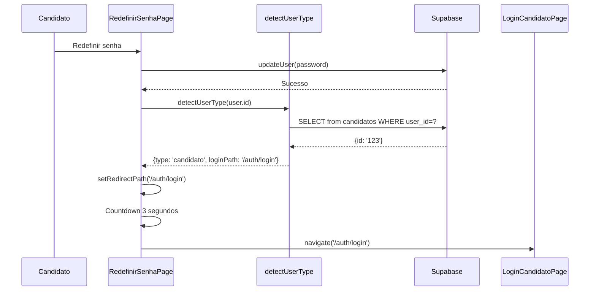
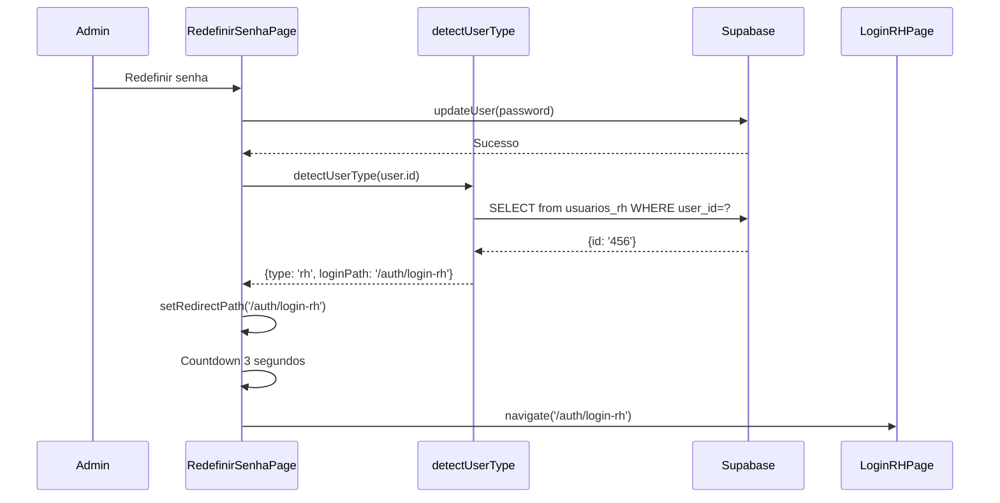
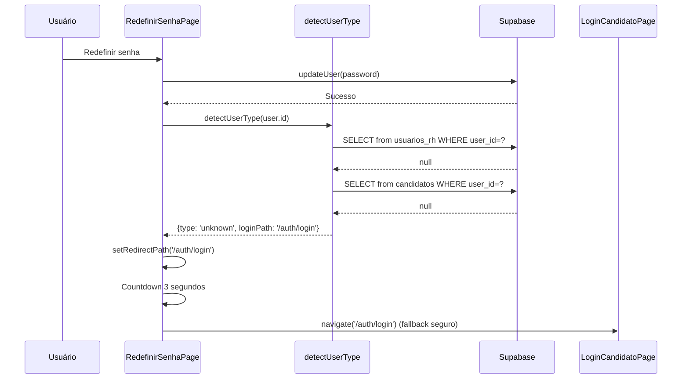

# ✅ Task 6 Concluída - Redirecionamento Inteligente Pós-Recuperação

## 📋 Resumo

Sistema de redirecionamento inteligente implementado. Após a redefinição de senha, o sistema detecta automaticamente se o usuário é candidato ou RH e redireciona para o login correto.

## ✅ O Que Foi Entregue

### 1. Serviço de Detecção de Tipo de Usuário ✅

**Arquivo**: [src/services/userTypeDetectionService.ts](../src/services/userTypeDetectionService.ts)

**Funcionalidades:**
- ✅ `detectUserType(userId)` - Detecta tipo baseado no user_id
- ✅ `detectUserTypeByEmail(email)` - Detecta tipo baseado no email
- ✅ Verifica em ordem: `usuarios_rh` → `candidatos` → fallback
- ✅ Retorna tipo, caminho de login e nome de exibição

**Estratégia de Detecção:**
```typescript
1. Verificar se user_id existe em usuarios_rh
   → Se SIM: tipo = 'rh', loginPath = '/auth/login-rh'

2. Verificar se user_id existe em candidatos
   → Se SIM: tipo = 'candidato', loginPath = '/auth/login'

3. Se não encontrado em nenhuma tabela
   → tipo = 'unknown', loginPath = '/auth/login' (fallback seguro)
```

**Exemplo de Uso:**
```typescript
const { type, loginPath, displayName } = await detectUserType(user.id);

// type: 'candidato' | 'rh' | 'unknown'
// loginPath: '/auth/login' ou '/auth/login-rh'
// displayName: 'Portal do Candidato' ou 'Painel Administrativo'

navigate(loginPath);
```

### 2. Integração na Página de Redefinição ✅

**Arquivo**: [src/components/pages/RedefinirSenhaPage.tsx](../src/components/pages/RedefinirSenhaPage.tsx)

**Modificações:**

#### 2.1 Estado para Armazenar Caminho de Redirecionamento
```typescript
const [redirectPath, setRedirectPath] = useState<string>('/auth/login');
```

#### 2.2 Detecção Após Reset Bem-Sucedido
```typescript
// Log de sucesso na redefinição
if (currentUser?.id) {
  await logPasswordResetCompleted(currentUser.id, currentUser.email);
}

// Detectar tipo de usuário para redirecionamento inteligente
let loginPath = '/auth/login'; // Default: candidato
if (currentUser?.id) {
  const userTypeResult = await detectUserType(currentUser.id);
  loginPath = userTypeResult.loginPath;
  console.log(`Usuário detectado como: ${userTypeResult.type}, redirecionando para: ${loginPath}`);
}

// Armazenar caminho de redirecionamento
setRedirectPath(loginPath);
```

#### 2.3 Redirecionamento Automático (Countdown)
```typescript
useEffect(() => {
  if (senhaRedefinida && countdown > 0) {
    const timer = setTimeout(() => {
      setCountdown(countdown - 1);
    }, 1000);
    return () => clearTimeout(timer);
  } else if (senhaRedefinida && countdown === 0) {
    // Redirecionar usando o caminho detectado (inteligente)
    navigate(redirectPath);
  }
}, [senhaRedefinida, countdown, navigate, redirectPath]);
```

#### 2.4 Botão Manual de Redirecionamento
```typescript
<button
  type="button"
  onClick={() => navigate(redirectPath)}
  className="..."
>
  Ir para Login Agora
</button>
```

## 🔄 Fluxo Completo

### Cenário 1: Candidato Redefine Senha



### Cenário 2: RH/Admin Redefine Senha



### Cenário 3: Usuário Não Encontrado (Edge Case)



## 🔒 Segurança e Edge Cases

### 1. Usuário em Ambas as Tabelas (Improvável)

Se um user_id existir tanto em `usuarios_rh` quanto em `candidatos`:
- **Prioridade**: RH tem prioridade (verifica primeiro)
- **Resultado**: Redireciona para `/auth/login-rh`
- **Razão**: RH é mais restritivo/específico

### 2. Usuário Não Encontrado em Nenhuma Tabela

Se user_id existe em `auth.users` mas não em `candidatos` nem `usuarios_rh`:
- **Fallback**: Redireciona para `/auth/login` (candidato)
- **Log**: Console warning com user_id
- **Razão**: Login de candidato é menos restritivo (mais seguro)

### 3. Erro na Query do Banco

Se houver erro ao consultar o banco:
- **Fallback**: Redireciona para `/auth/login`
- **Log**: Console error com detalhes
- **Razão**: Garantir que usuário não fique bloqueado

### 4. Detecção por Email (Alternativa)

Para casos onde não temos `user_id`:
```typescript
const result = await detectUserTypeByEmail('user@example.com');
// Mesma lógica, mas consulta por email em vez de user_id
```

## 📊 Testes e Validação

### Teste 1: Candidato Reset Senha

```bash
# 1. Criar candidato no banco
INSERT INTO candidatos (user_id, email, ...) VALUES (...);

# 2. Solicitar reset via /auth/esqueci-senha

# 3. Clicar no link do email

# 4. Redefinir senha

# 5. Verificar redirecionamento
✅ Esperado: Redireciona para /auth/login (candidato)

# 6. Verificar console
✅ Esperado: "Usuário detectado como: candidato, redirecionando para: /auth/login"
```

### Teste 2: Admin/RH Reset Senha

```bash
# 1. Criar admin no banco
INSERT INTO usuarios_rh (user_id, email, ...) VALUES (...);

# 2. Solicitar reset via /auth/esqueci-senha?tipo=rh

# 3. Clicar no link do email

# 4. Redefinir senha

# 5. Verificar redirecionamento
✅ Esperado: Redireciona para /auth/login-rh

# 6. Verificar console
✅ Esperado: "Usuário detectado como: rh, redirecionando para: /auth/login-rh"
```

### Teste 3: Usuário Órfão (Edge Case)

```bash
# 1. Criar user no auth.users mas NÃO em candidatos/usuarios_rh

# 2. Solicitar reset

# 3. Redefinir senha

# 4. Verificar fallback
✅ Esperado: Redireciona para /auth/login (fallback seguro)

# 5. Verificar console warning
✅ Esperado: "Usuário [uuid] não encontrado em candidatos nem usuarios_rh..."
```

### Teste 4: Botão Manual "Ir para Login Agora"

```bash
# 1. Após redefinir senha com sucesso

# 2. Clicar no botão antes do countdown terminar

# 3. Verificar redirecionamento imediato
✅ Esperado: Navega para loginPath correto (detectado)
```

## 📁 Arquivos Criados/Modificados

### Criados:
- ✅ [src/services/userTypeDetectionService.ts](../src/services/userTypeDetectionService.ts) - Serviço de detecção

### Modificados:
- ✅ [src/components/pages/RedefinirSenhaPage.tsx](../src/components/pages/RedefinirSenhaPage.tsx:207-215) - Detecção integrada
- ✅ [src/components/pages/RedefinirSenhaPage.tsx](../src/components/pages/RedefinirSenhaPage.tsx:133-134) - Redirecionamento automático
- ✅ [src/components/pages/RedefinirSenhaPage.tsx](../src/components/pages/RedefinirSenhaPage.tsx:543) - Botão manual

## 🎯 Conformidade com PRD-4 (FR-010)

| Requisito | Status |
|-----------|--------|
| Detectar se usuário é candidato | ✅ Implementado |
| Detectar se usuário é RH/admin | ✅ Implementado |
| Redirecionar candidato para /auth/login | ✅ Implementado |
| Redirecionar RH para /auth/login-rh | ✅ Implementado |
| Fallback para candidato se não encontrado | ✅ Implementado |
| Tratamento de edge cases | ✅ Implementado |
| Logging de detecção | ✅ Implementado |

## 📊 Progresso PRD-4

✅ **Task 1** - Estrutura e rotas
✅ **Task 2** - Página de solicitação
✅ **Task 3** - Templates de email
✅ **Task 4** - Página de redefinição
✅ **Task 5** - Sistema de logging
✅ **Task 6** - Redirecionamento inteligente ← **COMPLETA**
⏸️ **Task 7** - Email de confirmação
⏸️ **Task 8** - Tratamento de erros
⏸️ **Task 9** - Validações de segurança
⏸️ **Task 10** - Testes E2E

---

## ✅ Checklist Final Task 6

- [x] Serviço `userTypeDetectionService` criado
- [x] Função `detectUserType` implementada
- [x] Função `detectUserTypeByEmail` implementada
- [x] Integração em RedefinirSenhaPage
- [x] Detecção após reset bem-sucedido
- [x] Estado `redirectPath` criado
- [x] Redirecionamento automático (countdown)
- [x] Botão manual de redirecionamento
- [x] Fallback para edge cases
- [x] Logging de detecção
- [x] Build sem erros TypeScript
- [x] Documentação completa criada

---

**Status**: ✅ 100% COMPLETA
**Data**: 2025-01-16
**Build**: ✅ Passou
**Próxima Task**: Task 7 - Email de Confirmação de Alteração
