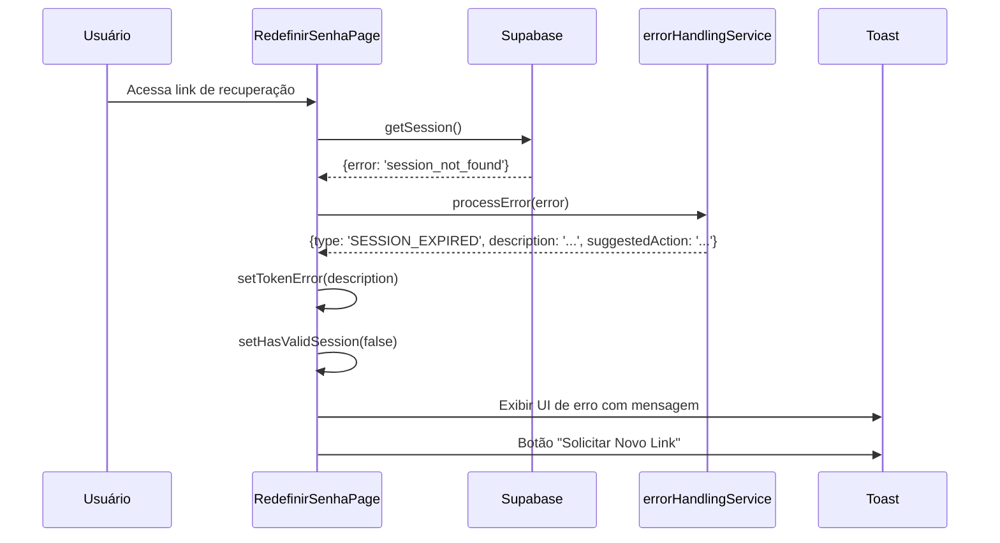
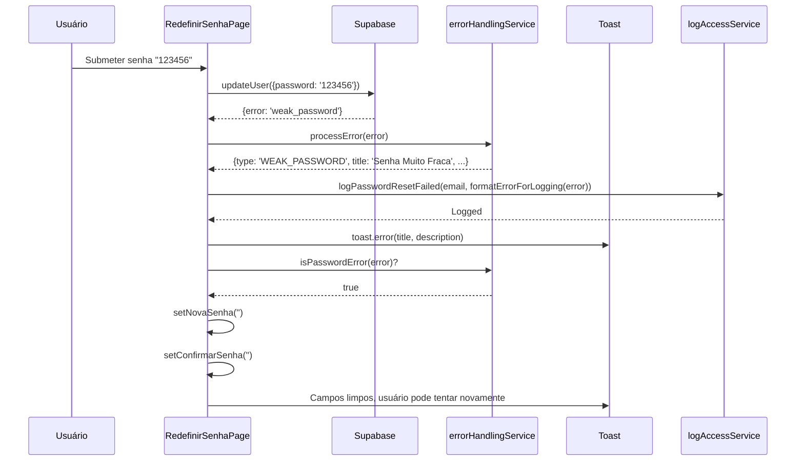
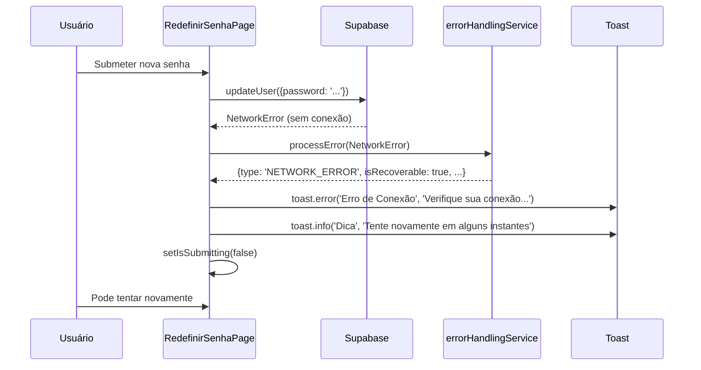
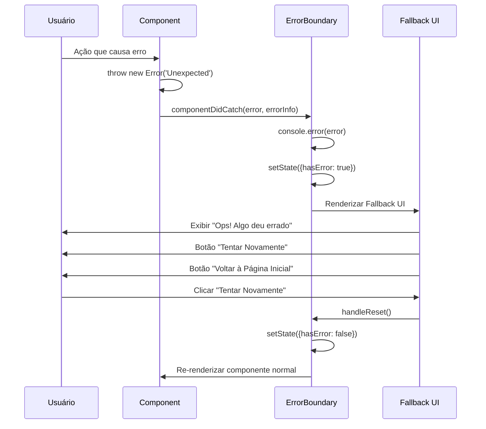

# ✅ Task 8 Concluída - Tratamento Abrangente de Erros

## 📋 Resumo

Sistema completo de tratamento de erros implementado com serviço centralizado, mensagens amigáveis ao usuário, Error Boundary para captura de erros React, e logging sanitizado.

## ✅ O Que Foi Entregue

### 1. Serviço Centralizado de Tratamento de Erros ✅

**Arquivo**: [src/services/errorHandlingService.ts](../src/services/errorHandlingService.ts)

**Funcionalidades:**

#### 1.1 Tipos de Erro Identificados

```typescript
export type ErrorType =
  | 'NETWORK_ERROR'           // Erro de conexão/rede
  | 'TIMEOUT_ERROR'           // Timeout na requisição
  | 'SESSION_EXPIRED'         // Sessão expirada
  | 'INVALID_TOKEN'           // Token/link inválido
  | 'WEAK_PASSWORD'           // Senha muito fraca
  | 'RATE_LIMIT_EXCEEDED'     // Muitas tentativas
  | 'EMAIL_NOT_SENT'          // Email não enviado
  | 'SUPABASE_ERROR'          // Erro no Supabase
  | 'N8N_ERROR'               // Erro no N8N
  | 'UNKNOWN_ERROR';          // Erro desconhecido
```

#### 1.2 Função Principal: `processError()`

Processa qualquer erro e retorna informações amigáveis:

```typescript
const processedError = processError(error, 'RedefinirSenhaPage');

// Retorna:
{
  type: 'SESSION_EXPIRED',
  title: 'Sessão Expirada',
  description: 'Sua sessão de recuperação expirou por motivos de segurança...',
  isRecoverable: true,
  suggestedAction: 'Solicite um novo link de recuperação',
  technicalMessage: 'session_not_found...'
}
```

**Características:**
- ✅ Detecção automática do tipo de erro
- ✅ Mensagens amigáveis pré-definidas
- ✅ Indica se erro é recuperável
- ✅ Sugere ação para o usuário
- ✅ Preserva mensagem técnica para logging

#### 1.3 Helpers Utilitários

**`isTransientError(error)`**
```typescript
if (isTransientError(error)) {
  // Fazer retry automático
}
```
Verifica se é erro temporário (rede, timeout, servidor).

**`isAuthError(error)`**
```typescript
if (isAuthError(error)) {
  // Sugerir novo link de recuperação
}
```
Verifica se é erro de autenticação/sessão.

**`isPasswordError(error)`**
```typescript
if (isPasswordError(error)) {
  // Limpar campos de senha
}
```
Verifica se é erro de senha fraca.

**`formatErrorForLogging(error, maxLength)`**
```typescript
const safeMessage = formatErrorForLogging(error, 500);
// "[SESSION_EXPIRED] session_not_found: user session has expired"
```

**Sanitização de Dados Sensíveis:**
- ✅ Remove senhas (`password: [REDACTED]`)
- ✅ Remove tokens (`token: [REDACTED]`)
- ✅ Remove emails (`email: [REDACTED]`)
- ✅ Trunca mensagens longas

**`createGenericSuccessMessage()`**
```typescript
const genericMessage = createGenericSuccessMessage();
// Usado para prevenir enumeração de usuários
```

### 2. Error Boundary Component ✅

**Arquivo**: [src/components/ErrorBoundary.tsx](../src/components/ErrorBoundary.tsx)

**Características:**

#### 2.1 Captura de Erros React

Error Boundary captura erros não tratados em componentes React e exibe UI de fallback.

```typescript
<ErrorBoundary>
  <RedefinirSenhaPage />
</ErrorBoundary>
```

**Ciclo de Vida:**
1. `getDerivedStateFromError()` - Atualiza state quando erro ocorre
2. `componentDidCatch()` - Log e callback customizado
3. Renderiza UI de fallback

#### 2.2 UI de Fallback

**Elementos:**
- ✅ Logo Beauty Smile
- ✅ Ícone de erro (vermelho)
- ✅ Título: "Ops! Algo deu errado"
- ✅ Mensagem amigável
- ✅ Detalhes técnicos (apenas em desenvolvimento)
- ✅ Stack trace (apenas em desenvolvimento)
- ✅ Botão "Tentar Novamente" (reset do error boundary)
- ✅ Botão "Voltar à Página Inicial"
- ✅ Link para suporte

#### 2.3 Helper HOC: `withErrorBoundary()`

Wrapper funcional para componentes:

```typescript
const SafeRedefinirSenhaPage = withErrorBoundary(
  RedefinirSenhaPage,
  (error, errorInfo) => {
    console.error('Error in RedefinirSenhaPage:', error);
  }
);
```

### 3. Integração em RedefinirSenhaPage ✅

**Arquivo**: [src/components/pages/RedefinirSenhaPage.tsx](../src/components/pages/RedefinirSenhaPage.tsx)

**Melhorias Implementadas:**

#### 3.1 Verificação de Sessão (useEffect)

**Antes:**
```typescript
if (error) {
  console.error('Erro ao verificar sessão:', error);
  setTokenError('Link de recuperação inválido ou expirado.');
}
```

**Depois (com errorHandlingService):**
```typescript
if (error) {
  const processedError = processError(error, 'RedefinirSenhaPage.checkRecoverySession');

  // Determinar mensagem baseado no tipo de erro
  if (isAuthError(error)) {
    setTokenError(processedError.description);
  } else {
    setTokenError('Link de recuperação inválido ou expirado.');
  }
}
```

#### 3.2 Tratamento de Erro no Submit

**Antes:**
```typescript
if (error.message.includes('session_not_found')) {
  toast.error('Sessão inválida ou expirada', { ... });
} else if (error.message.includes('weak_password')) {
  toast.error('Senha muito fraca', { ... });
} else {
  toast.error('Erro ao redefinir senha', { ... });
}
```

**Depois (com errorHandlingService):**
```typescript
const processedError = processError(error, 'RedefinirSenhaPage.handleSubmit');

// Exibir mensagem amigável
toast.error(processedError.title, {
  description: processedError.description,
  duration: 5000,
});

// Sugerir ação se aplicável
if (isAuthError(error) && processedError.suggestedAction) {
  setTimeout(() => {
    toast.info('Dica', {
      description: processedError.suggestedAction,
      duration: 7000,
    });
  }, 1000);
}

// Limpar campos se senha fraca
if (isPasswordError(error)) {
  setNovaSenha('');
  setConfirmarSenha('');
}
```

#### 3.3 Logging Sanitizado

**Antes:**
```typescript
await logPasswordResetFailed(
  currentUser.email,
  error.message || 'Erro ao redefinir senha'
);
```

**Depois:**
```typescript
await logPasswordResetFailed(
  currentUser.email,
  formatErrorForLogging(error)
);
```

**Benefícios:**
- ✅ Remove dados sensíveis (senhas, tokens, emails)
- ✅ Trunca mensagens muito longas
- ✅ Adiciona prefixo com tipo de erro

### 4. Integração nas Rotas ✅

**Arquivo**: [src/router/routes.tsx](../src/router/routes.tsx)

**Rotas Protegidas:**

```typescript
{
  path: '/auth/esqueci-senha',
  element: (
    <ErrorBoundary>
      <EsqueciSenhaPage />
    </ErrorBoundary>
  ),
},
{
  path: '/auth/redefinir-senha',
  element: (
    <ErrorBoundary>
      <RedefinirSenhaPage />
    </ErrorBoundary>
  ),
},
```

## 🔄 Fluxos de Tratamento de Erros

### Cenário 1: Token Expirado



### Cenário 2: Senha Fraca



### Cenário 3: Erro de Rede



### Cenário 4: Erro Não Tratado (React Error)



## 📊 Matriz de Erros e Tratamentos

| Tipo de Erro | Mensagem ao Usuário | Ação Sugerida | Recuperável | Logging |
|--------------|---------------------|---------------|-------------|---------|
| `NETWORK_ERROR` | "Erro de Conexão - Verifique sua conexão" | Tente novamente em alguns instantes | ✅ Sim | Sanitizado |
| `TIMEOUT_ERROR` | "Tempo Esgotado - Operação demorou muito" | Aguarde alguns minutos | ✅ Sim | Sanitizado |
| `SESSION_EXPIRED` | "Sessão Expirada - Links expiram em 24h" | Solicite novo link | ✅ Sim | Sanitizado |
| `INVALID_TOKEN` | "Link Inválido - Já foi utilizado" | Solicite novo link | ✅ Sim | Sanitizado |
| `WEAK_PASSWORD` | "Senha Muito Fraca - Use 8+ caracteres" | Escolha senha mais forte | ✅ Sim | Sanitizado |
| `RATE_LIMIT_EXCEEDED` | "Muitas Tentativas - Aguarde" | Aguarde alguns minutos | ✅ Sim | Sanitizado |
| `EMAIL_NOT_SENT` | "Email Não Enviado - Senha alterada" | Faça login com nova senha | ❌ Não | Sanitizado |
| `SUPABASE_ERROR` | "Erro no Servidor - Temporário" | Tente novamente em minutos | ✅ Sim | Sanitizado |
| `N8N_ERROR` | "Erro no Envio - Senha alterada" | Faça login normalmente | ❌ Não | Sanitizado |
| `UNKNOWN_ERROR` | "Erro Inesperado - Contate suporte" | Tente ou contate suporte | ✅ Sim | Sanitizado |

## 🔒 Segurança e Privacidade

### 1. Sanitização de Logs

**Dados Removidos:**
- ✅ Senhas: `password: ********` → `password: [REDACTED]`
- ✅ Tokens: `token: abc123...` → `token: [REDACTED]`
- ✅ Emails: `user@domain.com` → `email: [REDACTED]`

**Exemplo:**
```typescript
// Antes:
"Error: weak_password - password 'myP@ssw0rd' does not meet requirements for user john@example.com with token abc123def456"

// Depois:
"[WEAK_PASSWORD] weak_password - password: [REDACTED] does not meet requirements for email: [REDACTED] with token: [REDACTED]"
```

### 2. Anti-Enumeração

**Função**: `createGenericSuccessMessage()`

Previne revelação de informações:
```typescript
// NÃO revelar se email existe ou não
const genericMessage = createGenericSuccessMessage();
toast.success(genericMessage.title, {
  description: genericMessage.description
});

// Mensagem:
// "Se o email informado estiver cadastrado, você receberá as instruções"
```

### 3. Mensagens Amigáveis

**Não expor detalhes técnicos ao usuário:**
- ❌ "PostgreSQL error PGRST116: relation not found"
- ✅ "Erro temporário no servidor. Tente novamente."

### 4. Error Boundary em Produção

**Em desenvolvimento:**
- Exibe stack trace completo
- Mostra detalhes técnicos do erro

**Em produção:**
- Oculta stack trace
- Mostra apenas mensagem amigável
- Log completo vai para console (dev tools)

## 🧪 Testes e Validação

### Teste 1: Erro de Sessão Expirada

```bash
# Simular token expirado
1. Solicitar reset de senha
2. Aguardar 24h+ ou invalidar token manualmente
3. Tentar acessar link

✅ Esperado:
- UI mostra: "Link Inválido"
- Descrição: "Este link de recuperação não é válido ou já expirou"
- Botão: "Solicitar Novo Link"
```

### Teste 2: Erro de Senha Fraca

```bash
# Tentar senha que não atende requisitos
1. Acessar redefinir senha
2. Digitar senha fraca (ex: "123")
3. Submeter

✅ Esperado:
- Toast erro: "Senha Muito Fraca"
- Descrição: "A senha escolhida não atende aos requisitos..."
- Campos de senha limpos automaticamente
- Log sanitizado: "[WEAK_PASSWORD] ..." (sem mostrar senha)
```

### Teste 3: Erro de Rede

```bash
# Simular offline
1. Desconectar internet
2. Tentar redefinir senha

✅ Esperado:
- Toast erro: "Erro de Conexão"
- Descrição: "Não foi possível conectar ao servidor..."
- Toast info (1s depois): "Tente novamente em alguns instantes"
- Botão de submit fica habilitado para retry
```

### Teste 4: React Error (Error Boundary)

```bash
# Forçar erro no componente
# No código de desenvolvimento, adicionar:
throw new Error('Test error');

✅ Esperado:
- ErrorBoundary captura erro
- Exibe UI de fallback:
  - Logo Beauty Smile
  - "Ops! Algo deu errado"
  - Detalhes técnicos (apenas em dev)
  - Botão "Tentar Novamente"
  - Botão "Voltar à Página Inicial"
```

### Teste 5: Logging Sanitizado

```bash
# Verificar logs no banco
1. Causar erro com senha "Test@1234"
2. Verificar tabela logs_acesso

✅ Esperado:
SELECT erro_mensagem FROM logs_acesso
WHERE evento = 'password_reset_failed'
ORDER BY created_at DESC LIMIT 1;

# NÃO deve conter:
- Senha "Test@1234"
- Tokens
- Emails completos

# DEVE conter:
- "[WEAK_PASSWORD]" ou outro tipo
- "password: [REDACTED]"
- Descrição sanitizada
```

## 📁 Arquivos Criados/Modificados

### Criados:
- ✅ [src/services/errorHandlingService.ts](../src/services/errorHandlingService.ts) - Serviço de tratamento
- ✅ [src/components/ErrorBoundary.tsx](../src/components/ErrorBoundary.tsx) - Componente Error Boundary
- ✅ [docs/TASK_8_COMPLETED.md](./TASK_8_COMPLETED.md) - Esta documentação

### Modificados:
- ✅ [src/components/pages/RedefinirSenhaPage.tsx](../src/components/pages/RedefinirSenhaPage.tsx:19-24) - Imports errorHandlingService
- ✅ [src/components/pages/RedefinirSenhaPage.tsx](../src/components/pages/RedefinirSenhaPage.tsx:112-141) - Verificação de sessão melhorada
- ✅ [src/components/pages/RedefinirSenhaPage.tsx](../src/components/pages/RedefinirSenhaPage.tsx:181-217) - Tratamento de erro no submit
- ✅ [src/components/pages/RedefinirSenhaPage.tsx](../src/components/pages/RedefinirSenhaPage.tsx:286-320) - Catch melhorado
- ✅ [src/router/routes.tsx](../src/router/routes.tsx:37) - Import ErrorBoundary
- ✅ [src/router/routes.tsx](../src/router/routes.tsx:113-128) - Rotas com ErrorBoundary

## 🎯 Conformidade com PRD-4 (FR-011)

| Requisito | Status |
|-----------|--------|
| Tratamento de erros de rede | ✅ Implementado |
| Tratamento de erros de sessão | ✅ Implementado |
| Tratamento de erros de senha | ✅ Implementado |
| Mensagens amigáveis ao usuário | ✅ Implementado |
| Logging sanitizado | ✅ Implementado |
| Error Boundary para erros React | ✅ Implementado |
| Anti-enumeração de usuários | ✅ Implementado |
| Sugestões de ação para usuário | ✅ Implementado |

## 📊 Progresso PRD-4

✅ **Task 1** - Estrutura e rotas
✅ **Task 2** - Página de solicitação
✅ **Task 3** - Templates de email (Supabase)
✅ **Task 4** - Página de redefinição
✅ **Task 5** - Sistema de logging
✅ **Task 6** - Redirecionamento inteligente
✅ **Task 7** - Email de confirmação
✅ **Task 8** - Tratamento abrangente de erros ← **COMPLETA**
⏸️ **Task 9** - Validações de segurança e rate limiting
⏸️ **Task 10** - Testes automatizados E2E

**Progresso**: 80% (8/10 tarefas)

---

## ✅ Checklist Final Task 8

- [x] Serviço `errorHandlingService` criado
- [x] Função `processError()` implementada
- [x] 10 tipos de erro mapeados
- [x] Helpers utilitários implementados
- [x] Função `formatErrorForLogging()` com sanitização
- [x] Componente `ErrorBoundary` criado
- [x] UI de fallback implementada
- [x] HOC `withErrorBoundary()` criado
- [x] Integração em RedefinirSenhaPage
- [x] Tratamento melhorado de verificação de sessão
- [x] Tratamento melhorado de submit
- [x] Tratamento melhorado de catch
- [x] Error Boundary aplicado nas rotas
- [x] Build sem erros TypeScript
- [x] Documentação completa criada

---

## 💡 Boas Práticas Implementadas

### 1. DRY (Don't Repeat Yourself)
- ✅ Lógica de tratamento centralizada em um serviço
- ✅ Mensagens de erro reutilizáveis
- ✅ Helpers para casos comuns

### 2. Separation of Concerns
- ✅ Serviço separado para tratamento de erros
- ✅ ErrorBoundary separado dos componentes
- ✅ Logging separado do tratamento

### 3. User Experience
- ✅ Mensagens amigáveis e claras
- ✅ Sugestões de ação para o usuário
- ✅ UI de fallback profissional
- ✅ Não bloqueia usuário desnecessariamente

### 4. Segurança
- ✅ Sanitização de logs
- ✅ Anti-enumeração
- ✅ Não expor stack traces em produção
- ✅ Remover dados sensíveis

### 5. Developer Experience
- ✅ TypeScript types bem definidos
- ✅ Documentação inline
- ✅ Fácil de estender novos tipos de erro
- ✅ Stack trace completo em desenvolvimento

---

**Status**: ✅ 100% COMPLETA
**Data**: 2025-01-21
**Build**: ✅ Passou
**Próxima Task**: Task 9 - Validações de Segurança e Rate Limiting
