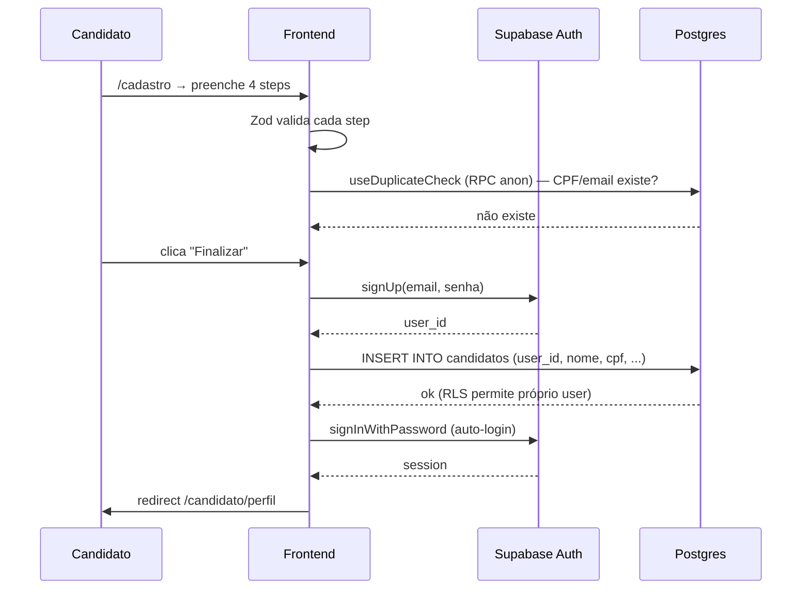
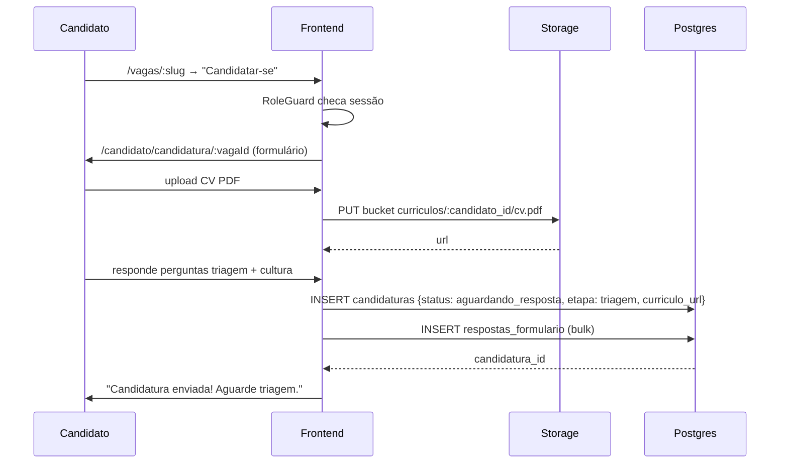
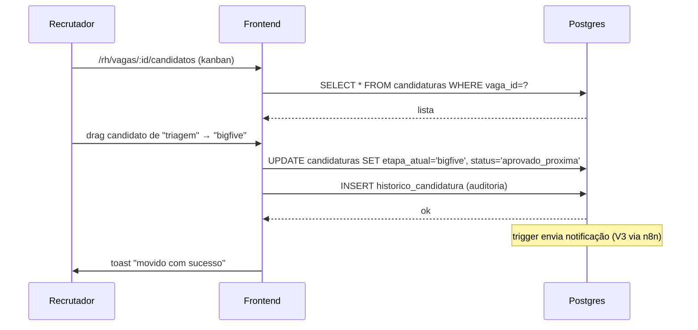
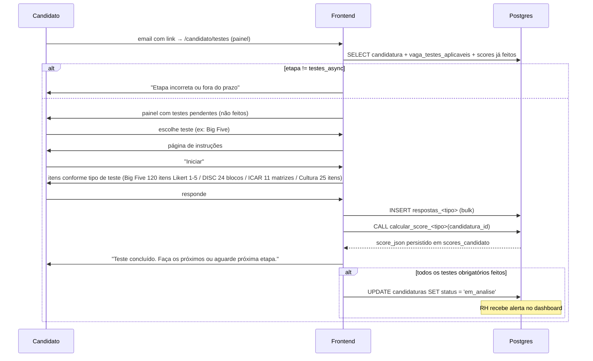

# PRD Mestre — Sistema de Recrutamento Beauty Smile

**Autor:** Fernando Costa | **Data:** 2026-04-19 | **Status:** Draft
**Nível:** Comprehensive
**Upstream:** `.planning/codebase/` (7 docs de análise brownfield) + `.claude/plans/cached-painting-stearns.md` (plano aprovado) + 27 PRDs de feature existentes em `docs/prds/0001..0021`

---

## Sumário

1. [Visão e Objetivos](#1-visão-e-objetivos)
2. [Personas e Jornadas](#2-personas-e-jornadas)
3. [Escopo In / Out](#3-escopo-in--out)
4. [Requisitos Funcionais](#4-requisitos-funcionais)
5. [Requisitos Não-Funcionais](#5-requisitos-não-funcionais)
6. [Modelo de Dados](#6-modelo-de-dados)
7. [Arquitetura Técnica](#7-arquitetura-técnica)
8. [Fluxos Críticos Detalhados](#8-fluxos-críticos-detalhados)
9. [Pipeline do Processo Seletivo (Reorganizado)](#9-pipeline-do-processo-seletivo-reorganizado)
10. [Testes Psicométricos — Mini-PRDs](#10-testes-psicométricos--mini-prds)
11. [Roadmap de Fases de Implementação](#11-roadmap-de-fases-de-implementação)
12. [Riscos e Mitigações](#12-riscos-e-mitigações)
13. [Glossário](#13-glossário)

---

## 1. Visão e Objetivos

### 1.1 Contexto

A Beauty Smile é uma rede de clínicas odontológicas que faz recrutamento contínuo de dentistas, recepcionistas, coordenadores e administrativos. Hoje o processo seletivo é fragmentado (formulários Google, planilhas, emails manuais, testes em PDF, entrevistas agendadas por WhatsApp). Há perda de dados entre etapas, falta de rastreabilidade e o RH não consegue comparar candidatos com base em critérios consistentes.

Um sistema foi iniciado em out/2025 (Figma Make → React + Supabase) mas **acabou inacabado e com bugs estruturais** (segurança, auth, schema dessincronizado) — detalhado em `.planning/codebase/CONCERNS.md`. Este PRD marca o **rebuild faseado** reaproveitando o design validado e reconstruindo a fundação.

### 1.2 Problema (MITRE Problem Framing)

**Suposições sobre o estado atual:**
- O RH gasta horas replicando candidatos entre planilhas.
- Candidatos somem entre etapas por falta de notificação.
- Decisões de aprovação são subjetivas por ausência de scores objetivos.

**Quem sofre?**
- **Recrutadores RH** — afogam em tarefas manuais, perdem bons candidatos por demora.
- **Candidatos** — não sabem em que etapa estão, sentem-se desinformados.
- **Gestores de clínica** — recebem candidatos fracos porque a triagem não filtra.
- **Empresa** — custo alto de aquisição por vaga e turnover elevado por mismatch.

**How Might We (HMW):**
- Como unificar cadastro + candidatura + triagem + testes + entrevista + decisão em um único sistema rastreável?
- Como objetivar decisões de "passou/não passou" com scores psicométricos comparáveis?
- Como manter o candidato informado sem trabalho manual do RH?

### 1.3 Objetivos (Guardrail Metrics)

| Camada | Métrica | Alvo MVP | Alvo V2 |
|---|---|---|---|
| **Primária** | Tempo médio triagem → decisão final | — (baseline) | < 10 dias úteis |
| **Secundária** | % candidatos que concluem processo completo | 60% | 80% |
| **Secundária** | Taxa de no-show em entrevistas | baseline | < 15% |
| **Secundária** | NPS do candidato (pós-processo) | medir | > 40 |
| **Guardrail** | Nenhum vazamento de dado pessoal | 0 incidentes | 0 incidentes |
| **Guardrail** | Conformidade LGPD (consentimento + direito de deleção) | 100% | 100% |
| **Guardrail** | Uptime do sistema | 99% | 99.5% |

### 1.4 Outcome Esperado

Sistema entregável e testável em fatias pequenas onde:
1. Candidato se cadastra, se candidata, faz testes psicométricos e acompanha status sem contato humano até a entrevista.
2. RH vê pipeline kanban por vaga, move candidatos entre etapas, compara scores, aprova/rejeita com trilha de auditoria.
3. Decisões técnicas (auth, schema, types, RLS) são sólidas o suficiente para sustentar uso contínuo em produção sem firefighting.

---

## 2. Personas e Jornadas

### 2.1 Persona 1 — Candidato

| Atributo | Detalhe |
|---|---|
| **Perfil** | Dentista / auxiliar / administrativo, 22–45 anos, mobile-first |
| **Tech literacy** | Média — usa Instagram, WhatsApp, recebe link da vaga por rede social |
| **Objetivo** | Conseguir emprego sem fricção, saber onde está no processo |
| **Dores** | Formulários longos, falta de retorno, testes desconectados do sistema |
| **Tabela de perfil** | `candidatos` (FK `user_id` → `auth.users`) |
| **Role** | `candidato` |

**Jornada feliz:**
```
Vê vaga (Insta/site) → clica → /vagas/:slug → "Candidatar-se" →
Se não logado: /cadastro (multi-step) → auto-login →
/candidato/candidatura/formulario/:vagaId (upload CV + perguntas) →
"Aguarde triagem" → [RH aprova em ≤ 48h] →
email com link do painel /candidato/testes →
Candidato faz testes aplicáveis à vaga (Big Five + Cultural + Cognitivo
+ DISC se pedido) na ordem que quiser, em até 7 dias →
→ entrevista online (agendada em ≤ 7 dias) →
→ entrevista presencial → referências → decisão final (≤ 3 dias).
Raven NÃO é da seleção; aparece depois no onboarding se aprovado.
```

### 2.2 Persona 2 — Recrutador RH

| Atributo | Detalhe |
|---|---|
| **Perfil** | Analista de RH, 28–45 anos, desktop-first |
| **Tech literacy** | Alta — usa ATS, Excel, Notion |
| **Objetivo** | Preencher vaga com qualidade no menor tempo |
| **Dores** | Ferramentas fragmentadas, decisões opinativas, trabalho repetitivo |
| **Tabela de perfil** | `usuarios_rh` com `role: 'recrutador'` |

**Jornada:**
```
/rh/login → /rh/dashboard (métricas: vagas abertas, candidatos em triagem,
entrevistas hoje) → /rh/vagas/nova (criar vaga com perguntas + seleção de
testes + perfil ideal do cargo) → /rh/vagas/:id/candidatos (kanban de 8
colunas: triagem → testes_async → entrevista_online → entrevista_presencial
→ referencias → avaliacao_final → aprovado/rejeitado) → move candidato
entre colunas → vê scores e perfil DISC no perfil do candidato → aprova
com ação explícita (nunca automático por score) → sistema dispara email
automático para candidato.
```

### 2.3 Persona 3 — Admin RH

| Atributo | Detalhe |
|---|---|
| **Perfil** | Coordenador/gerente de RH ou TI |
| **Objetivo** | Configurar sistema, gerenciar recrutadores, auditar |
| **Role** | `administrador` (mesmo schema `usuarios_rh`) |
| **Poderes extras** | CRUD de usuários RH, acesso a `/rh/configuracoes`, logs de auditoria, export LGPD |

---

## 3. Escopo In / Out

### 3.1 IN — MVP (Fases 0–5)

- ✅ Cadastro multi-step do candidato (DadosPessoais, Endereço, Disponibilidade, Autorizações LGPD)
- ✅ Login unificado (candidato + RH) com `authStore` único e `<RoleGuard>` baseado em `role`
- ✅ Recuperação de senha via Supabase Auth
- ✅ Listagem pública de vagas ativas (`/vagas`)
- ✅ Página de detalhe da vaga simples (`/vagas/:slug`)
- ✅ Candidatura a vaga: upload de currículo, formulário com perguntas de triagem, criação do registro em `candidaturas`
- ✅ Perfil do candidato (`/candidato/perfil`) mostrando candidaturas com status/etapa

### 3.2 IN — V2 (Fases 6–8, área RH)

- ✅ Login + Dashboard RH com métricas reais
- ✅ CRUD completo de vagas com perguntas customizadas (triagem, cultura, instruções de IA)
- ✅ Página de candidatos por vaga com kanban de 10 etapas (drag-drop)
- ✅ Transições de status com auto-advance de etapa
- ✅ Refactor do `candidaturasService.ts` em 4 arquivos especializados

### 3.3 IN — V3 (Fases 9–11)

- ✅ 4 testes psicométricos — **cada um com mini-PRD próprio escrito** (docs/prds/):
  - **Big Five (IPIP-NEO-120)** — filtro eliminatório com threshold. Banco pt-BR: repo Alheimsins MIT como seed, adaptado pela equipe
  - **ICAR-MR11 (Matrix Reasoning)** — cognitivo open-access (subset redesenhado em SVG próprio). Evita SATEPSI/CFP
  - **Fit Cultural Beauty Smile** — filtro eliminatório baseado em documentação de cultura BS (pré-existente)
  - **DISC** — **teste de contexto, NÃO eliminatório** (informa gestor na entrevista e plano de desenvolvimento pós-contratação)
- ✅ **Seleção de testes por vaga** — recrutador escolhe quais testes aplicar ao criar a vaga
- ✅ **Perfil ideal por cargo** — recrutador define pesos e thresholds de cada teste na vaga
- ✅ Execução **em paralelo** dos testes async — ver §9 pipeline
- ✅ Scores comparáveis e ordenação de candidatos por score
- ✅ Revisão humana **obrigatória** antes de qualquer rejeição por score (RNF-07a)
- ✅ **Onboarding pós-contratação** com teste cognitivo opcional — usa **ICAR60** (subset diferente do usado em seleção), NÃO Raven (SATEPSI-desfavorável desde 2023)
- ✅ Integrações n8n (emails automáticos, análise, Notion) fire-and-forget
- ✅ CI/CD, deploy Vercel (logs nativos no MVP; Sentry diferido para quando necessário)

### 3.4 OUT — Fora do Escopo (H2 obrigatória)

| Item | Por quê? | Quando (se algum dia)? |
|---|---|---|
| **Landing page dedicada por vaga (VagaLPPage)** | Decisão do usuário. Complexidade extra de editor WYSIWYG + hospedagem de assets. A página simples `/vagas/:slug` atende. | V4+, se houver demanda de marketing |
| **Raven Progressive Matrices** (seleção E onboarding) | SATEPSI-desfavorável desde 2023 (Res. CFP 31/2022); licenciamento Pearson inviável para embedding; imagens legadas deletadas do repo | Nunca — substituído por ICAR em ambos os usos |
| **Psicólogo consultor externo** | Decisão do usuário: equipe interna (inclusive IA) faz o trabalho de adaptação/validação psicométrica, com revisão humana obrigatória para decisões. Linguagem de produto: "avaliação comportamental" (não "teste psicológico") para ficar fora do escopo CFP-regulado | Contratar supervisor técnico pontual se escala exigir |
| **Automações n8n no MVP (Fases 0–8)** | Dependência externa frágil (conta pessoal n8n.cloud). Pode bloquear testes do core. | Fase 10 do roadmap |
| **Sentry no MVP** | Vercel logs nativos atendem no início; adicionar Sentry só se volume de bugs justificar | V3+ ou quando necessário |
| **App mobile nativo** | SPA responsivo atende mobile-first em web | 2027+ |
| **Multi-tenant (várias empresas)** | Sistema é single-tenant Beauty Smile | Nunca (usar Workable/Gupy se necessário) |
| **Integração com sistemas de folha (Senior, TOTVS)** | Escopo apenas seleção, não admissão | V4 |
| **Vídeo-entrevista em plataforma própria** | Usar Google Meet/Zoom e só armazenar link | Nunca |
| **IA generativa para triagem automática de CV** | Custo e risco de viés | V3+, com auditoria de fairness |
| **Chatbot com candidato** | Canal já existe por email + WhatsApp manual | V3+ |
| **Modo offline** | Não é caso de uso (conexão disponível em clínicas) | Nunca |
| **Workshop de definição de valores Beauty Smile** | Beauty Smile já tem documentação de cultura em Claude Project dedicado — input direto para o PRD de Fit Cultural | Nunca — insumo já existe |

---

## 4. Requisitos Funcionais

### 4.1 Candidato — Cadastro

| ID | Requisito | Aceite | Prioridade |
|---|---|---|---|
| RF-01 | Candidato preenche formulário multi-step de 4 etapas (Dados, Endereço, Disponibilidade, Autorizações) | Fluxo completo persiste em `candidatos` + `auth.users` | Must |
| RF-02 | Validação de CPF (dígito verificador + formato) em tempo real | CPF inválido mostra erro antes de submeter | Must |
| RF-03 | Validação de duplicata de CPF e email contra base existente | Mensagem clara "CPF já cadastrado" com link para login | Must |
| RF-04 | Auto-preenchimento de endereço via ViaCEP | CEP válido preenche rua, bairro, cidade, UF | Must |
| RF-05 | Upload de foto de perfil (opcional) | Arquivo aceito: jpg/png/webp, < 2MB | Should |
| RF-06 | Aceite explícito dos termos LGPD | Checkbox obrigatório; sem aceite, botão "Finalizar" desabilitado | Must |
| RF-07 | Auto-login após cadastro bem-sucedido | Usuário vai direto para `/candidato/perfil` | Must |

### 4.2 Candidato — Autenticação

| ID | Requisito | Aceite | Prioridade |
|---|---|---|---|
| RF-08 | Login com email + senha | Credenciais válidas → redirect; inválidas → mensagem clara | Must |
| RF-09 | Checkbox "Lembrar-me" controla `persistSession` do Supabase | Ativado: sessão sobrevive a fechar navegador. Desativado: sessão expira ao fechar aba. | Must |
| RF-10 | Recuperação de senha por email | Email com link válido por 1h; redefinição funciona | Must |
| RF-11 | Logout limpa sessão em todas as abas | `onAuthStateChange` propaga | Must |
| RF-12 | Rota protegida sem sessão redireciona para `/auth/login` com `?redirect=` | Usuário volta ao destino após login | Must |

### 4.3 Candidato — Candidatura

| ID | Requisito | Aceite | Prioridade |
|---|---|---|---|
| RF-13 | Listagem pública de vagas ativas (`/vagas`) | Só mostra `status = 'ativa'` | Must |
| RF-14 | Página de detalhe da vaga (`/vagas/:slug`) com descrição, requisitos, botão "Candidatar-se" | Botão leva ao formulário (se logado) ou ao login (se não) | Must |
| RF-15 | Formulário de candidatura com upload de currículo (PDF, < 5MB) | Arquivo em Supabase Storage bucket `curriculos` | Must |
| RF-16 | Resposta às perguntas de triagem customizadas da vaga | Respostas salvas em `formularios_candidatura` (nova tabela) | Must |
| RF-17 | Registro de candidatura vinculando `candidato_id + vaga_id` com `status = 'aguardando_resposta'` e `etapa_atual = 'triagem'` | Candidatura aparece em "Meu Perfil" | Must |
| RF-18 | Prevenção de candidatura duplicada (mesmo candidato + mesma vaga) | Mensagem clara se já candidatado | Must |

### 4.4 Candidato — Perfil

| ID | Requisito | Aceite | Prioridade |
|---|---|---|---|
| RF-19 | Listagem de candidaturas do candidato com status + etapa + data | Sem mock; dados reais via `useCandidaturas` | Must |
| RF-20 | Edição de dados pessoais | PATCH em `candidatos` com validação | Should |
| RF-21 | Upload/troca de foto de perfil | Storage bucket `avatares` | Could |
| RF-22 | Exclusão de conta (direito LGPD) | Soft-delete + anonimização + email de confirmação | Must |

### 4.5 RH — Autenticação e Dashboard

| ID | Requisito | Aceite | Prioridade |
|---|---|---|---|
| RF-23 | Login RH em `/rh/login` usando mesmo `authStore` unificado | Role lido de `usuarios_rh` | Must |
| RF-24 | Sessão RH com timeout de inatividade (30 min) | `useSessionTimeout` | Should |
| RF-25 | Dashboard RH com métricas: total vagas abertas, candidatos em triagem, entrevistas esta semana, aprovados este mês | Via RPC Postgres (não N selects) | Must |
| RF-26 | Filtros rápidos no dashboard (últimos 7/30/90 dias) | Queries parametrizadas | Should |

### 4.6 RH — CRUD Vagas

| ID | Requisito | Aceite | Prioridade |
|---|---|---|---|
| RF-27 | Criar vaga com título, descrição, requisitos, cidade, estado, modalidade (presencial/remoto/híbrido), tipo contrato, salário, status inicial `rascunho` | Slug gerado automaticamente, único | Must |
| RF-28 | Editar vaga (todas as colunas) | Histórico de alterações em `logs_acesso` | Should |
| RF-29 | Perguntas de triagem customizadas por vaga (até 10) | Salvas em `perguntas_triagem_vaga` | Must |
| RF-30 | Perguntas de fit cultural customizadas por vaga (até 10) | Salvas em `perguntas_cultura_vaga` | Should |
| RF-31 | Instruções para IA de análise (campo texto livre) | Salvas em coluna `instrucoes_ia` da `vagas` | Could |
| RF-32 | Mudar status: `rascunho → ativa → inativa → arquivada` | Enum `status_vaga`; transição validada | Must |
| RF-33 | Duplicar vaga | Novo slug único; perguntas copiadas | Should |
| RF-33a | **Selecionar quais testes aplicar à vaga** (Big Five, DISC, Cognitivo/ICAR, Cultura) — marcar cada um como `obrigatório` / `opcional` / `não-aplicar` | Salva em `vaga_testes_aplicaveis` | Must (V3) |
| RF-33b | **Definir perfil ideal por cargo** — para cada teste selecionado, recrutador define peso (0-100), threshold mínimo eliminatório (quando aplicável) e faixas ideais dos scores | Salva em `vaga_testes_aplicaveis.peso`, `threshold_eliminatorio`, `faixa_ideal_json` | Must (V3) |
| RF-33c | **Templates de perfil ideal por cargo** — RH salva templates reutilizáveis (ex: "Dentista Sênior", "Recepcionista") para acelerar criação de vagas similares | Tabela `templates_perfil_vaga` | Should (V3) |

### 4.7 RH — Gestão de Candidatos e Kanban

| ID | Requisito | Aceite | Prioridade |
|---|---|---|---|
| RF-34 | Lista geral de candidatos (`/rh/candidatos`) com filtros por vaga, etapa, status | Paginação + ordenação | Must |
| RF-35 | Perfil do candidato visto pelo RH (`/rh/candidatos/:id`) com dados pessoais, candidaturas, scores, currículo | Todos os dados em uma tela | Must |
| RF-36 | Kanban por vaga (`/rh/vagas/:id/candidatos`) com 10 colunas (enum `etapa_processo`) | Drag-drop move candidato entre etapas | Must |
| RF-37 | Transição de status respeitando enum `status_candidatura` (sem `'desistente'` — valor inválido) | Validação no DB | Must |
| RF-38 | Auto-advance de etapa ao marcar `aprovado_proxima` | Ex.: `triagem + aprovado_proxima` → `bigfive` | Must |
| RF-39 | Ordenação de candidatos por score (quando existir) | `ORDER BY score DESC NULLS LAST` | Should |
| RF-40 | Trilha de auditoria (quem moveu quem, quando) | Tabela `historico_candidatura` | Should |

### 4.8 Testes Psicométricos

Ver §10 para mini-PRDs detalhados. Requisitos agregados:

| ID | Requisito | Aceite | Prioridade |
|---|---|---|---|
| RF-41 | Candidato acessa teste atual da etapa em `/candidato/testes/:tipo` | Só o teste da etapa corrente está acessível | Must (V3) |
| RF-42 | Cada teste tem página de instrução + execução + confirmação | Timer visível quando aplicável | Must (V3) |
| RF-43 | Respostas salvas em tabela dedicada (`respostas_bigfive`, etc.) | Uma linha por resposta (evita JSON blob) | Must (V3) |
| RF-44 | Score calculado por RPC determinístico no Postgres | Mesmas respostas → mesmo score sempre | Must (V3) |
| RF-45 | Score acessível ao RH no perfil do candidato | Visualização com faixas/percentis | Must (V3) |
| RF-46 | Candidato pode exportar seus resultados (LGPD) | JSON + PDF | Should (V3) |
| RF-47 | Candidato pode excluir seus resultados (direito LGPD) | Cascade com confirmação | Must (V3) |

### 4.9 Configurações e Administração

| ID | Requisito | Aceite | Prioridade |
|---|---|---|---|
| RF-48 | Admin cria/edita/desativa usuários RH | `/rh/configuracoes/usuarios` | Should |
| RF-49 | Admin vê logs de acesso | Filtros por usuário, data, ação | Could |
| RF-50 | Templates de email customizáveis (futuro) | Integração com Supabase email templates | Won't (V2+) |

---

## 5. Requisitos Não-Funcionais

### 5.1 Segurança

| ID | Requisito | Aceite |
|---|---|---|
| RNF-01 | **`service_role` do Supabase NUNCA no client** | Busca em `src/**` retorna zero matches de `SERVICE_ROLE_KEY` |
| RNF-02 | Operações privilegiadas (criar usuário, bypass RLS) em Edge Functions | Função invocada via `supabase.functions.invoke()` |
| RNF-03 | RLS habilitado em 100% das tabelas com dados de usuário | Auditoria manual + script de verificação |
| RNF-04 | Rate limiting em endpoints públicos (duplicate check, login) | Supabase rate limits + RPC com `pg_sleep` se preciso |
| RNF-05 | Senha mínima 8 caracteres com 1 maiúscula + 1 número | Validação client + Supabase Auth policy |
| RNF-06 | Rotas protegidas **realmente** redirecionam sem sessão | E2E suite cobre isso |
| RNF-07 | Dev menu oculto em produção | Gated por `import.meta.env.DEV` |
| RNF-07a | **Revisão humana obrigatória antes de rejeitar candidato por score de teste** — sistema nunca rejeita automaticamente | UI não permite transição automática para `rejeitado`; sempre requer ação explícita de um usuário RH com registro em `historico_candidatura.por_usuario` |

### 5.1.1 SLAs de Processo (prazos entre etapas)

| ID | Requisito | Aceite |
|---|---|---|
| RNF-SLA-01 | **Triagem:** RH decide em ≤ 48h úteis após candidatura | Dashboard RH alerta candidaturas pendentes > 48h |
| RNF-SLA-02 | **Teste disponível → candidato responde:** janela de 7 dias corridos | Link expira; RH pode reemitir |
| RNF-SLA-03 | **Gap entre etapas assíncronas (teste → próximo teste):** ≤ 5 dias úteis | Notificação automática ao candidato a cada 2 dias |
| RNF-SLA-04 | **Entrevista online:** agendamento em ≤ 7 dias úteis após liberação da etapa | RH recebe alerta se atrasar |
| RNF-SLA-05 | **Decisão final após `avaliacao_final`:** ≤ 3 dias úteis | Email automático ao candidato com desfecho |
| RNF-SLA-06 | **Feedback ao candidato rejeitado:** email automático em ≤ 24h após `rejeitado` | Template padrão + observação opcional do RH |

### 5.2 LGPD

| ID | Requisito | Aceite |
|---|---|---|
| RNF-08 | Consentimento explícito e versionado | Coluna `termos_aceitos_versao` + `termos_aceitos_em` |
| RNF-09 | Direito de acesso (exportar todos os dados) | `/candidato/privacidade/exportar` gera JSON |
| RNF-10 | Direito de deleção (esquecimento) — solicitação do candidato | Soft-delete imediato → anonimização após 30 dias |
| RNF-10a | **Retenção automática de dados de candidato rejeitado: 1 ano** após a data de rejeição | Job Postgres (`pg_cron` ou equivalente) anonimiza registros vencidos diariamente; candidato recebe email 30 dias antes da anonimização avisando |
| RNF-10b | Retenção de dados de candidato aprovado (contratado): migrado para `funcionarios` (fora deste sistema) | Pipeline de handoff a definir em V4 |
| RNF-11 | Base legal documentada (consentimento para recrutamento) | Coluna `base_legal` em `candidatos` (valor default: `'consentimento'`) |
| RNF-12 | Logs de acesso a dados sensíveis | Tabela `logs_acesso` com retenção 2 anos |
| RNF-12a | **Linguagem do produto:** nunca "teste psicológico"; sempre "avaliação comportamental", "questionário de perfil", "avaliação cognitiva open-access". Protege da regulação CFP (Resolução 31/2022) | Revisão de copy em todas as telas do candidato antes do go-live |

### 5.3 Performance

| ID | Requisito | Aceite |
|---|---|---|
| RNF-13 | Lighthouse Mobile > 80 (Performance + Accessibility) | CI valida |
| RNF-14 | TTFB < 300ms p95 | Vercel analytics |
| RNF-15 | Listagens com paginação (< 50 rows por página) | Infinite scroll ou pagination controls |
| RNF-16 | Query de dashboard RH em < 500ms | RPC única no Postgres |

### 5.4 Acessibilidade

| ID | Requisito | Aceite |
|---|---|---|
| RNF-17 | WCAG 2.1 AA | Axe passa em todas as páginas principais |
| RNF-18 | Navegação por teclado em toda a UI | Tab order correto; focus visível |
| RNF-19 | Labels em todos os inputs | Lint axe + revisão |
| RNF-20 | Contraste de cores ≥ 4.5:1 texto, 3:1 UI | Verificado no design system |

### 5.5 Confiabilidade

| ID | Requisito | Aceite |
|---|---|---|
| RNF-21 | Uptime 99% (downtime ≤ 7h/mês) | Medido via Vercel (plano Pro já contratado) |
| RNF-22 | Backup diário do Postgres | Supabase automático (plano Pro já contratado) |
| RNF-23 | Recuperação de estado em <5s após erro de rede | TanStack Query retry + UI skeleton |
| RNF-24 | Observabilidade de erros em produção | **MVP: Vercel Runtime Logs + Function Logs nativos** (já incluído no Pro). ErrorBoundary client-side loga via `console.error` (capturado pelo Vercel). Sentry opcional em V3+ se volume justificar |
| RNF-24a | Alertas de erro crítico (auth quebrado, RLS vazando) | Vercel Log Drains → email / webhook custom (config Fase 11) |

### 5.6 Desenvolvimento e Operações

| ID | Requisito | Aceite |
|---|---|---|
| RNF-25 | `database.types.ts` gerado automaticamente | Script `npm run db:types` + hook pré-commit |
| RNF-26 | CI: **lint + build em TODO PR**; **E2E só em merge para `main`** (economia de GitHub Actions minutes) | GitHub Actions workflow split |
| RNF-27 | Deploy preview por branch | Vercel preview URLs (plano Pro) |
| RNF-28 | Env vars separadas por ambiente (dev/preview/prod) | `vercel env pull` |
| RNF-29 | **Edge Functions hospedadas no Supabase** (não Vercel Functions) | Deno runtime; deploy via `supabase functions deploy` |
| RNF-30 | Single-tenant Beauty Smile — sem `tenant_id` nas tabelas | RLS simples baseado em `auth.uid()` |

---

## 6. Modelo de Dados

### 6.1 Entidades Principais (ERD)

```
┌──────────────┐         ┌───────────────┐         ┌──────────────┐
│  auth.users  │1───────1│  candidatos   │1───────*│ candidaturas │
│ (Supabase)   │         │               │         │              │
└──────┬───────┘         └───────────────┘         └──────┬───────┘
       │                                                   │ *
       │1                                                  │
       │                                                   │ 1
┌──────┴───────┐                                   ┌───────┴──────┐
│ usuarios_rh  │                                   │    vagas     │
│              │                                   │              │
└──────────────┘                                   └──────────────┘
                                                           │1
                                                           │
                           ┌───────────────────────────────┤
                           │                               │
                    ┌──────┴──────────┐           ┌────────┴──────────┐
                    │ perguntas_      │           │ perguntas_cultura │
                    │ triagem_vaga    │           │ _vaga             │
                    └─────────────────┘           └───────────────────┘

┌──────────────┐ 1    * ┌─────────────────────────┐
│ candidaturas │────────│ respostas_formulario    │
└──────────────┘        │ (triagem + cultura)     │
                        └─────────────────────────┘

┌──────────────┐ 1    * ┌──────────────────┐
│ candidaturas │────────│ respostas_bigfive│
└──────────────┘        └──────────────────┘
          │
          ├────────*──► respostas_disc
          ├────────*──► respostas_raven
          ├────────*──► respostas_cultura
          └────────*──► scores_candidato  (tipo_teste + score_json)

┌──────────────┐ 1    * ┌─────────────────────┐
│ candidaturas │────────│ historico_          │
│              │        │ candidatura         │ (auditoria: etapa_de, etapa_para, por_usuario, em)
└──────────────┘        └─────────────────────┘
```

### 6.2 Tabelas Core (schema-level)

**`candidatos`** (preservar do schema atual, remover colunas órfãs)
```sql
id               uuid PK DEFAULT gen_random_uuid()
user_id          uuid UNIQUE NOT NULL REFERENCES auth.users(id) ON DELETE CASCADE
nome_completo    text NOT NULL
cpf              text UNIQUE NOT NULL
email            text UNIQUE NOT NULL
celular          text NOT NULL
data_nascimento  date
linkedin         text
instagram        text
-- endereço
cep              text
rua              text
numero           text
complemento      text
bairro           text
cidade           text
estado           text
-- disponibilidade
disponibilidade_inicio       date
disponibilidade_modalidade   text
pretensao_salarial           numeric
-- lgpd
termos_aceitos_em     timestamptz NOT NULL
termos_aceitos_versao text NOT NULL
base_legal            text NOT NULL DEFAULT 'consentimento'
-- soft delete
deleted_at       timestamptz
created_at       timestamptz DEFAULT now()
updated_at       timestamptz DEFAULT now()
```

**`usuarios_rh`** (preservar)
```sql
id         uuid PK
user_id    uuid UNIQUE REFERENCES auth.users(id)
nome       text NOT NULL
email      text UNIQUE NOT NULL
role       text NOT NULL CHECK (role IN ('recrutador','administrador'))
ativo      boolean DEFAULT true
created_at timestamptz
```

**`vagas`** (corrigir — usar `status` enum, não boolean `ativa`)
```sql
id                uuid PK
slug              text UNIQUE NOT NULL
titulo            text NOT NULL
descricao         text
requisitos        text
cidade            text
estado            text
modalidade        text CHECK (modalidade IN ('presencial','remoto','hibrido'))
tipo_contrato     text CHECK (tipo_contrato IN ('clt','pj','estagio','temporario'))
salario_min       numeric
salario_max       numeric
status            status_vaga NOT NULL DEFAULT 'rascunho'
instrucoes_ia     text
criada_por        uuid REFERENCES usuarios_rh(id)
created_at        timestamptz DEFAULT now()
updated_at        timestamptz
```

**`candidaturas`** (corrigir uso de `data_candidatura` → usar `created_at`)
```sql
id                  uuid PK
candidato_id        uuid NOT NULL REFERENCES candidatos(id) ON DELETE CASCADE
vaga_id             uuid NOT NULL REFERENCES vagas(id) ON DELETE RESTRICT
status              status_candidatura NOT NULL DEFAULT 'aguardando_resposta'
etapa_atual         etapa_processo NOT NULL DEFAULT 'triagem'
curriculo_url       text
data_decisao_final  timestamptz
observacoes_rh      text
created_at          timestamptz DEFAULT now()
updated_at          timestamptz
UNIQUE (candidato_id, vaga_id)
```

**`perguntas_triagem_vaga`** e **`perguntas_cultura_vaga`** (novas)
```sql
id         uuid PK
vaga_id    uuid REFERENCES vagas(id) ON DELETE CASCADE
ordem      int NOT NULL
pergunta   text NOT NULL
tipo       text NOT NULL CHECK (tipo IN ('texto','escolha','likert_5'))
opcoes     jsonb            -- se tipo = 'escolha', lista de opções
obrigatoria boolean DEFAULT true
```

**`respostas_formulario`** (substitui o TODO de `formularios_candidatura`)
```sql
id             uuid PK
candidatura_id uuid REFERENCES candidaturas(id) ON DELETE CASCADE
pergunta_id    uuid NOT NULL
tipo_pergunta  text NOT NULL CHECK (tipo_pergunta IN ('triagem','cultura'))
resposta       text
resposta_json  jsonb
created_at     timestamptz DEFAULT now()
```

**`scores_candidato`** (unificado)
```sql
id             uuid PK
candidatura_id uuid REFERENCES candidaturas(id) ON DELETE CASCADE
tipo_teste     text CHECK (tipo_teste IN ('bigfive','disc','cognitivo','cultura'))
score_json     jsonb NOT NULL  -- estrutura definida por cada mini-PRD
score_principal numeric         -- score agregado para ordenação rápida
calculado_em   timestamptz DEFAULT now()
versao_modelo  text NOT NULL    -- ex: 'bigfive-ipip120-v1', 'cognitivo-icar-matrix-v1'
UNIQUE (candidatura_id, tipo_teste)
```

**`vaga_testes_aplicaveis`** (nova — RF-33a/b: seleção e perfil ideal por vaga)
```sql
id                      uuid PK
vaga_id                 uuid REFERENCES vagas(id) ON DELETE CASCADE
tipo_teste              text CHECK (tipo_teste IN ('bigfive','disc','cognitivo','cultura'))
aplicar                 text NOT NULL CHECK (aplicar IN ('obrigatorio','opcional','nao_aplicar')) DEFAULT 'nao_aplicar'
peso                    int NOT NULL DEFAULT 0 CHECK (peso BETWEEN 0 AND 100)  -- peso relativo no score final
threshold_eliminatorio  numeric          -- NULL = não eliminatório (caso do DISC); numeric = score mínimo
faixa_ideal_json        jsonb            -- ex: Big Five → {abertura:{min:50,max:90}, conscienciosidade:{min:60,max:95}, ...}
ordem                   int              -- ordem de apresentação ao candidato (testes podem rodar em paralelo ou serial)
created_at              timestamptz DEFAULT now()
UNIQUE (vaga_id, tipo_teste)
```

**`templates_perfil_vaga`** (nova — RF-33c: templates reutilizáveis por cargo)
```sql
id             uuid PK
nome           text NOT NULL        -- ex: "Dentista Sênior", "Recepcionista", "Coordenador Regional"
descricao      text
config_json    jsonb NOT NULL       -- snapshot de vaga_testes_aplicaveis + perguntas padrão
criado_por     uuid REFERENCES usuarios_rh(id)
ativo          boolean DEFAULT true
created_at     timestamptz DEFAULT now()
updated_at     timestamptz
```

**`historico_candidatura`** (nova, auditoria)
```sql
id             uuid PK
candidatura_id uuid REFERENCES candidaturas(id) ON DELETE CASCADE
etapa_de       etapa_processo
etapa_para     etapa_processo
status_de      status_candidatura
status_para    status_candidatura
por_usuario    uuid REFERENCES auth.users(id)
motivo         text
em             timestamptz DEFAULT now()
```

### 6.3 Enums

```sql
CREATE TYPE status_vaga AS ENUM ('rascunho','ativa','inativa','arquivada');

CREATE TYPE status_candidatura AS ENUM (
  'aguardando_resposta','em_analise','aprovado_proxima','rejeitado','finalizado'
);

-- NOVO: pipeline reordenado com testes async em paralelo + nova etapa referencias
CREATE TYPE etapa_processo AS ENUM (
  'triagem',
  'testes_async',          -- "bloco" onde rodam Big Five + DISC + Cognitivo + Cultura em paralelo (conforme vaga_testes_aplicaveis)
  'entrevista_online',
  'entrevista_presencial',
  'referencias',            -- NOVA: checagem de referências profissionais
  'avaliacao_final',
  'aprovado',
  'rejeitado'
);
```

> **Importante:** O enum `etapa_processo` foi **reorganizado** (ver §9). Antes tinha 10 valores com testes em série (bigfive → disc → entrevista → raven → cultura). Agora tem 8 etapas com os testes agrupados em `testes_async` rodando em paralelo. A granularidade "qual teste o candidato está fazendo" vive em `vaga_testes_aplicaveis` + `scores_candidato`.

### 6.4 Políticas RLS (princípios)

- `candidatos`: SELECT/UPDATE próprio registro (`auth.uid() = user_id`). Nada anônimo (mover duplicate check para RPC `SECURITY DEFINER`).
- `candidaturas`: candidato vê suas próprias; RH vê todas.
- `vagas`: SELECT público só para `status = 'ativa'`; RH CRUD completo.
- `usuarios_rh`: só admin lê/escreve.
- `scores_candidato`: candidato vê os próprios; RH vê todos.

### 6.5 Storage Buckets

| Bucket | Acesso | Conteúdo |
|---|---|---|
| `avatares` | candidato own | Foto de perfil |
| `curriculos` | candidato upload + RH read | PDF de currículo |
| `icar-imagens` | autenticado read | Estímulos visuais do teste cognitivo ICAR (usado em seleção — ver §10.3) |
| `raven-imagens-onboarding` | autenticado read (apenas funcionários ativos) | Estímulos do Raven — **usado apenas em onboarding pós-contratação**, não em seleção (ver §10.3.1) |

---

## 7. Arquitetura Técnica

### 7.1 Stack

| Camada | Tech | Versão |
|---|---|---|
| **Frontend** | React + Vite + TypeScript (strict) | React 18, Vite 5+ |
| **UI** | Tailwind CSS + shadcn/ui (Radix primitives) | Tailwind 3 |
| **Forms** | React Hook Form + Zod | RHF 7+, Zod 3+ |
| **Estado servidor** | TanStack Query | v5 |
| **Estado cliente** | Zustand + `persist` | último |
| **Router** | react-router-dom | v6 |
| **Backend** | Supabase (Postgres + Auth + Storage + Edge Functions) | latest |
| **Edge Functions** | Deno + TypeScript | — |
| **Testes** | Playwright (E2E) + Vitest (unit) | latest |
| **Lint/Format** | ESLint + Prettier + Husky (NOVO) | latest |
| **CI/CD** | GitHub Actions + Vercel | — |
| **Observabilidade** | Sentry | V3 (Fase 11) |
| **Automação externa** | n8n (hosted) | V3 (Fase 10) |

### 7.2 Layers

```
┌───────────────────────────────────────────────────────┐
│                   Browser (React SPA)                 │
│ ┌───────────────────────────────────────────────────┐ │
│ │ Pages (src/features/<domain>/pages/)              │ │
│ │   ↓                                               │ │
│ │ Hooks TanStack Query (src/features/*/hooks/)      │ │
│ │   ↓                                               │ │
│ │ Services (src/features/*/services/)               │ │
│ │   ↓                                               │ │
│ │ Supabase Client (anon) — src/lib/supabase/client  │ │
│ │   ↓                                               │ │
│ │ AuthStore único (Zustand) — src/store/authStore   │ │
│ └───────────────────────────────────────────────────┘ │
└──────────────┬────────────────────────────┬──────────┘
               │                            │
    ┌──────────▼──────────┐        ┌────────▼───────────┐
    │  Supabase           │        │  Edge Functions    │
    │  (RLS + Auth +      │◄───────┤  (service_role ops)│
    │   Storage)          │        │                    │
    └──────────┬──────────┘        └────────────────────┘
               │
    ┌──────────▼──────────┐
    │  Postgres + RPCs    │
    │  (scores, duplic.)  │
    └─────────────────────┘
```

### 7.3 Pipeline de Types

```
supabase/migrations/*.sql  ─┐
                            ├─► npm run db:types ─► database.types.ts
(alterações de schema)      ┘       (hook pre-commit)      │
                                                            ▼
                                              TS strict em todo src/
```

### 7.4 Organização de Código

```
src/
├── features/
│   ├── auth/           # authStore, RoleGuard, login pages
│   ├── cadastro/       # CadastroMultiStepForm (preservado)
│   ├── vagas/          # CRUD vagas + useVagas
│   ├── candidaturas/   # NOVO: split do candidaturasService
│   │   ├── services/
│   │   │   ├── candidaturasQueryService.ts
│   │   │   ├── candidaturasMutationService.ts
│   │   │   ├── candidaturasStatusService.ts
│   │   │   └── candidaturasWebhookService.ts
│   │   └── hooks/
│   ├── testes/         # Big Five, DISC, Raven, Cultura (V3)
│   ├── dashboard-rh/   # métricas + RPC
│   └── admin/          # CRUD usuarios_rh
├── components/
│   ├── ui/             # shadcn primitives (preservado)
│   ├── layout/         # RHLayout, CandidatoLayout
│   └── RoleGuard.tsx
├── lib/
│   ├── supabase/
│   │   └── client.ts   # APENAS anon; sem service_role
│   └── utils/
├── store/
│   └── authStore.ts    # UNIFICADO com role
└── router/
    └── routes.tsx
```

### 7.5 Convenções

- **Nomenclatura:** domínio em `pt-BR` (nomes de tabelas, colunas, enums), código técnico em `en` (funções, utils), mensagens ao usuário em `pt-BR`.
- **Imports:** alias absoluto `@/` → `src/`.
- **Commits:** conventional commits (`feat:`, `fix:`, `refactor:`, `chore:`).
- **Branches:** `feat/<fase>-<descricao>`, uma fase do roadmap = uma branch.
- **Review:** PR obrigatório com CI verde antes de merge em `main`.

---

## 8. Fluxos Críticos Detalhados

### 8.1 Fluxo Cadastro do Candidato



### 8.2 Fluxo de Candidatura



### 8.3 Fluxo de Triagem RH



### 8.4 Fluxo de Teste Psicométrico (genérico — detalhes por teste em §10)



---

## 9. Pipeline do Processo Seletivo (Reorganizado)

**Mudança de design:** a versão anterior tinha 10 etapas com testes **em série** (bigfive → disc → entrevista → raven → cultura), o que gastava tempo de humano (entrevista) antes de saber se o candidato passava nos filtros cognitivos/culturais. **Novo pipeline** agrupa os testes assíncronos numa etapa paralela e reordena para respeitar custo crescente (async barato → humano caro).

### 9.1 Pipeline Atualizado (8 etapas)

| # | Etapa | O que acontece | Quem age | Duração típica | Artefato gerado |
|---|---|---|---|---|---|
| 1 | `triagem` | RH avalia currículo + respostas do formulário de candidatura | RH | ≤ 48h (SLA) | Decisão: avançar/rejeitar |
| 2 | `testes_async` | **Todos os testes aplicáveis à vaga** (conforme `vaga_testes_aplicaveis`) rodam em paralelo. Candidato faz Big Five + Cultura + Cognitivo/ICAR (+ DISC se vaga pedir) — ordem à escolha do candidato. | Candidato | Até 7 dias (SLA) | 1 linha em `scores_candidato` por teste aplicado |
| 3 | `entrevista_online` | Entrevista via Meet/Zoom (link manual). Gestor já tem **scores + perfil DISC** em mãos. | RH + Candidato | Agendamento em 7 dias úteis (SLA) | Ata em `observacoes_rh` |
| 4 | `entrevista_presencial` | Visita à clínica + chat com gestor local | RH + Gestor | — | Ata + decisão |
| 5 | `referencias` | RH contata 2+ referências profissionais | RH | ≤ 5 dias úteis | `referencias_candidato` (nova tabela opcional) |
| 6 | `avaliacao_final` | Comparação de scores + consolidação. Dono = Gestor. | Gestor + RH | ≤ 3 dias úteis (SLA) | Recomendação |
| 7 | `aprovado` | Candidato aprovado — emite carta/email de oferta | RH | — | `candidaturas.status = 'finalizado'` |
| 8 | `rejeitado` | Candidato não avançou (estado terminal a partir de qualquer etapa) | sistema ou RH | — | `historico_candidatura` + email em 24h (SLA) |

### 9.2 Bloco `testes_async` em Detalhe

Quando a candidatura entra em `testes_async`:

1. Sistema lê `vaga_testes_aplicaveis` → sabe quais testes (e se são obrigatórios/opcionais) aplicar
2. Candidato recebe email com link para painel `/candidato/testes` listando testes pendentes
3. Candidato faz **na ordem que quiser**; cada teste gera linha em `scores_candidato`
4. Quando **todos os obrigatórios** estão completos → `status = 'em_analise'` (RH revisa scores)
5. RH clica "Aprovar próxima" → `etapa_atual = 'entrevista_online'`

**Benefícios vs pipeline antigo:**
- Candidato sente menos passos (1 bloco vs 4 etapas em série)
- Dropout menor por menos "esperas" entre testes
- Gestor entra na entrevista já conhecendo perfil completo
- Vagas sem necessidade cognitiva (ex: recepcionista) simplesmente marcam `cognitivo` como `nao_aplicar` na vaga

### 9.3 Regras de Transição

- Estados terminais: `aprovado`, `rejeitado`
- **Sistema NUNCA transita para `rejeitado` automaticamente por score baixo** (RNF-07a). Apenas usuário RH explicitamente, com registro em `historico_candidatura.por_usuario`.
- `status = 'aprovado_proxima'` → trigger `avançar_etapa()` incrementa `etapa_atual` para a próxima
- Thresholds eliminatórios (de `vaga_testes_aplicaveis.threshold_eliminatorio`) **sinalizam visualmente** ao RH no kanban (ex: badge vermelho), mas não movem o candidato
- `etapa_atual = 'aprovado'` → `status = 'finalizado'`
- SLAs de cada etapa em §5.1.1

### 9.4 Pulos e Skip

- Vagas podem pular `referencias` se `vaga.exige_referencias = false` (default true)
- Vagas podem pular todo `testes_async` se nenhum teste está marcado como `obrigatorio` em `vaga_testes_aplicaveis` (raro — apenas vagas de urgência)

---

## 10. Avaliações Comportamentais e Cognitivas — Mini-PRDs

**Nota de nomenclatura (RNF-12a):** neste PRD e no produto, evitamos o termo "teste psicométrico" para ficar fora do escopo regulado pelo CFP (Resolução 31/2022). Usamos "avaliação comportamental" (Big Five, DISC, Cultural) e "avaliação cognitiva" (ICAR).

Cada avaliação tem mini-PRD completo já escrito em `docs/prds/`:
- [bigfive-prd.md](bigfive-prd.md) — 879 linhas
- [disc-prd.md](disc-prd.md) — 720 linhas
- [cognitivo-icar-prd.md](cognitivo-icar-prd.md) — 799 linhas
- [fit-cultural-prd.md](fit-cultural-prd.md) — 953 linhas
- [raven-onboarding-prd.md](raven-onboarding-prd.md) — 629 linhas (**recomenda substituição por ICAR60**)

### 10.0 Classificação das Avaliações

| Avaliação | Papel | Elimina? | Usado em |
|---|---|---|---|
| **Big Five (IPIP-NEO-120)** | Filtro de perfil comportamental | **SIM** (threshold configurável por vaga) | Seleção |
| **Fit Cultural Beauty Smile** | Filtro de aderência aos valores BS | **SIM** (threshold configurável por vaga) | Seleção |
| **Cognitivo ICAR-MR11** | Filtro cognitivo open-access | **SIM** (threshold configurável por vaga) | Seleção |
| **DISC** | **Contexto comportamental** — NÃO elimina | **NÃO** (informa gestor na entrevista e desenvolvimento pós-contratação) | Seleção |
| **Cognitivo ICAR60 (onboarding)** | Baseline cognitivo para trilha de desenvolvimento | N/A (não é filtro) | **Onboarding pós-contratação** (ver §10.3.1) |
| ~~Raven Progressive Matrices~~ | ❌ **DESCARTADO** | N/A | SATEPSI-desfavorável desde 2023 + licença Pearson inviável |

> **Princípio:** Big Five, Cultural e Cognitivo/ICAR sinalizam reprovação com badge vermelho no kanban RH, mas **a decisão de rejeitar é sempre humana** (RNF-07a).

> **Quem faz a adaptação psicométrica?** A equipe interna (incluindo IA) faz adaptação de itens, redação pt-BR e validação de pilotos. Linguagem de produto mantém "avaliação comportamental" (não "teste psicológico"), ficando fora do escopo CFP-regulado. Todas as decisões de rejeição passam por revisão humana obrigatória (RNF-07a).

### 10.1 Big Five (OCEAN) — mini-PRD em `docs/prds/bigfive-prd.md`

| Campo | Valor |
|---|---|
| **Papel no sistema** | **FILTRO ELIMINATÓRIO** (com revisão humana) |
| **O que é?** | Modelo OCEAN dos 5 grandes traços de personalidade (Abertura, Conscienciosidade, Extroversão, Amabilidade, Neuroticismo) |
| **Literatura** | Costa & McCrae (1992), IPIP (Goldberg, 1999) |
| **Instrumento recomendado** | **IPIP-NEO-120** (domínio público, 120 itens, Likert 1-5) |
| **Tempo esperado** | 15-20 min |
| **Licença** | Uso livre comercial (IPIP); **não está no SATEPSI**, uso livre no Brasil |
| **Cálculo de scores** | Média de 24 itens por traço → percentil (norm sample) |
| **Output** | `{abertura: 72, conscienciosidade: 85, extroversao: 60, amabilidade: 78, neuroticismo: 40}` (percentis 0-100) |
| **Threshold configurável** | Em `vaga_testes_aplicaveis.threshold_eliminatorio` (ex: Conscienciosidade mín 40%) |
| **Faixa ideal** | Em `vaga_testes_aplicaveis.faixa_ideal_json` (por traço) — alimenta score agregado |
| **Modelo de dados** | `respostas_bigfive (candidatura_id, item_id, resposta)` + `scores_candidato` (tipo_teste='bigfive') |
| **UX** | Instruções → 120 itens paginados (20 por página) → barra progresso → confirmação |
| **LGPD** | Resultado visível para o candidato; consentimento específico |

**Gaps remanescentes** (detalhe em [bigfive-prd.md](bigfive-prd.md)): adaptação linguística pt-BR (equipe interna + IA revisa o seed do repo Alheimsins MIT), piloto interno com 20-30 colaboradores BS para calibrar, coletar amostra BR ≥ 200 para norma local (V4). Norma US Johnson 2014 usada em V3.

### 10.2 DISC — mini-PRD em `docs/prds/disc-prd.md`

| Campo | Valor |
|---|---|
| **Papel no sistema** | **CONTEXTO — NÃO ELIMINATÓRIO.** Informa o gestor sobre estilo de comunicação do candidato para a entrevista presencial e plano de desenvolvimento pós-contratação |
| **O que é?** | Modelo DISC — 4 estilos comportamentais (Dominância, Influência, Estabilidade, Conformidade) |
| **Literatura** | Marston (1928), várias versões modernas |
| **Licença** | DISC clássico é **domínio público**; banco de adjetivos em pt-BR precisa ser criado ou validado (não está no SATEPSI) |
| **Formato** | Ipsativo (forced-choice): escolha 1 de 4 adjetivos mais/menos descritivos em ~24 blocos |
| **Tempo esperado** | 10 min |
| **Cálculo** | Contagem de seleções "mais/menos" por estilo → perfil DISC |
| **Output** | `{d: 65, i: 40, s: 30, c: 70, perfil_primario: 'C', perfil_secundario: 'D'}` |
| **Threshold** | **NENHUM** — `threshold_eliminatorio` fica NULL em `vaga_testes_aplicaveis` |
| **Uso pelo gestor** | Relatório visual no perfil do candidato (4 barras D/I/S/C) + sugestões de abordagem na entrevista |
| **Modelo de dados** | `respostas_disc (candidatura_id, bloco_id, mais, menos)` + `scores_candidato` (tipo_teste='disc') |
| **UX candidato** | Instruções → 24 blocos de 4 opções → confirmação |
| **UX RH** | Card "Perfil DISC" no perfil do candidato + notas para entrevista gerada automaticamente |

**Gaps remanescentes** (detalhe em [disc-prd.md](disc-prd.md)): construir banco de ~150 adjetivos pt-BR via equipe interna + IA (psicólogo consultor dispensado por decisão do cliente), piloto interno com 20-30 colaboradores BS, validar rótulo "Questionário Comportamental" com jurídico antes do go-live, alfa de Cronbach ≥ 0.6 pós-piloto.

### 10.3 Cognitivo (ICAR Matrix Reasoning) — mini-PRD em `docs/prds/cognitivo-icar-prd.md`

| Campo | Valor |
|---|---|
| **Papel no sistema** | **FILTRO ELIMINATÓRIO** (com revisão humana) — para vagas com demanda cognitiva (dentista, coordenador, gestor) |
| **O que é?** | Raciocínio lógico-visual por matrizes progressivas, **alternativa open-access ao Raven** |
| **Por que NÃO Raven em seleção?** | Raven's Progressive Matrices **está no SATEPSI** (sistema do CFP) e sua aplicação/interpretação em contexto de decisão de emprego **legalmente exige psicólogo registrado** (Resolução CFP 002/2003). ICAR é "avaliação cognitiva" open-access, **não é teste psicológico regulamentado** — status legal diferente. |
| **Instrumento** | **ICAR Matrix Reasoning** (Condon & Revelle, 2014) — 11 itens de matriz (ou subset/variante ICAR60), **domínio público**, validado em literatura científica internacional |
| **Licença** | Creative Commons / open-access — sem custo, sem SATEPSI |
| **Tempo esperado** | 10-15 min com timer rígido |
| **Cálculo** | Total de acertos → percentil por faixa etária/escolaridade |
| **Output** | `{acertos: 8, total: 11, percentil_ajustado: 70, score_principal: 70}` |
| **Threshold configurável** | `vaga_testes_aplicaveis.threshold_eliminatorio` (ex: mín 40 para dentista) |
| **Modelo de dados** | `respostas_cognitivo (candidatura_id, item_id, resposta, tempo_ms)` + `scores_candidato` (tipo_teste='cognitivo') |
| **UX** | Instruções com item de exemplo → timer visível → item-a-item → submit final; **assets do ICAR em `icar-imagens` bucket** |

**Gaps resumidos** (detalhe completo em [cognitivo-icar-prd.md](cognitivo-icar-prd.md)): redesenho dos 11 itens em SVG próprio (equivalentes psicometricamente aos ICAR-MR), parecer jurídico sobre PI, norma local via coleta interna.

#### 10.3.1 Onboarding — ICAR60 (substitui Raven descartado)

| Campo | Valor |
|---|---|
| **Papel** | **Baseline cognitivo voluntário** aplicado nos primeiros 30 dias pós-contratação como ferramenta de desenvolvimento. **NÃO é usado para avaliação de desempenho, promoção ou demissão** |
| **Por que ICAR60 e não Raven?** | Raven está **desfavorável no SATEPSI desde 2023** (Res. CFP 31/2022); Pearson não licencia embedding em app próprio; cliente não contrata psicólogo CFP. ICAR60 é open-access (Creative Commons), fora do SATEPSI, sem custo |
| **Por que subset diferente do usado em seleção?** | Evita memorização cruzada: candidato aprovado não deve ter visto os mesmos itens |
| **Quando aplicar?** | Opcional, primeiros 30 dias de onboarding. Funcionário pode recusar sem prejuízo |
| **Modelo de dados** | Tabela SEPARADA `onboarding_cognitivo (funcionario_id, ...)` — **não vincula a `candidaturas`** |
| **Storage bucket** | `icar-onboarding-imagens` (acesso restrito a funcionários ativos) |
| **Uso** | Baseline cognitivo para trilha de desenvolvimento individual. Resultado NÃO vai para dashboard comparativo. **Nunca** usado em decisão de demissão/promoção/aumento (RNF obrigatório) |
| **LGPD** | Consentimento explícito específico; funcionário pode solicitar deleção a qualquer momento; retenção máxima 2 anos |

Detalhe completo e justificativa legal em [raven-onboarding-prd.md](raven-onboarding-prd.md) (nome do arquivo preservado por rastreabilidade; conteúdo agora recomenda ICAR60 em vez de Raven).

### 10.4 Fit Cultural Beauty Smile — mini-PRD em `docs/prds/fit-cultural-prd.md`

| Campo | Valor |
|---|---|
| **Papel no sistema** | **FILTRO ELIMINATÓRIO** (com revisão humana obrigatória) |
| **O que é?** | Avaliação de aderência aos valores oficiais da Beauty Smile |
| **Base teórica** | OCAI (Cameron & Quinn, 2011) + valores específicos da Beauty Smile extraídos da documentação interna |
| **Origem dos valores** | ⭐ **Documentação de cultura Beauty Smile já existente** (Claude Project dedicado) — elimina workshop prévio |
| **Licença** | Proprietário Beauty Smile — sem SATEPSI, uso livre |
| **Formato** | Híbrido: 12 SJT (cenários clínica odontológica) + 10 Likert + 3 Ranking = 25 itens |
| **Tempo esperado** | 10-13 min |
| **Cálculo** | Distância euclidiana ponderada entre vetor candidato e vetor `faixa_ideal_json` da vaga |
| **Output** | `{afinidade: 78, dimensoes: {<4-6 valores BS>: scores}}` |
| **Threshold configurável** | `vaga_testes_aplicaveis.threshold_eliminatorio` (ex: afinidade mín 60) |
| **Modelo de dados** | `respostas_cultura (candidatura_id, item_id, resposta, resposta_json)` + `scores_candidato` (tipo_teste='cultura') + `valores_beauty_smile` (versionado) + `itens_cultura_bank` (banco versionado) |
| **UX** | Apresentação dos valores BS → consentimento LGPD específico → 25 itens → confirmação (candidato NÃO vê o score) |

**Gaps remanescentes** (detalhe em [fit-cultural-prd.md](fit-cultural-prd.md)):
- Extrair valores da documentação BS (prompt dedicado disponível para conversa no Claude Project Beauty Smile) — **desbloqueia quando output for colado de volta**
- Equipe interna + IA geram os 25 itens pt-BR a partir dos valores extraídos
- Piloto interno com 20-30 colaboradores BS para calibrar normas
- `faixa_ideal_json` por cargo (Dentista, Auxiliar, Recepcionista, Coordenador, Gestor)

---

## 11. Roadmap de Fases de Implementação

Detalhado em `.claude/plans/cached-painting-stearns.md`. Resumo de alinhamento PRD ↔ Fase:

| Fase | Requisitos PRD cobertos | Checkpoint |
|---|---|---|
| **Pré-0** — PRD Mestre (este doc) + 4 mini-PRDs | §1-§12 | PRD revisado e aprovado pelo usuário |
| **0** — Backup & Saneamento | RNF-07 (dev menu), higiene | Dev app roda; backup no GitHub |
| **1** — Foundation Saneada | RNF-01, RNF-02, RNF-03, RNF-06, RNF-25, RF-12 | E2E login 19/21+; tsc passa |
| **2** — Candidato: Cadastro | RF-01..RF-07 | E2E cadastro passa |
| **3** — Candidato: Login + Recuperação | RF-08..RF-12, RF-10 | E2E login 21/21 |
| **4** — Candidato: Vagas + Candidatura | RF-13..RF-19 | E2E candidatura passa |
| **5** — Hardening MVP Candidato | RNF-13, RNF-17..RNF-20, RNF-24 (parcial) | Lighthouse mobile > 80 |
| **6** — RH: Auth + Dashboard | RF-23..RF-26 | Dashboard com dados reais |
| **7** — RH: CRUD Vagas | RF-27..RF-33 | Vaga criada aparece pública |
| **8** — RH: Candidatos + Kanban | RF-34..RF-40 | Move candidato, auto-advance |
| **9** — Testes Psicométricos (com mini-PRDs) | RF-41..RF-47, §10 | Cada teste calcula score determinístico |
| **10** — Integrações n8n | RF-50 (futuro), automações | Email de confirmação chega |
| **11** — Observabilidade & Produção | RNF-21..RNF-28 | Sentry vivo; CI bloqueia; deploy Vercel |

**Total estimado:** ~30 dias úteis (MVP em ~10; RH em ~17; completo em ~30).

---

## 12. Riscos e Mitigações

### 12.1 Riscos Técnicos (herdados do estado atual)

| # | Risco | Severidade | Probabilidade | Mitigação |
|---|---|---|---|---|
| R-01 | service_role exposto no browser | **Crítica** | Certa (existe hoje) | Fase 1: remover do client; edge functions |
| R-02 | Rotas protegidas que não protegem | Alta | Certa (E2E prova) | Fase 1: RoleGuard + testes |
| R-03 | database.types.ts dessincronizado | Alta | Alta | Fase 1: pipeline automático + pre-commit |
| R-04 | 43 arquivos WIP podem ser perdidos | Alta | Média | Fase 0: backup imediato |
| R-05 | RLS anonymous leakage em `candidatos` | Alta | Média | Fase 1: mover para RPC |
| R-06 | candidaturasService 1000+ linhas (bug farm) | Média | Alta | Fase 8: split em 4 |
| R-07 | E2E flaky (9/21 falhando) | Média | Certa | Fase 3/5: estabilizar |

### 12.2 Riscos de Produto/Legal

| # | Risco | Severidade | Probabilidade | Mitigação |
|---|---|---|---|---|
| R-08 | Uso do Raven violaria SATEPSI/CFP + licença Pearson | ~~**Crítica**~~ | ~~Alta~~ | ✅ **RESOLVIDO:** Raven descartado completamente (seleção E onboarding). Substituído por ICAR-MR11 (seleção) e ICAR60 (onboarding) |
| R-08a | Imagens legadas do Raven no repo — 60 arquivos em `src/assets/images/raven/*.webp` + scripts de cópia | Alta (legal) | ~~Alta~~ | ✅ **DELETADO** em `chore(legal): remove legacy Raven assets`. Pendência: rewrite de git history para remover de commits antigos |
| R-09 | LGPD: candidato pede deleção e não há processo | Alta | Média | RF-22, RNF-10 — Fase 2/5. Retenção automática 1 ano pós-rejeição (RNF-10a) |
| R-10 | Licença DISC de item-bank pt-BR | Média | Baixa | §10.2 — DISC clássico domínio público + banco próprio pt-BR gerado pela equipe interna (não precisa licenciar) |
| R-11 | Dependência de conta pessoal n8n.cloud | Média | Alta | Fase 10: isolar; ok se cair |
| R-12 | Avaliações usadas discriminatoriamente | Alta | Média | **RNF-07a:** revisão humana obrigatória antes de rejeitar. Sistema nunca rejeita automaticamente por score |
| R-12a | Decisão de emprego contestada sob Art. 20 LGPD (direito à revisão humana) | Alta | Baixa (mitigado) | Log de quem decidiu + motivo em `historico_candidatura`; política documentada |
| R-12b | Cliente decidiu não contratar psicólogo CFP — risco residual em caso de ação alegando uso indevido de testes psicológicos | Média | Baixa | Mitigação em 4 camadas: (1) apenas instrumentos fora do SATEPSI (IPIP, DISC clássico, ICAR, Cultural próprio); (2) linguagem do produto nunca usa "teste psicológico" (RNF-12a); (3) Raven descartado completamente; (4) revisão humana obrigatória em toda decisão (RNF-07a) |
| R-12c | Adaptação pt-BR dos instrumentos feita sem psicólogo — qualidade psicométrica abaixo do ideal | Média | Média | Mitigação: pilotos internos com 20-30 colaboradores por teste; alfa de Cronbach ≥ 0.6 antes de liberar; opção de contratar supervisor técnico pontual se escala exigir |

### 12.3 Riscos de Projeto

| # | Risco | Severidade | Probabilidade | Mitigação |
|---|---|---|---|---|
| R-13 | Escopo expande (mais testes, chatbot, LP...) | Alta | Alta | §3.4 OUT rigorosamente mantido |
| R-14 | Retorno ao firefighting por pressão de uso | Alta | Média | Fases independentemente deployáveis + gates |
| R-15 | Mini-PRDs dos testes atrasam Fase 9 | Média | Alta | Começar mini-PRDs em paralelo à Fase 5 |

---

## 13. Glossário

| Termo | Significado |
|---|---|
| **Candidatura** | Registro que liga um candidato a uma vaga, com status + etapa |
| **Etapa** | Posição atual no pipeline de 8 etapas (enum `etapa_processo`) — ver §9 |
| **`testes_async`** | Etapa do pipeline que agrupa todos os testes aplicáveis à vaga rodando em paralelo |
| **Status** | Estado da candidatura (aguardando, em análise, aprovado_próxima, rejeitado, finalizado) |
| **Triagem** | Primeira etapa do pipeline — RH revisa currículo + respostas |
| **Big Five / OCEAN** | Modelo de 5 grandes traços de personalidade — **filtro eliminatório** no sistema |
| **DISC** | Modelo de 4 estilos comportamentais — **contexto, NÃO eliminatório** no sistema |
| **Cognitivo / ICAR** | Avaliação cognitiva open-access por matrizes progressivas — **substitui Raven tanto em seleção (ICAR-MR11) quanto em onboarding (ICAR60)**. Fora do SATEPSI |
| **Raven** | Teste cognitivo clássico Pearson — **descartado do sistema** (SATEPSI-desfavorável desde 2023, licença Pearson inviável) |
| **Fit Cultural** | Aderência aos valores organizacionais da Beauty Smile — **filtro eliminatório** |
| **Perfil ideal da vaga** | Pesos + thresholds + faixas definidos em `vaga_testes_aplicaveis` pelo recrutador ao criar a vaga |
| **Template de vaga** | Snapshot reutilizável de configuração de testes/perguntas por cargo (`templates_perfil_vaga`) |
| **SATEPSI** | Sistema de Avaliação de Testes Psicológicos do CFP — testes listados exigem psicólogo registrado |
| **CFP** | Conselho Federal de Psicologia |
| **RLS** | Row Level Security — policies Postgres aplicadas ao nível de linha |
| **RPC** | Remote Procedure Call — função Postgres exposta via PostgREST |
| **Edge Function** | Função serverless Deno hospedada pelo Supabase |
| **Role** | Papel do usuário: `candidato`, `recrutador`, `administrador` |
| **ICAR** | International Cognitive Ability Resource — banco open-access de itens cognitivos (Condon & Revelle, 2014) |
| **IPIP** | International Personality Item Pool — banco open-access de itens de personalidade |
| **OCAI** | Organizational Culture Assessment Instrument |
| **SLA** | Service Level Agreement — prazos máximos entre etapas (ver §5.1.1) |
| **GSD** | Get Shit Done — framework de execução faseada usado para implementar este PRD |
| **Brownfield** | Reconstrução/refactor sobre código existente (vs greenfield) |

---

## Questões em Aberto

> Questões que precisam ser resolvidas antes ou durante fases específicas. Cada uma é um potencial bloqueador.

| # | Questão | Status | Resolução |
|---|---|---|---|
| Q-01 | Onde hospedar Edge Functions? | ✅ **RESOLVIDO** | Supabase Edge Functions (Deno) — Vercel para frontend |
| Q-02 | Provedor de email transacional? | ✅ **RESOLVIDO** | Supabase Auth SMTP nativo (MVP). Trocar por Resend/SendGrid se volume exigir |
| Q-03 | Banco de itens IPIP-NEO-120 em pt-BR | ✅ **RESOLVIDO** | Repo `Alheimsins/b5-johnson-120-ipip-neo-pi-r` (MIT) como seed; adaptação linguística feita pela equipe interna + IA |
| Q-04 | DISC pt-BR livre ou licenciado? | ✅ **RESOLVIDO** | DISC clássico (domínio público) + banco de adjetivos próprio criado internamente |
| Q-05 | Raven em seleção? | ✅ **RESOLVIDO** | Raven descartado completamente (seleção E onboarding). ICAR-MR11 em seleção, ICAR60 em onboarding |
| Q-05a | Subset ICAR em seleção | ✅ **RESOLVIDO** | ICAR-MR11 (11 itens Matrix Reasoning), redesenhados em SVG próprio |
| Q-05b | Imagens Raven legadas no repo | ✅ **RESOLVIDO** | Deletadas em commit `chore(legal): remove legacy Raven assets`. Pendente rewrite de git history (ação manual) |
| Q-06 | Valores oficiais da Beauty Smile | ✅ **RESOLVIDO** | 4 valores extraídos da documentação cultural: **Experiência UAU, Inovação, Atitude de Dono, Sede de Crescimento** + Ética como princípio fundante. Input completo em [CULTURA-BEAUTY-SMILE-INPUT.md](CULTURA-BEAUTY-SMILE-INPUT.md). Banco de 25 itens gerado em [fit-cultural-banco-itens-v1.md](fit-cultural-banco-itens-v1.md) |
| Q-07 | Multi-tenant futuro? | ✅ **RESOLVIDO** | Single-tenant Beauty Smile — sem `tenant_id`, RLS simples |
| Q-08 | Normas brasileiras de referência | ✅ **RESOLVIDO** | V3: usar normas internacionais (Johnson 2014 para Big Five, literatura ICAR). V4: coletar norma BR interna após ≥200 candidatos |
| Q-09 | Retenção LGPD pós-rejeição | ✅ **RESOLVIDO** | **1 ano** após rejeição, anonimização automática via `pg_cron`. Email aviso 30 dias antes (RNF-10a) |
| Q-10 | Sentry? | ✅ **RESOLVIDO** | Não no MVP — usar Vercel Runtime Logs nativos (Plano Pro já contratado). Sentry só se volume de bugs justificar em V3+ |
| Q-11 | CI E2E em PR ou merge? | ✅ **RESOLVIDO** | Lint+build em todo PR; E2E só em merge para `main` (economia GitHub Actions) |
| Q-12 | Plano Supabase | ✅ **RESOLVIDO** | Pro já contratado (+ Vercel Pro) |

### Questões NOVAS Abertas

| # | Questão | Fase que bloqueia | Dono |
|---|---|---|---|
| Q-13 | Output da extração de valores Beauty Smile | ✅ **RESOLVIDO** (2026-04-19) — Documento cultural entregue e 25 itens gerados |
| Q-14 | Rewrite de git history para remover Raven de commits antigos | Fase 0 (manual) | Fernando (janela sem outras atividades no repo) |
| Q-15 | Política de SLA quando candidato pede deleção durante processo ativo | Fase 2 | Fernando + jurídico |
| Q-16 | **Piloto interno Fit Cultural** com 20-30 colaboradores BS — calibra norma + psicometria (α Cronbach ≥ 0.70) + identifica itens fracos | Antes de Fase 9.5 (release Fit Cultural) | Fernando + RH BS |
| Q-17 | **Revisão dos 25 itens pelos fundadores** (Fernando Jr., Fernando Neto, Ricardo Blaustein) — validar que cenários refletem cultura real, não aspiracional | Antes do piloto (Q-16) | Fernando |
| Q-18 | Threshold eliminatório default por cargo — recomendação: 65 para clínica/recepção, 70 para coordenação/gestão; ajustar após piloto | Fase 9.4 | Fernando (calibrável) |
| Q-19 | Mostrar score bruto ao candidato? Recomendação do agente: **não** (evita gaming + reduz pressão de performar) | Fase 9.4 | Fernando |

---

## PRDs de Feature Referenciados

Este PRD-Mestre **engloba e consolida** os 27 PRDs existentes em `docs/prds/`:

| PRD Existente | Absorvido em / Relação |
|---|---|
| 0001-prd-sistema-cadastro-candidatos | Seção 4.1 + Fluxo 8.1 + Fase 2 |
| 0002-prd-sistema-login-candidatos | Seção 4.2 + Fase 3 |
| 0003-prd-sistema-login-rh-admin | Seção 4.5 + Fase 6 (unificado sob RoleGuard) |
| 0004-prd-sistema-recuperacao-senha | RF-10 + Fase 3 |
| 0005-prd-fluxo-aplicacao-vagas | Seção 4.3 + Fluxo 8.2 + Fase 4 |
| 0006-prd-dashboard-candidato | Seção 4.4 + Fase 2/4 |
| 0007-prd-teste-big-five | §10.1 mini-PRD + Fase 9.1 |
| 0008-prd-teste-disc | §10.2 mini-PRD + Fase 9.2 |
| 0009-prd-teste-raven | §10.3 mini-PRD + Fase 9.3 |
| 0010-prd-visualizacao-resultados-testes | RF-45, RF-46 + Fase 9.5 |
| 0011-prd-integracao-n8n-analise-testes | Fase 10 |
| 0012-prd-dashboard-rh-admin | Seção 4.5 + Fase 6 |
| 0013-prd-gestao-candidatos | Seção 4.7 + Fase 8 |
| 0014-prd-aprovacao-rejeicao-candidatos | RF-37, RF-38 + Fase 8 |
| 0015-prd-sistema-comunicacao-candidatos | Fase 10 (n8n) |
| 0016-prd-crud-vagas | Seção 4.6 + Fase 7 |
| 0017-prd-gestao-candidaturas-vaga | Seção 4.7 + Fase 8 |
| 0018-prd-pipeline-recrutamento | §9 (pipeline 10 etapas) |
| 0019-prd-edicao-perfil-candidato | RF-20..RF-22 + Fase 2 |
| 0020-prd-configuracoes-sistema | Seção 4.9 + Fase 6+ |
| 0021-prd-gestao-documentos-rh | Storage §6.5 + RF-15 |
| prd-db-001..005 | Consolidados no Modelo de Dados §6 |
| prd-frontend-meu-perfil | Seção 4.4 |

> Os PRDs antigos permanecem como referência histórica. Em caso de conflito, **este PRD-Mestre é a fonte da verdade.**

---

## Metadados

- **Versão:** 1.2 (Draft) — resolução de 12 questões em aberto + descarte completo do Raven
- **Mudanças v1.1 → v1.2:**
  - ❌ **Raven completamente descartado** do sistema (seleção E onboarding) — SATEPSI-desfavorável desde 2023 + licença Pearson inviável
  - ✅ Onboarding cognitivo agora usa **ICAR60** (subset diferente do usado em seleção)
  - 🗑️ Imagens Raven legadas **deletadas** do repo (60 arquivos + 2 scripts)
  - ❌ **Psicólogo consultor externo NÃO contratado** — equipe interna + IA faz adaptação de itens, com revisão humana obrigatória para decisões
  - ✅ Linguagem de produto padronizada: "avaliação comportamental" / "avaliação cognitiva" (nunca "teste psicológico") — RNF-12a
  - ✅ **Retenção LGPD:** 1 ano após rejeição com anonimização automática (RNF-10a)
  - ✅ **Observabilidade MVP:** Vercel Runtime Logs nativos (Sentry diferido)
  - ✅ **Edge Functions no Supabase** (Deno); Vercel hospeda o frontend
  - ✅ **Single-tenant** confirmado — sem `tenant_id`, RLS simples
  - ✅ **CI strategy:** lint+build em PR, E2E só em merge para `main`
  - ✅ **Fit Cultural** usa documentação BS existente (Claude Project) como input direto — workshop eliminado
  - ✅ 12 de 15 questões em aberto **resolvidas**; 3 novas (Q-13, Q-14, Q-15)
- **Mudanças v1.0 → v1.1:**
  - Pipeline reordenado: 10 etapas seriais → 8 etapas com bloco `testes_async` paralelo (§9)
  - ICAR substitui Raven em seleção (§10.3)
  - DISC reposicionado como contexto (não eliminatório) — §10.2
  - Adicionada seleção de testes por vaga (`vaga_testes_aplicaveis`) — §6.2 + RF-33a/b/c
  - Adicionados templates de perfil por cargo (`templates_perfil_vaga`)
  - Adicionada etapa `referencias` + SLAs entre etapas (§5.1.1)
  - RNF-07a: revisão humana obrigatória antes de rejeição por score
- **Próxima revisão:** após usuário colar o output da conversa Beauty Smile (extração de valores culturais) — destrava Fit Cultural
- **Arquivos críticos relacionados:**
  - Plano de execução: `/Users/fernando/.claude/plans/cached-painting-stearns.md`
  - Análise brownfield: `.planning/codebase/` (7 docs)
  - Concerns: `.planning/codebase/CONCERNS.md`
  - Arquitetura atual: `.planning/codebase/ARCHITECTURE.md`
- **Mini-PRDs (escritos):**
  - [bigfive-prd.md](bigfive-prd.md) — 879 linhas
  - [disc-prd.md](disc-prd.md) — 720 linhas
  - [cognitivo-icar-prd.md](cognitivo-icar-prd.md) — 799 linhas
  - [fit-cultural-prd.md](fit-cultural-prd.md) — 953 linhas (aguarda input de valores BS)
  - [raven-onboarding-prd.md](raven-onboarding-prd.md) — 629 linhas (recomenda descarte do Raven e uso do ICAR60; nome preservado para rastreabilidade)
- **Executor recomendado:** GSD (`/gsd-new-project` → `/gsd-plan-phase` → `/gsd-execute-phase` por fase)

---

*Fim do PRD-Mestre v1.2. Sistema pronto para iniciar Fase 0 via GSD em paralelo à extração dos valores Beauty Smile.*
