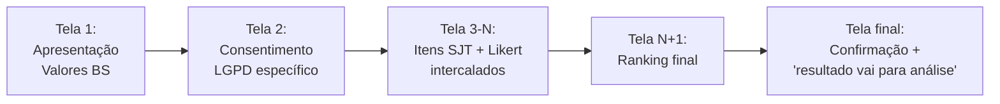

# ⛔ DEPRECATED — Mini-PRD: Teste de Fit Cultural Beauty Smile (versão SJT/Likert/Ranking)

> ## 🛑 ESTE PRD FOI SUPERADO
>
> **Data da depreciação:** 2026-05-10 (reforçada em 2026-05-12 com revisão v1.1 do substituto)
> **Substituído por:** [`docs/prds/m2-funil-rh/PRD-redacao-fit-cultural.md` v1.1](./m2-funil-rh/PRD-redacao-fit-cultural.md) (modelo redação aberta 200-500 palavras + BARS 4D pesos iguais V1 + 3 caps especiais + sistema 3 cores + few-shot inline + revisão humana sempre obrigatória)
> **Razão da mudança:**
> - Este PRD modela o teste cultural como **SJT + Likert + Ranking de 25 itens** com scoring vetorial e distância para perfil ideal.
> - Em sessão de design 2026-04-26 (Master M2 PRD), decidiu-se mover SJT para o **instrumento dedicado de Work Sample/SJT odontológico** (mini-PRD `PRD-sjt-work-sample-odontologia.md` — futuro).
> - Fit cultural ganha tratamento qualitativo via **redação aberta de 200-500 palavras** avaliada por IA (BARS 4D) + revisão humana sempre obrigatória — captura nuance que SJT fechado perde.
>
> ## ⚠️ O QUE DESTE DOCUMENTO AINDA É VÁLIDO
>
> - **Banco de itens v1** ([`fit-cultural-banco-itens-v1.md`](./fit-cultural-banco-itens-v1.md)) segue válido como **fonte de cenários e dilemas** para construir as perguntas customizadas da redação por cargo (não mais como instrumento de scoring direto).
> - **Documento-fonte cultural** ([`CULTURA-BEAUTY-SMILE-INPUT.md`](./CULTURA-BEAUTY-SMILE-INPUT.md)) segue canônico — destilado para o RAG da redação em [`docs/conhecimento/fit-cultural/valores-beauty-smile-resumo.md`](../conhecimento/fit-cultural/valores-beauty-smile-resumo.md).
> - **Análise teórica** (Person-Organization Fit / Kristof / OCAI) segue como referência conceitual.
>
> ## 🔗 PARA NOVO TRABALHO, USE
>
> - **PRD ativo:** [`docs/prds/m2-funil-rh/PRD-redacao-fit-cultural.md`](./m2-funil-rh/PRD-redacao-fit-cultural.md)
> - **RAG knowledge base:** [`docs/conhecimento/fit-cultural/`](../conhecimento/fit-cultural/) (4 arquivos)
> - **Master M2:** [`docs/prds/m2-funil-rh/PRD-MASTER-funil-rh-m2.md`](./m2-funil-rh/PRD-MASTER-funil-rh-m2.md) (RF-16/17/17a/17b)
>
> ---
>
> **Conteúdo abaixo preservado para histórico apenas. Não use como referência de implementação.**

---

# (Conteúdo histórico abaixo)

## Mini-PRD: Teste de Fit Cultural Beauty Smile (versão original — SJT)

> **Status original (DEPRECATED):** v1.0 — valores oficiais consolidados a partir de `CULTURA-BEAUTY-SMILE-INPUT.md` (abril/2026); banco inicial de 25 itens disponível em `fit-cultural-banco-itens-v1.md`. Pronto para piloto interno de validação.
>
> **Owners:** RH Beauty Smile (validação de conteúdo + piloto) + Tech (implementação + anti-viés).
> **Referência primária:** PRD-MASTER §10.4, §10.0, §9 (pipeline), §6.2 (`vaga_testes_aplicaveis`, `scores_candidato`).
> **Documento-fonte de cultura:** [`CULTURA-BEAUTY-SMILE-INPUT.md`](./CULTURA-BEAUTY-SMILE-INPUT.md) — destilação oficial dos 4 valores, comportamentos exemplares/anti-exemplares, cenários típicos e red flags.
> **Banco de itens v1:** [`fit-cultural-banco-itens-v1.md`](./fit-cultural-banco-itens-v1.md) — 25 itens (12 SJT + 10 Likert + 3 Ranking) com chave de pontuação e `faixa_ideal_json` por cargo.
> **Instrumento:** modelo próprio Beauty Smile — **avaliação comportamental** (nunca "teste psicológico", RNF-12a do PRD-MASTER) inspirada em OCAI (Cameron & Quinn, 2011) + Person-Organization Fit (Kristof, 1996) + Situational Judgment Tests. **Sem SATEPSI / sem CFP obrigatório** (R-12b).

---

## 1. Papel no Sistema — FILTRO ELIMINATÓRIO (com revisão humana)

| Item | Valor |
|---|---|
| **Classificação** | FILTRO ELIMINATÓRIO (PRD-MASTER §10.0, linha 860) |
| **Etapa do pipeline** | `testes_async` — roda em paralelo com Big Five, DISC e ICAR (§9 / linha 811) |
| **Threshold configurável por vaga** | `vaga_testes_aplicaveis.threshold_eliminatorio` (numeric, ex: afinidade mínima 60/100) |
| **Faixa ideal por vaga** | `vaga_testes_aplicaveis.faixa_ideal_json` (vetor de pesos por dimensão) |
| **Decisão automática?** | **NÃO.** Sinaliza badge vermelho no kanban RH. A decisão de rejeitar é **sempre humana** (RNF-07a, linha 865) |
| **LGPD** | Direito à revisão humana antes de rejeição (Art. 20 LGPD, R-12a) |
| **Obrigatoriedade** | Por padrão `obrigatorio` em todas as vagas V3; recrutador pode marcar `nao_aplicar` em vagas de urgência (raro) |

**Por que eliminatório (e não só informativo):** a Beauty Smile é rede de clínicas odontológicas em que o atendimento ao paciente depende do alinhamento comportamental com os **4 valores oficiais** da marca — Experiência UAU, Inovação, Atitude de Dono e Sede de Crescimento. Contratar fora do fit cultural gera rotatividade e reviews negativos — custo estimado 3-6 meses de salário por saída precoce. Literatura confirma: P-O fit é preditor robusto de retenção, satisfação e performance ([Kristof 1996](https://onlinelibrary.wiley.com/doi/abs/10.1111/j.1744-6570.1996.tb01790.x); meta-análises subsequentes).

**Por que revisão humana obrigatória:** mitigação de R-12 (scores usados discriminatoriamente) e R-12a (Art. 20 LGPD — direito à revisão humana de decisões automatizadas). **Especialmente crítico em red flags éticos:** nenhum desligamento ou rejeição por disparo de red flag pode ocorrer sem revisão humana com motivo textual registrado.

---

## 2. O que é Fit Cultural

### 2.1 Definição operacional

**Fit cultural (Person-Organization Fit)** é a **congruência entre os valores individuais do candidato e os valores organizacionais da Beauty Smile**, medida por um vetor multidimensional e comparada com o perfil ideal da vaga.

Formalmente (Kristof, 1996):

> "Compatibilidade entre pessoas e organizações que ocorre quando ao menos uma das entidades provê o que a outra precisa, ou quando compartilham características fundamentais similares, ou ambos."

Usamos especificamente a vertente **supplementary fit** (congruência de valores — "values similarity"), que é a forma mais estudada e validada de P-O fit.

### 2.2 Evidência empírica

- **Retenção:** novos colaboradores cujos valores se aproximam mais dos da organização permanecem significativamente mais tempo (Kristof, 1996; Kristof-Brown et al., 2005 meta-análise).
- **Satisfação:** correlação positiva robusta com satisfação no trabalho.
- **Performance:** correlação moderada com performance no cargo.
- **Comprometimento:** correlação forte com comprometimento organizacional e OCB (Organizational Citizenship Behavior).

### 2.3 O que fit cultural NÃO é

- **NÃO é "essa pessoa parece com a gente"** — isso é viés de afinidade (R-12), não fit. O teste **afere valores declarados e comportamentos situacionais**, não traços demográficos, estética ou background.
- **NÃO é personalidade** — isso é o Big Five (§10.1). Fit cultural mede valores organizacionais compartilhados, não traços individuais estáveis.
- **NÃO é estilo comportamental** — isso é o DISC (§10.2). Fit cultural é sobre "o que a pessoa valoriza", DISC é sobre "como a pessoa se comporta".

---

## 3. Modelo Teórico de Referência

### 3.1 Referência primária: OCAI (Cameron & Quinn, 2011)

O **Competing Values Framework** mapeia a cultura em 4 arquétipos em 2 eixos ortogonais ([Cameron & Quinn](https://webuser.bus.umich.edu/cameronk/PDFs/Organizational%20Culture/CULTURE%20BOOK-CHAPTER%201.pdf); [OCAI Online](https://www.ocai-online.com/about-the-Organizational-Culture-Assessment-Instrument-OCAI)):

| Eixo Horizontal → | **Foco Interno** (integração) | **Foco Externo** (diferenciação) |
|---|---|---|
| **Flexibilidade / Discrição** | **CLAN** (família, colaboração, mentoria) | **ADHOCRACY** (inovação, risco, criação) |
| **Estabilidade / Controle** | **HIERARCHY** (ordem, processos, previsibilidade) | **MARKET** (competição, resultados, metas) |

**Por que OCAI como referência (e não instrumento direto):**
- **Prós:** validado internacionalmente há 30+ anos; reconhecível para o RH; formato ipsativo original (100 pontos entre 4 alternativas) força trade-offs reais.
- **Contras:** vocabulário corporativo americano; foca na percepção da organização atual, não em valores pessoais do candidato; 4 quadrantes são genéricos demais para capturar especificidades Beauty Smile (ex: acolhimento do paciente, excelência clínica, ética).

**Decisão (v1.0):** usamos OCAI como **scaffold teórico** para a construção de itens situacionais, mas as **4 dimensões operacionais do teste são os 4 valores oficiais Beauty Smile** (Experiência UAU, Inovação, Atitude de Dono, Sede de Crescimento) + **Ética como princípio fundante acima dos 4 valores** (§3.3). Ver `CULTURA-BEAUTY-SMILE-INPUT.md` para o detalhamento de cada valor (descrição, comportamentos exemplares, anti-exemplos, cenários típicos, pesos por cargo).

### 3.2 Alternativas consideradas

| Instrumento | Prós | Contras | Decisão |
|---|---|---|---|
| **OCAI puro (Cameron & Quinn)** | Validado, formato ipsativo, literatura rica | Genérico; foco em percepção da org, não do candidato | Usado como scaffold (§3.1) |
| **Barrett Values Assessment** | 7 níveis de consciência (Maslow); forte em transformação cultural | Proprietário; licença paga; overkill para seleção | Não usado (custo + escopo) |
| **Culture Deck estilo Netflix** | Excelente como manifesto público da cultura | Não é instrumento de medição — é artefato de comunicação | Usado como input para comunicação ao candidato, não como teste |
| **Culture Fit Index (proprietários: Gupy Culture Match, Harver, Testlify)** | Prontos, validados para BR | Caixa-preta; lock-in; não customizável por cargo | Não usado (queremos modelo próprio) |
| **Schwartz Values Survey (SVS)** | Validado cross-cultural (57 países, incluindo BR) | 10 valores universais — não captura cultura organizacional específica | Referência complementar para item bank |
| **Person-Organization Fit Scale (Cable & DeRue 2002)** | 3-item direct-fit measure — simples | Self-report puro; gera respostas socialmente desejáveis | Referência para 3 itens âncora de validação |

**Decisão final (v1.0):** modelo próprio Beauty Smile com **4 dimensões operacionais** (os 4 valores oficiais) + **Ética como princípio inegociável acima dos 4 valores** (§3.3), medidas por **SJT + Likert + Ranking** (§5).

### 3.3 Os 4 valores oficiais Beauty Smile

Consolidados em `CULTURA-BEAUTY-SMILE-INPUT.md`:

| # | Valor | Tagline | Essência operacional |
|---|---|---|---|
| 1 | **Experiência UAU** | "Cada interação é memorável ou não conta." | Personalização, antecipação, escuta ativa, surpresa positiva. Paciente sai sentindo que foi genuinamente cuidado. |
| 2 | **Inovação** | "Inconformados com o 'sempre foi assim'." | Mentalidade de melhoria contínua; propor com dado; dominar a ciência do laser, não só operar o botão. |
| 3 | **Atitude de Dono** | "Vê o problema, resolve o problema." | Propriedade emocional, não hierárquica. "Não é minha função" é o anti-exemplo literal. |
| 4 | **Sede de Crescimento** | "Hoje melhor que ontem, sempre." | Pedir feedback proativo, estudar por conta própria, compartilhar aprendizado, rejeitar estagnação. |

**Pesos por cargo:** ver tabela em `CULTURA-BEAUTY-SMILE-INPUT.md` §2.1-§2.4 e `fit-cultural-banco-itens-v1.md` §3 (`faixa_ideal_json` JSON concreto por cargo).

### 3.4 Ética como princípio fundante — **acima dos 4 valores**

> *"Valores acima de qualquer pessoa — inclusive dos fundadores."*
> — Manual de Cultura Beauty Smile

**Princípio:** a Ética é **inegociável** e está **acima dos 4 valores declarados**. Nenhum dos 4 valores justifica violação ética. Isso tem implicação operacional direta no teste:

1. **Red flags éticos têm prioridade sobre scores de afinidade.** Um candidato com afinidade 90 que dispara um red flag ético (item FC-V1-003 alternativa (b), FC-V1-020 alternativa (b) ou (d), FC-V1-022 alternativa (b) ou (d), FC-V1-024 alternativa (b) ou (d), FC-V1-025 resposta 4 ou 5) recebe **badge vermelho + revisão humana obrigatória** mesmo com afinidade alta.
2. **Red flags cobertos no banco v1:**
   - Mentir para paciente (diagnóstico, resultado, prognóstico, custo)
   - Recomendar procedimento desnecessário por meta/comissão
   - Esconder erro técnico próprio ou de colega
   - Tirar vantagem de vulnerabilidade emocional
   - Quebrar confidencialidade (prontuário, foto em rede social sem autorização)
   - Relativização explícita de honestidade com paciente em situação de fechamento
3. **Decisão sempre humana:** red flag nunca rejeita automaticamente — apenas sinaliza e exige revisão com motivo textual registrado (Art. 20 LGPD + RNF-07a).
4. **Hierarquia prática em conflito (do documento-fonte §3):**
   - Ética > qualquer um dos 4 valores
   - Experiência UAU é o valor "carro-chefe" operacional
   - Atitude de Dono é "valor-habilitador" dos outros três
   - Inovação e Sede de Crescimento podem ser desenvolvidos; lacuna em Dono é quase impeditiva; lacuna em UAU é impeditiva para cargos com contato direto com paciente.

---

## 4. Referência cultural e banco de itens v1

> **Status v1.0:** os valores oficiais foram consolidados no documento-fonte [`CULTURA-BEAUTY-SMILE-INPUT.md`](./CULTURA-BEAUTY-SMILE-INPUT.md) (abril/2026) e o banco inicial de 25 itens está em [`fit-cultural-banco-itens-v1.md`](./fit-cultural-banco-itens-v1.md). A etapa de "workshop de destilação dos valores" que bloqueava versões anteriores foi **concluída** — agora o foco é validação piloto interna.

### 4.1 Documento-fonte de cultura

`CULTURA-BEAUTY-SMILE-INPUT.md` traz, de forma consolidada:

- Resumo da cultura e origem da Beauty Smile (§1)
- Os 4 valores com: descrição, tagline, comportamentos exemplares, anti-exemplos, cenários típicos, peso por cargo (§2.1 a §2.4)
- Hierarquia entre valores quando há conflito (§3)
- 10 comportamentos eliminatórios ("Definitely NOT") (§4)
- 5 dilemas éticos típicos com alternativas verossímeis (§5)
- Perfis culturais de 5 cargos (Dentista, Auxiliar, Recepcionista, Coordenador, Gestor regional) (§6)
- 10 citações/princípios dos fundadores (§7)
- Rituais, símbolos e vocabulário cultural ("cruzado", "UAU", "5 Momentos", cartão de bolso) (§8)

### 4.2 Banco de itens v1 (25 itens)

`fit-cultural-banco-itens-v1.md` traz:

- **25 itens** (IDs `FC-V1-001` a `FC-V1-025`) com: enunciado em pt-BR, alternativas, chave de pontuação por dimensão, flag eliminatório quando aplicável, rationale.
- **Distribuição por dimensão:** 6 UAU, 5 Atitude de Dono, 4 Inovação, 4 Sede de Crescimento, 4 Dilemas Éticos, 2 Red Flag puros.
- **Formato híbrido:** 12 SJT, 10 Likert (3 reversos), 3 Ranking.
- **`faixa_ideal_json` por cargo** (Dentista, Auxiliar, Recepcionista, Coordenador, Gestor regional) em formato JSON pronto para uso em `vaga_testes_aplicaveis.faixa_ideal_json`.
- Matriz de cobertura, recomendações de validação piloto e anti-gaming.

### 4.3 Processo de destilação dos valores (histórico)

A destilação dos 4 valores foi realizada via consolidação de fontes oficiais (Manual de Cultura, Storytelling Empresarial, Company Story, Brand DNA, Manual de Onboarding, Checklist Experiência UAU, Políticas e Regras, Quiz de Cultura). O resultado está congelado em `CULTURA-BEAUTY-SMILE-INPUT.md`. Revisões futuras (v2, v3) seguem o mesmo princípio: partir de comportamentos reais observados, não de valores aspiracionais.

---

## 5. Modelo do Teste

### 5.1 Formato híbrido: escolha situacional + Likert complementar

**Decisão:** combinar Situational Judgment Test (SJT) + Likert.

**Rationale (apoiado em literatura):**
- **SJTs são mais precisos para construtos nuançados** e têm alta validade preditiva para comportamento no trabalho ([Cogn-IQ.org](https://www.cogn-iq.org/blog/situational-judgment-tests/); [PMC residency selection review](https://pmc.ncbi.nlm.nih.gov/articles/PMC9579621/)).
- **Likert permite comparação normativa entre candidatos** — SJTs ipsativos não ([Bryq: Likert vs Forced Choice](https://www.bryq.com/blog/likert-scale-vs-forced-choice-for-employee-selection)).
- **Híbrido mitiga social desirability bias** — SJT contextualizado em clínica é mais difícil de "responder certo" do que frase Likert abstrata.
- **OCAI original usa ipsativo** (100 pontos entre 4 alternativas) — preservamos isso nos itens-âncora de dimensão.

### 5.2 Estrutura: 3 tipos de itens

| Tipo | Qtd | Formato | Tempo médio | Mede |
|---|---|---|---|---|
| **Tipo A — SJT "mais/menos identifico"** | 12 itens | Cenário em clínica + 4 alternativas; candidato escolhe a que **mais** se identifica e a que **menos** se identifica | ~40s/item | Preferência relativa entre dimensões (formato ipsativo) |
| **Tipo B — Likert de valores** | 10 itens | Afirmação + escala 1-5 (discordo totalmente → concordo totalmente) | ~15s/item | Intensidade absoluta de cada dimensão (normativa) |
| **Tipo C — Ranking de prioridades** | 3 itens | Lista de 6 opções para ordenar (drag-and-drop) | ~60s/item | Hierarquia de valores sob pressão |

**Total: 25 itens ≈ 10-13 minutos** (dentro do alvo PRD-MASTER §10.4).

### 5.3 Mapeamento item → dimensão

Cada item mapeia para **1-2 dimensões** do modelo (4 OCAI + 2-3 Beauty Smile-específicas = **6 dimensões**).

Matriz de cobertura mínima: cada dimensão deve ter **≥ 4 itens** medindo-a (ao menos 2 SJT + 2 Likert), para confiabilidade (α de Cronbach > 0.70 alvo).

### 5.4 Randomização e ordem

- **Itens randomizados por candidato** (seed por candidatura_id, determinístico para reprodutibilidade)
- **Dentro de cada item SJT, as 4 alternativas também randomizam** (elimina viés posicional)
- **Tipo B Likert intercalado com Tipo A** para reduzir fadiga e padrões de resposta
- **Tipo C no final** (quando candidato já "aqueceu")

---

## 6. Banco de Itens (criar em pt-BR, contextualizado em clínica odontológica)

### 6.1 Princípios de redação

1. **Linguagem acessível** — evitar jargão corporativo americano ("stakeholder", "accountability", "ownership"). Usar pt-BR de clínica.
2. **Concreto, não abstrato** — ancorar em ações observáveis no dia da clínica.
3. **Neutro quanto a classe social, região e gênero** — revisar §11 antes de incluir.
4. **Sem resposta "certa" óbvia** — cada alternativa deve representar um valor legítimo, não uma armadilha.
5. **Realismo** — cenários devem soar como dias reais da clínica Beauty Smile (recepcionista, dentista, coordenador).

### 6.2 Banco v1 — 25 itens consolidados em arquivo separado

O banco completo está em [`fit-cultural-banco-itens-v1.md`](./fit-cultural-banco-itens-v1.md). Resumo:

| Dimensão | Itens | IDs |
|---|---|---|
| Experiência UAU | 6 | FC-V1-001 a FC-V1-006 |
| Atitude de Dono | 5 | FC-V1-007 a FC-V1-011 |
| Inovação | 4 | FC-V1-012 a FC-V1-015 |
| Sede de Crescimento | 4 | FC-V1-016 a FC-V1-019 |
| Dilemas Éticos | 4 | FC-V1-020 a FC-V1-023 |
| Red Flag puro (detecção eliminatória) | 2 | FC-V1-024 a FC-V1-025 |

**Distribuição por tipo:** 12 SJT + 10 Likert (3 reversos) + 3 Ranking.

### 6.3 Exemplos ilustrativos

**SJT (FC-V1-003) — Paciente chora na cadeira:**
> Uma paciente senta na cadeira e, antes do dentista encostar, começa a chorar relatando trauma de infância. O próximo paciente chega em 20 minutos. O que você faz?
> - (a) Paro tudo, sento ao lado, escuto o tempo necessário, valido o medo e remarco se preciso — mesmo que atrase o próximo. [+2 UAU]
> - (b) Falo "vai passar, é rapidinho, nem dói" e sigo com a avaliação. [**RED FLAG se "mais alinhado"**]
> - (c) Chamo o dentista imediatamente enquanto ofereço água e fico ao lado dela. [+1 UAU, +1 Dono]
> - (d) Explico passo a passo de forma técnica para tranquilizá-la com informação. [0 UAU]

**Likert reverso (FC-V1-008) — Atitude de Dono:**
> "Se algo que precisa ser resolvido na clínica não está na minha descrição de cargo, eu não devo me envolver."
> Escala 1-5; **discordar = alinhado**. Captura direto o anti-exemplo "não é minha função".

**Ranking (FC-V1-021) — Priorização em conflito:**
> Ordene de 1 a 4: cumprir meta / paciente recebe exatamente o que precisa / evitar conflito com sênior / manter horário da agenda.
> β ("paciente") em 1º → alinhado. α ou γ em 1º → **red flag ético**.

### 6.4 Critérios de redação aplicados (todos os 25 itens)

- **pt-BR informal mas profissional** — sem jargão corporativo americano
- **Cenários ancorados em clínica odontológica Beauty Smile** — paciente atrasado, trauma na cadeira, material acaba, review negativo, pressão de meta, erro de sênior, confidencialidade de foto
- **Cada alternativa é plausível** — sem "armadilha óbvia"
- **Red flags disfarçados** — as alternativas eliminatórias aparecem como "atalhos razoáveis" ou "só desta vez", conforme §4 do documento-fonte

### 6.5 Versionamento do banco

Toda alteração no banco de itens gera **nova versão** registrada em `itens_cultura_bank.versao`. Candidaturas existentes usam a versão do teste **no momento da aplicação** (congelada em `scores_candidato.versao_modelo`). Isso é requisito de auditabilidade (RNF relacionados).

---

## 7. Cálculo de Score

### 7.1 Vetor de scores por dimensão (candidato)

Após o candidato responder todos os itens, o backend calcula um vetor de **4 dimensões** (+ flag ético):

```
v_candidato = [uau, inovacao, dono, crescimento]
             = [85, 70, 92, 78]   // valores 0-100

red_flags   = []  // lista de itens FC-V1-XXX que dispararam (ex: ["FC-V1-020:b"])
```

**Como:**
- **SJT:** "mais identifico" = +2 pts para a dimensão; "menos identifico" = -1 pt. Normalizado 0-100 por dimensão.
- **Likert:** score médio dos itens daquela dimensão (revertendo os 3 itens reversos — FC-V1-008, 013, 025), escalado 1-5 → 0-100.
- **Ranking:** peso por posição (1º = 3 pts; 2º = 2; 3º = 1; 4º = 0), normalizado 0-100 por dimensão.
- **Score final por dimensão:** média ponderada `0.5 × SJT + 0.3 × Likert + 0.2 × Ranking` (pesos calibráveis no piloto §13).
- **Red flags:** disparados conforme chave de cada item (ver `fit-cultural-banco-itens-v1.md` §2). Um único red flag → `alerta_eliminatorio = true` no `scores_candidato.score_json` + badge vermelho.

### 7.2 Vetor ideal da vaga (perfil ideal)

Recrutador define ao criar a vaga (RF-33b). Os JSONs concretos por cargo estão em `fit-cultural-banco-itens-v1.md` §3. Exemplo para **Dentista**:

```json
// vaga_testes_aplicaveis.faixa_ideal_json para tipo_teste='cultura'
{
  "cargo": "dentista",
  "versao_modelo": "cultura-bs-v1.0",
  "dimensoes": {
    "uau":         { "min": 85, "max": 100, "peso": 1.2, "alvo": 100 },
    "inovacao":    { "min": 85, "max": 100, "peso": 1.2, "alvo": 100 },
    "dono":        { "min": 75, "max": 100, "peso": 1.0, "alvo": 90  },
    "crescimento": { "min": 85, "max": 100, "peso": 1.2, "alvo": 100 }
  },
  "vetor_ideal": [100, 100, 90, 100],
  "threshold_eliminatorio": 65,
  "red_flag_etica": "sempre_eliminatorio_com_revisao_humana"
}
```

**Templates por cargo (resumo):**

| Cargo | UAU | Inovação | Dono | Crescimento |
|---|---|---|---|---|
| Dentista | 100 | 100 | 90 | 100 |
| Auxiliar de saúde bucal | 100 | 70 | 100 | 90 |
| Recepcionista | 100 | 60 | 100 | 90 |
| Coordenador de clínica | 90 | 90 | 100 | 100 |
| Gestor regional | 80 | 100 | 100 | 100 |

JSONs completos (com `min`/`max`/`peso` por cargo): ver `fit-cultural-banco-itens-v1.md` §3.2.

- `min`/`max`: faixa aceitável (fora disso penaliza)
- `peso`: importância relativa da dimensão para esta vaga (usado na distância ponderada)
- `vetor_ideal`: ponto central usado no cálculo de distância
- `alvo`: score ideal da dimensão; default = `peso_do_valor_por_cargo × 10`
- `threshold_eliminatorio`: afinidade mínima abaixo da qual o badge fica vermelho (revisão humana ainda obrigatória)
- `red_flag_etica`: sempre `"sempre_eliminatorio_com_revisao_humana"` — independente do cargo, o princípio ético é inegociável

### 7.3 Métrica de distância: decisão

**Decisão: distância euclidiana ponderada** (PRD-MASTER §10.4 já indica euclidiana).

**Rationale:**
- **Euclidiana preserva magnitude** — importa se o candidato tem score 50 ou 90 em acolhimento, não só o padrão relativo. Em fit cultural, um candidato "balanceado mas baixo em tudo" **não é** equivalente a um "balanceado e alto em tudo" ([Baeldung CS: Euclidean vs Cosine](https://www.baeldung.com/cs/euclidean-distance-vs-cosine-similarity)).
- **Cosseno ignora magnitude** — dois candidatos com perfis [90,90,90,90,90,90] e [10,10,10,10,10,10] teriam similaridade = 1, o que é absurdo para nosso caso.
- **Manhattan é alternativa** — mais robusta a outliers, mas menos sensível a discrepâncias pontuais relevantes (ex: candidato com acolhimento=20 deve ter penalização forte).

**Fórmula:**

```
d(v_candidato, v_ideal) = sqrt( Σ_i w_i × (candidato_i - ideal_i)² )

onde:
  w_i = peso da dimensão i em faixa_ideal_json
  i ∈ {uau, inovacao, dono, crescimento}
```

**Observação:** a ética **não** entra na distância euclidiana — ela opera como **gate independente**. Um red flag disparado sobrescreve qualquer cálculo de afinidade e sinaliza revisão humana obrigatória.

### 7.4 Score final de afinidade (0-100)

Converter distância em score de afinidade intuitivo para o RH:

```
d_max = sqrt( Σ_i w_i × 100² )   // distância máxima possível
afinidade = round( 100 × (1 - d / d_max) )
```

- Afinidade **100** = vetor candidato idêntico ao ideal
- Afinidade **0** = vetor candidato maximamente distante
- Expectativa empírica (a calibrar no piloto): média ~65, desvio padrão ~12

### 7.5 Penalização por fora-da-faixa

Adicional: se alguma dimensão do candidato cai **fora do `[min, max]` com peso ≥ 1.0**, aplica-se **penalidade de -5 pts no score final por dimensão violada** (cap em -20 total).

Exemplo: candidato com acolhimento=55 quando faixa é [70, 100] e peso=1.2 → violação → afinidade_final = afinidade_bruta - 5.

### 7.6 Output armazenado

```json
// scores_candidato.score_json para tipo_teste='cultura'
{
  "afinidade": 78,
  "afinidade_bruta": 82,
  "penalidades": -4,
  "dimensoes": {
    "uau":         { "score": 88, "ideal_min": 85, "ideal_max": 100, "dentro_faixa": true  },
    "inovacao":    { "score": 75, "ideal_min": 85, "ideal_max": 100, "dentro_faixa": false },
    "dono":        { "score": 92, "ideal_min": 75, "ideal_max": 100, "dentro_faixa": true  },
    "crescimento": { "score": 80, "ideal_min": 85, "ideal_max": 100, "dentro_faixa": false }
  },
  "distancia": 18.3,
  "distancia_max": 120.0,
  "alerta_eliminatorio": false,
  "red_flags_detectados": [],
  "versao_itens": "cultura-v1.0",
  "versao_modelo": "cultura-bs-v1.0"
}
```

**Em caso de red flag ético disparado:**

```json
{
  "afinidade": 72,
  "alerta_eliminatorio": true,
  "red_flags_detectados": [
    {
      "item": "FC-V1-020",
      "alternativa_marcada": "b",
      "tipo": "meta_acima_do_paciente",
      "descricao": "Candidato escolheu vender clareamento desnecessário como 'mais alinhado'",
      "revisao_humana_obrigatoria": true
    }
  ],
  "versao_itens": "cultura-v1.0",
  "versao_modelo": "cultura-bs-v1.0"
}
```

`score_principal` (coluna dedicada) = `afinidade` (78 no exemplo).

---

## 8. Modelo de Dados (SQL DDL)

### 8.1 `valores_beauty_smile` (tabela auxiliar — seed inicial com os 4 valores oficiais)

```sql
CREATE TABLE valores_beauty_smile (
  id            uuid PRIMARY KEY DEFAULT gen_random_uuid(),
  versao        text NOT NULL,                -- 'v1.0'
  codigo        text NOT NULL,                -- 'uau' | 'inovacao' | 'dono' | 'crescimento'
  nome          text NOT NULL,                -- 'Experiência UAU', 'Inovação', 'Atitude de Dono', 'Sede de Crescimento'
  tagline       text NOT NULL,                -- 'Cada interação é memorável ou não conta.'
  descricao     text NOT NULL,                -- parágrafo do documento-fonte
  exemplos_json jsonb NOT NULL,               -- [{comportamento, contraexemplo, cenario_tipico}]
  ordem         int NOT NULL,
  ativo         boolean DEFAULT true,
  created_at    timestamptz DEFAULT now(),
  UNIQUE (versao, codigo)
);

CREATE INDEX idx_valores_versao_ativo ON valores_beauty_smile(versao, ativo);

-- Seed (v1.0)
INSERT INTO valores_beauty_smile (versao, codigo, nome, tagline, descricao, exemplos_json, ordem) VALUES
('v1.0', 'uau',         'Experiência UAU',      'Cada interação é memorável ou não conta.',           '...', '...'::jsonb, 1),
('v1.0', 'inovacao',    'Inovação',             'Inconformados com o sempre foi assim.',              '...', '...'::jsonb, 2),
('v1.0', 'dono',        'Atitude de Dono',      'Vê o problema, resolve o problema.',                 '...', '...'::jsonb, 3),
('v1.0', 'crescimento', 'Sede de Crescimento',  'Hoje melhor que ontem, sempre.',                     '...', '...'::jsonb, 4);
```

### 8.2 `itens_cultura_bank` (banco de itens versionado)

```sql
CREATE TABLE itens_cultura_bank (
  id            uuid PRIMARY KEY DEFAULT gen_random_uuid(),
  versao        text NOT NULL,                -- 'cultura-v1.0'
  codigo        text NOT NULL,                -- 'A-01', 'B-03', 'C-02'
  tipo          text NOT NULL CHECK (tipo IN ('sjt','likert','ranking')),
  enunciado     text NOT NULL,
  alternativas_json jsonb NOT NULL,           -- estrutura depende do tipo
  mapeamento_dimensoes_json jsonb NOT NULL,   -- {a: 'clan', b: 'hierarchy', ...} ou {dimensao: 'clan', reverso: false}
  ordem_default int,
  ativo         boolean DEFAULT true,
  created_at    timestamptz DEFAULT now(),
  UNIQUE (versao, codigo)
);

CREATE INDEX idx_itens_versao_ativo ON itens_cultura_bank(versao, ativo);
```

**Estrutura `alternativas_json` por tipo:**

```json
// tipo='sjt' — ex: FC-V1-003 (paciente chora na cadeira)
{
  "opcoes": [
    {"id": "a", "texto": "Paro tudo, sento ao lado, escuto...",   "dimensao": "uau",     "peso": 2},
    {"id": "b", "texto": "Falo 'vai passar, é rapidinho'...",     "dimensao": "uau",     "peso": -2, "red_flag": true, "tipo_red_flag": "desumaniza_vulneravel"},
    {"id": "c", "texto": "Chamo o dentista imediatamente...",     "dimensao": "uau",     "peso": 1, "secundaria": "dono"},
    {"id": "d", "texto": "Explico passo a passo tecnicamente...", "dimensao": "uau",     "peso": 0}
  ],
  "instrucao": "Escolha a que MAIS e a que MENOS se identifica"
}

// tipo='likert' — ex: FC-V1-008 (não é minha função)
{
  "escala": "1-5",
  "rotulos": ["Discordo totalmente", "Discordo", "Neutro", "Concordo", "Concordo totalmente"],
  "dimensao": "dono",
  "reverso": true
}

// tipo='ranking' — ex: FC-V1-021 (priorização em conflito)
{
  "opcoes": [
    {"id": "alpha", "texto": "Cumprir a meta financeira do mês.",           "dimensao": "meta",     "alerta_se_primeiro": true},
    {"id": "beta",  "texto": "Garantir o que o paciente precisa clinicamente.", "dimensao": "etica", "alinhado_se_primeiro": true},
    {"id": "gamma", "texto": "Evitar conflito com colegas seniores.",        "dimensao": "hierarquia","alerta_se_primeiro": true},
    {"id": "delta", "texto": "Manter a agenda no horário estabelecido.",     "dimensao": "uau"}
  ],
  "instrucao": "Ordene de 1 (prioridade mais alta) a 4 (prioridade mais baixa)"
}
```

### 8.3 `respostas_cultura` (fact table das respostas do candidato)

```sql
CREATE TABLE respostas_cultura (
  id             uuid PRIMARY KEY DEFAULT gen_random_uuid(),
  candidatura_id uuid NOT NULL REFERENCES candidaturas(id) ON DELETE CASCADE,
  item_id        uuid NOT NULL REFERENCES itens_cultura_bank(id),
  item_codigo    text NOT NULL,               -- snapshot para auditoria
  resposta_json  jsonb NOT NULL,              -- ver abaixo
  tempo_ms       int,                         -- tempo gasto no item
  created_at     timestamptz DEFAULT now(),
  UNIQUE (candidatura_id, item_id)
);

CREATE INDEX idx_respostas_cultura_candidatura ON respostas_cultura(candidatura_id);
```

**Estrutura `resposta_json`:**

```json
// tipo='sjt'
{"mais": "a", "menos": "d"}

// tipo='likert'
{"valor": 4}

// tipo='ranking'
{"ordem": ["3", "1", "6", "2", "4", "5"]}  // ids na ordem escolhida
```

### 8.4 `scores_candidato` — reuso da tabela global (PRD-MASTER §6.2)

Já existe (definida no master). Para fit cultural:

```sql
-- INSERT exemplo
INSERT INTO scores_candidato (
  candidatura_id,
  tipo_teste,
  score_json,
  score_principal,
  versao_modelo
) VALUES (
  '<uuid>',
  'cultura',
  '{"afinidade": 78, "dimensoes": {...}, ...}'::jsonb,
  78,
  'cultura-bs-v1.0'
);
```

### 8.5 RLS (Row Level Security)

```sql
-- Candidato vê apenas suas respostas
CREATE POLICY candidato_suas_respostas_cultura ON respostas_cultura
  FOR SELECT USING (
    candidatura_id IN (
      SELECT id FROM candidaturas WHERE candidato_id = auth.uid()
    )
  );

-- RH vê respostas de candidaturas de vagas da sua organização
CREATE POLICY rh_respostas_cultura ON respostas_cultura
  FOR SELECT USING (
    candidatura_id IN (
      SELECT c.id FROM candidaturas c
      JOIN vagas v ON v.id = c.vaga_id
      WHERE v.organizacao_id = (SELECT organizacao_id FROM usuarios_rh WHERE id = auth.uid())
    )
  );

-- valores_beauty_smile e itens_cultura_bank: leitura pública (anon + authenticated) para itens ativos
CREATE POLICY itens_cultura_leitura_publica ON itens_cultura_bank
  FOR SELECT USING (ativo = true);
```

---

## 9. UX Detalhada

### 9.1 Fluxo de 5 telas



### 9.2 Tela 1 — Apresentação dos valores Beauty Smile

**Objetivo:** educar o candidato sobre a cultura ANTES de ele responder — princípio de transparência (LGPD + ética anti-viés) e melhora validade preditiva (candidato responde sabendo o contexto, reduz "chutar a resposta certa").

**Conteúdo:**
- Header com logo Beauty Smile
- Intro: "Antes de começarmos, queremos que você conheça o que faz uma pessoa Beauty Smile"
- 6 cards (um por valor) com: nome + descrição + 2 exemplos de comportamento
- CTA: "Estou pronto para começar"
- Tempo estimado: 2-3 min de leitura

**⚠️ Decisão de UX:** mostrar os valores **não enviesa** o teste? Evidência: a maioria dos ATSs modernos faz isso (Gupy, Harver) e a literatura de P-O fit recomenda transparência ([Kristof-Brown 2023](https://onlinelibrary.wiley.com/doi/10.1111/peps.12581)) — reduz ansiedade, aumenta engajamento, e o **SJT contextualizado** é resistente a "resposta certa" (cada alternativa é um valor legítimo).

### 9.3 Tela 2 — Consentimento LGPD específico

**Obrigatório** — fit cultural toca opiniões/valores pessoais, potencialmente categoria **sensível** por extensão (Art. 5º II LGPD — opiniões políticas/religiosas são sensíveis; valores de trabalho não são explicitamente, mas zona cinzenta).

**Checkbox obrigatório:** "Autorizo a Beauty Smile a coletar e processar minhas respostas para fins exclusivos deste processo seletivo, com direito a: (a) acesso às respostas; (b) revisão humana da decisão; (c) eliminação após o término do processo (máx 6 meses pós-conclusão)."

**Link para política completa** (RF-22 do master).

**Não prosseguir sem checkbox.**

### 9.4 Telas 3-N — Itens intercalados

**Layout por item:**
- Barra de progresso no topo ("Item 7 de 25")
- Timer **NÃO visível** (remove pressão desnecessária; é medido no backend para análise, não mostrado)
- Cenário (SJT) ou afirmação (Likert) em caixa destacada
- Alternativas clicáveis (mobile-first, cada uma ≥ 48px touch target)
- Botão "Próximo" (desabilitado até resposta completa)
- Botão "Voltar" nos primeiros 5 itens apenas (evita gaming)

**Salvamento incremental:** cada resposta é gravada no backend imediatamente (RNF-anti-perda — vide mitigação do problema similar do Big Five §10.1 gaps).

**Mobile first:** PRD-MASTER §RNF-17.

### 9.5 Tela Ranking final (Tipo C — Tela N+1)

**Drag-and-drop** com fallback acessível (botões "mover para cima/baixo"). Testar no iOS Safari (PRD-MASTER §RNF-17/18).

### 9.6 Tela final — Confirmação

**Mensagem:**
> "Recebemos suas respostas. O resultado será analisado pela nossa equipe de RH e você verá o andamento do seu processo no seu painel. Obrigado pela sinceridade!"

**NÃO mostrar score ao candidato** (diferente do Big Five onde pode-se mostrar resultado "educativo"). Rationale:
- Score bruto pode ser mal interpretado ("fui reprovado")
- Protege contra gaming em reaplicação
- Revisão humana obrigatória — candidato ver score antes do RH decidir quebra o fluxo

**Pode mostrar:** "Você completou o teste de fit cultural" + timestamp + link para o dashboard do candidato.

### 9.7 Acessibilidade

- Suporte a leitor de tela (labels ARIA)
- Contraste WCAG AA mínimo
- Teclado-navegável (tab order)
- Sem exigir arraste em contexto de ranking se `prefers-reduced-motion` (fallback com botões)

---

## 10. Integração com `vaga_testes_aplicaveis`

### 10.1 Schema já definido no master

```sql
-- De PRD-MASTER §6.2 (linha 524)
id                      uuid PK
vaga_id                 uuid REFERENCES vagas(id) ON DELETE CASCADE
tipo_teste              text CHECK (tipo_teste IN ('bigfive','disc','cognitivo','cultura'))
aplicar                 text NOT NULL CHECK (aplicar IN ('obrigatorio','opcional','nao_aplicar'))
peso                    int NOT NULL DEFAULT 0 CHECK (peso BETWEEN 0 AND 100)
threshold_eliminatorio  numeric
faixa_ideal_json        jsonb
ordem                   int
```

Para `tipo_teste='cultura'`:
- `threshold_eliminatorio`: afinidade mínima (ex: 60 = rejeitar com badge vermelho se candidato < 60)
- `faixa_ideal_json`: estrutura de §7.2

### 10.2 UI do recrutador — edição do perfil ideal

**Tela:** "Criar/editar vaga → Aba 'Testes e perfil ideal' → Seção 'Fit Cultural'"

**Componentes:**

1. **Toggle "Aplicar teste de fit cultural"** → `aplicar`: `nao_aplicar` | `opcional` | `obrigatorio` (default: `obrigatorio`)

2. **Slider de threshold eliminatório** (0-100) — "Afinidade mínima para não disparar alerta" (default: 60)

3. **Editor de vetor ideal — 6 sliders duplos (min/max) + peso por dimensão:**

   ```
   Clan            [====|=====]  min 60 — max 90    Peso: [●●●●○] 1.0
   Adhocracy       [==|=======]  min 50 — max 85    Peso: [●●●○○] 0.8
   Market          [=|=========] min 40 — max 75    Peso: [●●○○○] 0.6
   Hierarchy       [===|======]  min 50 — max 80    Peso: [●●●○○] 0.7
   Acolhimento     [======|===]  min 70 — max 100   Peso: [●●●●●] 1.2
   Excelência      [=====|====]  min 65 — max 95    Peso: [●●●●○] 1.0
   ```

4. **Preview visual:** radar chart do vetor ideal com faixas sombreadas — ajuda recrutador a "ver" o perfil.

5. **Botão "Usar template de cargo"** → popup com templates pré-configurados de `templates_perfil_vaga` (RF-33c, master §6.2 linha 538):
   - "Dentista" (UAU + Inovação + Crescimento altos)
   - "Auxiliar de saúde bucal" (UAU + Dono altos; Inovação moderada)
   - "Recepcionista" (UAU + Dono altos; Inovação baixa-moderada)
   - "Coordenador de clínica" (Dono + Crescimento = 100; UAU + Inovação altos)
   - "Gestor regional" (Inovação + Dono + Crescimento = 100; UAU moderado)

### 10.3 Templates por cargo — v1 (calibração baseada nos pesos do documento-fonte)

Os templates abaixo seguem a tabela oficial de pesos por cargo do `CULTURA-BEAUTY-SMILE-INPUT.md` §2. Os JSONs completos (com `min`/`max`/`peso` por dimensão, prontos para `vaga_testes_aplicaveis.faixa_ideal_json`) estão em `fit-cultural-banco-itens-v1.md` §3.2.

| Cargo | UAU | Inovação | Atitude de Dono | Sede de Crescimento |
|---|---|---|---|---|
| Dentista | 100 | 100 | 90 | 100 |
| Auxiliar de saúde bucal | 100 | 70 | 100 | 90 |
| Recepcionista | 100 | 60 | 100 | 90 |
| Coordenador de clínica | 90 | 90 | 100 | 100 |
| Gestor regional | 80 | 100 | 100 | 100 |

> **Status:** esses valores são **hipóteses iniciais informadas pela documentação oficial de cultura** — já têm base sólida para release piloto. O piloto com 20-30 colaboradores BS (§13) será usado para calibrar o `min`/`max` de faixa aceitável e validar se a distribuição real dos colaboradores "5 estrelas" confirma esses alvos.

### 10.4 Lógica backend no kanban

```sql
-- Query: candidatos da vaga com badge cultura
SELECT
  c.id,
  c.nome,
  sc.score_json->'afinidade' AS afinidade,
  CASE
    WHEN (sc.score_principal < vta.threshold_eliminatorio) THEN 'vermelho'
    WHEN (sc.score_principal BETWEEN vta.threshold_eliminatorio AND vta.threshold_eliminatorio + 10) THEN 'amarelo'
    ELSE 'verde'
  END AS badge_cultura
FROM candidatos c
JOIN candidaturas cd ON cd.candidato_id = c.id
JOIN vaga_testes_aplicaveis vta ON vta.vaga_id = cd.vaga_id AND vta.tipo_teste = 'cultura'
LEFT JOIN scores_candidato sc ON sc.candidatura_id = cd.id AND sc.tipo_teste = 'cultura'
WHERE cd.vaga_id = $1;
```

---

## 11. Anti-Viés e Fairness

### 11.1 Princípios

1. **Fit cultural NÃO é "pessoa parece com a gente"** — R-12 do master. Viés de afinidade é o maior risco.
2. **Item bank revisado para bias** antes de ir para produção — cada item passa por checklist (§11.2).
3. **Transparência**: candidato vê quais valores estão sendo medidos (§9.2) — reduz ansiedade e sentimento de "caixa preta".
4. **Revisão humana obrigatória** antes de rejeição (RNF-07a).
5. **Auditoria periódica** de adverse impact (§11.3).

### 11.2 Checklist anti-viés por item

Cada item do banco deve passar ANTES de ser incluído:

- [ ] **Classe social:** a situação é reconhecível por alguém que nunca morou em capital? Usei vocabulário que exclui (ex: "brunch", "networking")?
- [ ] **Região:** o cenário é generalizável (clínica em Recife vs SP tem que fazer sentido igual)? Evitar gírias regionais.
- [ ] **Gênero:** alternativas assumem papéis de gênero (ex: "a recepcionista" sempre feminino)? Usar neutro quando possível.
- [ ] **Raça/etnia:** implícitos culturais (ex: "fulano da festa junina") podem alienar? Revisar.
- [ ] **Orientação sexual / estrutura familiar:** assumi modelo nuclear heteronormativo? Neutralizar.
- [ ] **Religião:** assumi calendário cristão, jargão religioso? Usar seculares.
- [ ] **Deficiência:** cenário pressupõe mobilidade plena / visão plena? Revisar ou adicionar variante.
- [ ] **Nível educacional:** vocabulário exige 3º grau? Ajustar para ensino médio compreensível.
- [ ] **Socialmente desejável:** uma alternativa é obviamente "a certa"? Se sim, redesenhar.

Insight da literatura ([Rise People](https://risepeople.com/blog/culture-fit-becomes-employment-discrimination/); [HR Dive](https://www.hrdive.com/news/is-culture-fit-code-for-bias-recruiters-must-be-wary-experts-say/507272/)):
> "Certain assessment criteria automatically privilege people from a higher socioeconomic class, ensuring that those who don't participate in certain activities—either because they aren't interested or they can't afford to—are left out."

### 11.3 Auditoria de adverse impact (pós-lançamento)

**Regra 4/5 (EEOC/guideline):** a taxa de aprovação de qualquer subgrupo não deve ser < 80% da taxa do subgrupo mais favorecido.

Implementar dashboard RH a cada 6 meses comparando:
- Taxa de aprovação por gênero
- Taxa de aprovação por faixa etária
- Taxa de aprovação por escolaridade
- Taxa de aprovação por região (estado)
- Taxa de aprovação por raça/cor autodeclarada (opcional, com consentimento)

Se qualquer subgrupo cair abaixo de 80%: **alerta + revisão do item bank**.

### 11.4 Validade preditiva longitudinal

Comparar scores de fit cultural com:
- **Retenção aos 6 meses** (principal outcome)
- **Avaliação de performance aos 12 meses** (pelo gestor)
- **NPS de paciente** (para cargos client-facing)

Se correlações forem fracas (< 0.2): instrumento não é válido → revisar. Se correlações apresentam viés por subgrupo: instrumento é válido mas enviesado → recalibrar item bank.

### 11.5 Proteções adicionais anti-gaming

- **Itens reversos** no Likert (detectar straightlining)
- **Itens-âncora** (PO Fit scale direta de Cable & DeRue) para triangulação
- **Tempo de resposta mínimo por item** (< 3s em SJT = flag de revisão)
- **Ordem randomizada** por candidato

---

## 12. LGPD — atenção especial

### 12.1 Classificação do dado

**Dados coletados:** opiniões sobre trabalho, valores pessoais, preferências comportamentais em cenários profissionais.

**Classificação:** dados pessoais **potencialmente sensíveis por extensão** — não são explicitamente sensíveis (Art. 5º II LGPD lista raça, religião, opinião política, filiação sindical, saúde, vida sexual, dados genéticos/biométricos), mas **padrões de resposta podem inferir** traços sensíveis (ex: alguém muito baixo em "Hierarchy" pode ser lido como ideologia política específica).

**Decisão:** tratar como **dado pessoal comum com cuidado elevado** — sem declarar como sensível (evita over-compliance que trava o fluxo), mas com controles adicionais (consentimento específico, retenção limitada, direito à revisão).

### 12.2 Base legal

**Execução de contrato** (Art. 7º V LGPD) — o processamento é necessário para o processo seletivo ao qual o candidato se inscreveu.

**Adicionalmente:** consentimento específico (§9.3) para o uso de resultados agregados em análises futuras (opt-in separado).

### 12.3 Retenção

- **Durante processo seletivo:** retém respostas + scores
- **Após rejeição:** retém por até **180 dias** (direito a recurso; auditoria)
- **Após 180 dias:** anonimização (mantém score agregado para normalização, apaga respostas individuais)
- **Candidatos contratados:** retém por até **2 anos pós-desligamento** como dado de RH
- **Direito à eliminação (RF-22):** candidato pode pedir antes do prazo; processo formal

### 12.4 Direito à revisão humana (Art. 20 LGPD)

**Obrigatório:** antes de qualquer rejeição com base em fit cultural, um recrutador humano revisa o caso e registra:
- Decisão (aprovar / rejeitar / pedir mais info)
- Motivo textual
- Timestamp + user_id em `historico_candidatura`

**Comunicação ao candidato rejeitado:**
> "Após análise dos seus resultados e do seu perfil, decidimos seguir com outros candidatos neste processo. Você pode solicitar a revisão desta decisão respondendo a este email em até 10 dias."

### 12.5 Explainability

Ao candidato que solicitar, fornecer:
- Quais dimensões foram medidas
- Que o resultado foi um dos fatores considerados (não o único)
- Que houve revisão humana antes da decisão
- Como solicitar revisão

**NÃO fornecer:** score numérico exato do candidato, vetor ideal da vaga específica (trade secret), nem identificação do recrutador que decidiu.

---

## 13. Gaps e Decisões Pendentes

### 13.1 Gaps bloqueantes resolvidos na v1.0

| # | Gap | Status v1.0 |
|---|---|---|
| ~~G-01~~ | ~~Workshop de valores Beauty Smile não realizado~~ | **RESOLVIDO** — 4 valores oficiais consolidados em `CULTURA-BEAUTY-SMILE-INPUT.md` (abril/2026) a partir de Manual de Cultura, Storytelling, Brand DNA, Onboarding, Checklist UAU e Políticas. |
| ~~G-02~~ | ~~Lista oficial de 4-6 valores com descrições + exemplos~~ | **RESOLVIDO** — 4 valores com descrições, comportamentos exemplares, anti-exemplos, cenários típicos e pesos por cargo consolidados. |
| ~~G-03~~ | ~~Banco de itens v0 em pt-BR~~ | **RESOLVIDO** — 25 itens em `fit-cultural-banco-itens-v1.md` (12 SJT + 10 Likert + 3 Ranking) com chave de pontuação, red flags mapeados e rationale por item. |
| ~~G-05~~ | ~~`faixa_ideal_json` por cargo~~ | **v1 PRONTA** — JSONs para Dentista, Auxiliar, Recepcionista, Coordenador e Gestor regional (ver `fit-cultural-banco-itens-v1.md` §3). Calibração fina do `min`/`max` dependente do piloto. |

### 13.2 Gaps bloqueantes remanescentes

| # | Gap | Owner | Quando |
|---|---|---|---|
| G-04 | **Validação piloto interna com 20-30 colaboradores BS** — amostra normativa + psicometria (α de Cronbach > 0.70 por dimensão) + refinamento de itens fracos | RH + operação BS + Tech | Antes de release produção |
| G-11 | **Revisão de conteúdo dos 25 itens pelos fundadores** — validar que cada cenário captura a cultura real, não aspiracional | Fundadores (Fernando Jr., Fernando Neto, Ricardo Blaustein) | 1 semana |
| G-12 | **Teste cego de reconhecimento cultural** — 5-10 colaboradores não-participantes leem os itens e identificam os 4 valores sem o gabarito | RH | 1 semana após G-11 |

### 13.3 Gaps não-bloqueantes

| # | Gap | Impacto | Quando |
|---|---|---|---|
| G-06 | Revisão anti-viés por consultoria externa (cientista social ou especialista DEI) | Qualidade e proteção legal | Antes do release |
| G-08 | Dashboard de auditoria de adverse impact (§11.3) | Compliance LGPD + ética | 3 meses pós-release |
| G-09 | Estudo longitudinal validade preditiva (score vs retenção 6 meses vs NPS de paciente) | Validade do instrumento | 6 meses pós-release |
| G-10 | Versão em espanhol/inglês (futura expansão internacional) | Internacionalização | N/A (pt-BR only v1) |
| G-13 | Item bank v2 — expandir de 25 para 35-40 itens, permitir **randomização por pool** (cada candidato vê 25 dos 40) para reduzir gaming entre candidaturas | Robustez psicométrica | 6-12 meses pós-release |

### 13.4 Decisões pendentes (precisam ser tomadas pelo cliente)

| # | Decisão | Opções | Recomendação |
|---|---|---|---|
| ~~D-01~~ | ~~Nº final de dimensões~~ | ~~4, 5, 6 ou 7~~ | **RESOLVIDO:** 4 dimensões (os 4 valores oficiais) + Ética como gate independente. |
| D-02 | Mostrar score bruto ao candidato? | Sim / Não | **Não** (§9.6) |
| D-03 | Teste é retomável (salva respostas parciais)? | Sim / Não | **Sim** (salva incremental, 48h para retomar) |
| D-04 | Candidato pode refazer o teste em outra vaga? | Reutiliza score / Refaz sempre / Refaz após 6 meses | **Refaz após 6 meses** (valores podem evoluir; evita gaming) |
| ~~D-05~~ | ~~Psicólogo CFP supervisiona o instrumento?~~ | ~~Sim / Não~~ | **RESOLVIDO:** Não — instrumento próprio não-SATEPSI; é "avaliação comportamental", não teste psicológico (RNF-12a). |
| D-06 | Threshold eliminatório default do sistema | 50, 55, 60, 65, 70 | **65** para cargos clínicos/recepção; **70** para coordenação/gestão (calibrar após piloto G-04) |

### 13.5 Riscos específicos desta feature

| # | Risco | Severidade | Mitigação |
|---|---|---|---|
| FC-R1 | Banco v1 é psicometricamente fraco (α < 0.7 em alguma dimensão) | Média | Piloto G-04 mede; refinar itens com α baixo ou taxa de resposta extrema antes de release. |
| FC-R2 | Instrumento tem adverse impact por classe/região/gênero | Alta | Cada item passou por checklist §11.2; auditoria 4/5 pós-release; revisão externa opcional. |
| FC-R3 | Score de afinidade vira "eliminatório de facto" e RH não registra motivo textual (R-12 do master) | Alta | UI força motivo textual; auditoria mensal de % de rejeições com motivo registrado. |
| FC-R4 | Candidatos respondem de forma socialmente desejável nos Likert diretos | Média | SJT com cenários nuançados + 3 itens reversos + tempo mínimo por item. |
| FC-R5 | Red flag ético eliminatório gera processo trabalhista por rejeição discriminatória | Alta | Art. 20 LGPD — revisão humana obrigatória, motivo registrado, retenção 180d, direito a recurso em 10d. |
| FC-R6 | Retenção LGPD mal implementada → PII além de 180 dias | Alta (legal) | Job diário de expurgo (RF-22); dashboard de retenção. |
| FC-R7 | Fundadores querem "ajustar" itens para refletir uma aspiração da cultura, não a realidade | Média | G-11 exige validação de que cada item reflete comportamento **já observado** na clínica, não aspiração. |

---

## 14. Roadmap de Implementação

### Semana 0 (CONCLUÍDO) — Destilação de valores
- [x] Consolidação dos 4 valores oficiais a partir de Manual de Cultura + Storytelling + Brand DNA
- [x] Documento `CULTURA-BEAUTY-SMILE-INPUT.md` com descrições, exemplos, cenários, pesos e dilemas éticos
- [x] Banco de itens v1 (25 itens) em `fit-cultural-banco-itens-v1.md`
- [x] `faixa_ideal_json` v1 por cargo (Dentista, Auxiliar, Recepcionista, Coordenador, Gestor regional)

### Semana 1 — Revisão de conteúdo pelos fundadores
- [ ] Fundadores revisam os 25 itens: cada cenário reflete a cultura real (não aspiracional)?
- [ ] Ajustes no enunciado (linguagem, realismo, nomes)
- [ ] Teste cego de reconhecimento cultural com 5-10 colaboradores não-participantes

### Semana 2 — Validação piloto interna com colaboradores BS
- [ ] 20-30 colaboradores atuais respondem ao teste (sem consequência — opt-in, anonimato, reforço de que não afeta vínculo)
- [ ] Análise psicométrica: α de Cronbach por dimensão (alvo > 0.70), distribuições, correlações inter-item
- [ ] Refinar itens com α baixo, correlações erradas ou taxa de resposta extrema (>80% em uma alternativa)
- [ ] Calibrar normas e `faixa_ideal_json` `min`/`max` por cargo com base nos dados reais
- [ ] Revisão anti-viés externa (consultoria opcional — cientista social / DEI)

### Semana 3 — Refinamento e preparo técnico
- [ ] Aplicar ajustes do piloto no banco (v1.1 se mudanças menores; v1.0 → v2.0 se mudanças estruturais)
- [ ] DDL + migrations (§8) aplicadas em dev
- [ ] Seed do banco de itens refinado

### Semana 4 — Implementação técnica + release
- [ ] DDL + migrations (§8) aplicadas em dev
- [ ] Seed do banco de itens v1
- [ ] Backend: cálculo de score (§7) + endpoint de submissão
- [ ] Frontend: 5 telas (§9) + integração com o bloco `testes_async`
- [ ] UI do recrutador: editor de `faixa_ideal_json` (§10.2)
- [ ] UI do kanban: badge de cultura (§10.4)
- [ ] E2E test: candidato completa teste + RH visualiza score
- [ ] Deploy staging + smoke test com 5 candidatos reais (opt-in)
- [ ] Release produção

### Pós-release
- [ ] 30 dias: revisar scores agregados, ajustar threshold default
- [ ] 90 dias: dashboard de adverse impact (§11.3)
- [ ] 180 dias: estudo longitudinal validade preditiva (§11.4)
- [ ] Anual: revisão do banco de itens + re-workshop se cultura evoluiu

---

## 15. Referências

### Acadêmicas

- **Cameron, K. S., & Quinn, R. E. (2011).** *Diagnosing and Changing Organizational Culture: Based on the Competing Values Framework* (3rd ed.). Jossey-Bass. [PDF do capítulo 1 disponível](https://webuser.bus.umich.edu/cameronk/PDFs/Organizational%20Culture/CULTURE%20BOOK-CHAPTER%201.pdf)
- **Kristof, A. L. (1996).** Person-organization fit: An integrative review of its conceptualizations, measurement, and implications. *Personnel Psychology, 49*(1), 1-49. [Wiley](https://onlinelibrary.wiley.com/doi/abs/10.1111/j.1744-6570.1996.tb01790.x)
- **Kristof-Brown, A. L., Zimmerman, R. D., & Johnson, E. C. (2005).** Consequences of individuals' fit at work: A meta-analysis of person–job, person–organization, person–group, and person–supervisor fit. *Personnel Psychology, 58*(2), 281-342.
- **Kristof-Brown, A. L., et al. (2023).** Person-organization fit theory and research: Conundrums, conclusions, and calls to action. *Personnel Psychology.* [Wiley](https://onlinelibrary.wiley.com/doi/10.1111/peps.12581)
- **Cable, D. M., & DeRue, D. S. (2002).** The convergent and discriminant validity of subjective fit perceptions. *Journal of Applied Psychology, 87*(5), 875-884.
- **Schwartz, S. H. (1992).** Universals in the content and structure of values: Theoretical advances and empirical tests in 20 countries. *Advances in Experimental Social Psychology, 25*, 1-65.
- **Flanagan, J. C. (1954).** The critical incident technique. *Psychological Bulletin, 51*(4), 327-358.

### Framework e ferramentas

- **OCAI Online** — [About the Organizational Culture Assessment Instrument](https://www.ocai-online.com/about-the-Organizational-Culture-Assessment-Instrument-OCAI)
- **Barrett Values Centre** — [valuescentre.com](https://www.valuescentre.com/)
- **Netflix Culture Deck** — [Field Notes by Nick retrospective](https://fieldnotesbynick.substack.com/p/netflixs-famous-culture-deck-2009); [SlideShare original](https://www.slideshare.net/slideshow/culture-1798664/1798664)
- **PeopleShift — Cameron & Quinn's Competing Values Culture Model** — [article](https://people-shift.com/articles/cameron-quinns-competing-values-culture-model/)

### Métricas e métodos

- **Baeldung CS** — [Euclidean Distance vs Cosine Similarity](https://www.baeldung.com/cs/euclidean-distance-vs-cosine-similarity)
- **Bryq** — [Likert Scale vs. Forced Choice for Employee Selection](https://www.bryq.com/blog/likert-scale-vs-forced-choice-for-employee-selection)
- **Cogn-IQ.org** — [Situational Judgment Tests: What They Measure, Validity, and When to Use](https://www.cogn-iq.org/blog/situational-judgment-tests/)

### Fairness e compliance

- **HR Dive** — ["Is 'culture fit' code for bias?"](https://www.hrdive.com/news/is-culture-fit-code-for-bias-recruiters-must-be-wary-experts-say/507272/)
- **Rise People** — [How to avoid bias in hiring: Bad "culture fit" or discrimination?](https://risepeople.com/blog/culture-fit-becomes-employment-discrimination/)
- **AAHA** — [Hiring for fit and culture: How to avoid unintentional bias](https://www.aaha.org/newstat/publications/hiring-for-fit-and-culture-how-to-avoid-unintentional-bias/)
- **ABA Journal of Labor & Employment Law** — [Fairness in Algorithmic Employment Selection (PDF)](https://www.americanbar.org/content/dam/aba/publications/aba_journal_of_labor_employment_law/v35/no-2/fairness-algorithmic-employment-selection.pdf)

### Estado da arte brasileiro (benchmarking)

- **Gupy** — [Como aplicar testes de fit cultural com validade: guia completo](https://www.gupy.io/blog/teste-de-fit-cultural)
- **Gupy** — [Fit cultural: significado, o que não é e como identificar](https://www.gupy.io/blog/fit-cultural-significado)
- **Genyo** — [Fit Cultural Exemplos Gupy: Perguntas, Respostas, Como Fazer](https://genyo.com.br/fit-cultural/)
- **AIHR** — [How to Conduct an Effective Cultural Fit Assessment](https://www.aihr.com/blog/cultural-fit-assessment/)

### Legislação

- **Lei nº 13.709/2018 (LGPD)** — Art. 5º, Art. 7º, Art. 20 (direito à revisão humana)
- **Resolução CFP 002/2003** — uso de testes psicológicos (aplica-se ao Raven, **não se aplica** ao instrumento próprio Beauty Smile; R-12b do master confirma escolha de instrumentos não-SATEPSI)

---

## Changelog

| Versão | Data | Autor | Mudanças |
|---|---|---|---|
| 0.1 | 2026-04-19 | Claude Agent + Fernando | Draft inicial; estrutura completa; bloqueador de workshop documentado. |
| 1.0 | 2026-04-19 | Claude Agent + Fernando | **v1.0:** incorporados os 4 valores oficiais (Experiência UAU, Inovação, Atitude de Dono, Sede de Crescimento); adicionada §3.3 com os 4 valores e §3.4 com princípio ético como gate independente; removido bloqueador de workshop (destilação concluída via consolidação documental); §4 reorganizada para apontar para documento-fonte e banco de itens v1; §6 substituída por resumo + referência ao banco de 25 itens; §7 atualizada para 4 dimensões + gate ético; §10.3 atualizada com templates por cargo derivados dos pesos oficiais; §13 marca G-01/G-02/G-03/G-05 como resolvidos e adiciona G-04/G-11/G-12 (piloto + revisão fundadores + teste cego); roadmap semana 0 marcado como concluído. |

---

**Fim do mini-PRD v1.0. Próximo passo: revisão dos 25 itens pelos fundadores (G-11) + piloto interno (G-04).**
